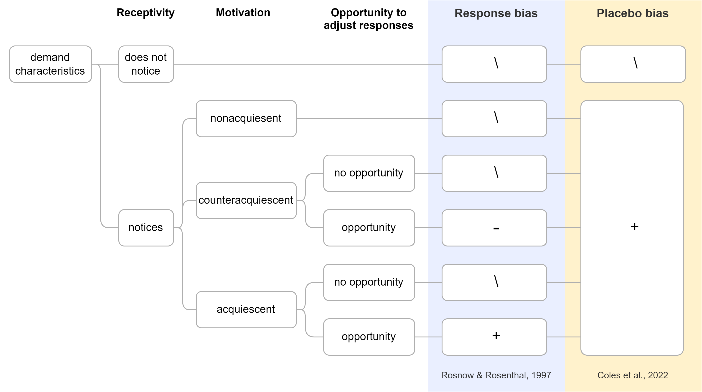
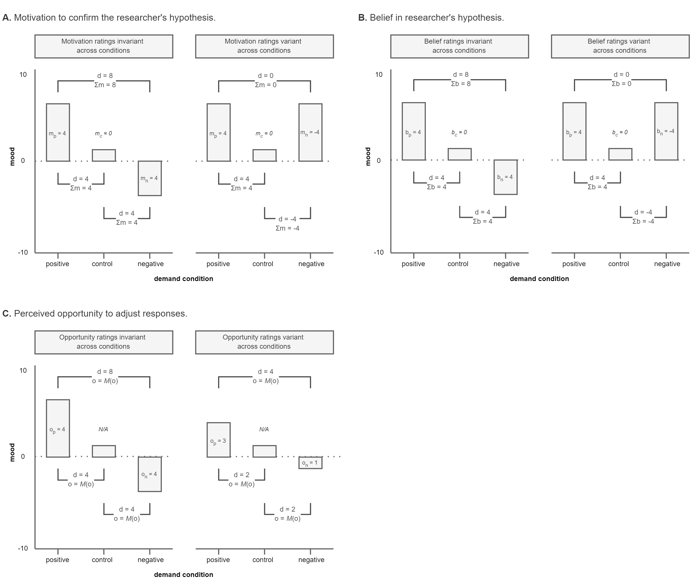

```{r setup, include = F}
# load packages writing and data processing packages
library("papaja")
library("tidyverse")
library("readxl")

# load meta-analyses packages
library("metafor")
library("weightr")
library("PublicationBias")

# identify refs
r_refs("r-references.bib")
```

Imagine that one day a mysterious person approaches you and begins telling you about a new method for understanding humans: Colesology. The person explains that Colesology is a new approach for estimating causal relationships. However, they add that the method can sometimes be thrown off by a *methodological artifact.* When you ask the Colesologist about this artifact, they explain that, sometimes, it causes researchers to detect an effect that's not real; other times, it causes researchers to miss an effect that *is* real. They add that, sometimes, the artifact causes estimates of relationships to be biased upward; other times, it causes the estimates to be biased downward. And, in general, they explain, it means that the things researchers observe using Colesology don't necessarily capture real-world human behavior. Imagine that, at this point, you become skeptical and ask the Colesologist, "How does this methodological artifact work?" And they respond that they don't know---because sometimes the artifact seems to matter and other times it doesn't.

If this scenario were real, you would reasonably question whether Colesology is a valid method of scientific inquiry. But here's the thing: we're not describing Colesology, we're describing experimental psychology.

## Demand characteristics as a methodological artifact

In 1962, Martin Orne published a seminal paper highlighting a view that challenged deeply-ingrained beliefs about experimental psychology. Orne argued that research participants are not passive responders to the experimental context. Instead, he suggested that participants actively try to make sense of the situation based on their assumptions, beliefs, and motivations. One factor that Orne believed played a particularly powerful role was *demand characteristics*: "cues which convey an experimental hypothesis to the subject" (p. 779). This idea was immediately controversial, with some researchers arguing that Orne's claims about demand characteristics were vague and overblown [e.g., @berkowitz1971weapons; @milgram1972interpreting; @kruglanski1975human]. Nonetheless, over the next 60 years, demand characteristics would become recognized as a literal textbook methodological concern in experimental psychology [@sharpe2016frightened].

Orne initially focused on evidence that demand characteristics can lead to false positives---such as patients exhibiting sham symptoms of hypnosis [@orne1959nature]. Follow-up research, though, indicated that demand characteristics can also lead to false negatives. For example, @hayes1967two demonstrated that participants will ignore visual cues of depth when they believe that doing so is the purpose of the experiment. In addition to creating inferential errors, demand characteristics can bias estimates of causal relationships. For example, @coles2022fact found that the estimated effect of facial poses on self-reported emotion could be amplified *or* attenuated based on the communicated purpose of the study. However, not all researchers have found that demand characteristics matter. For example, in large replications of classic studies in behavioral economics, @mummolo2019demand consistently failed to find that manipulations of the communicated hypothesis impacted participants' responses.

After over 60 years, experimental psychologists are left with an uncomfortable truth: demand characteristics are a literal textbook methodological concern, but it is not clear when and how their effects emerge. The goal of the current paper, thus, is to use meta-analysis to take stock of what we know---and what we don't know---about demand characteristics. We first provide an overview of a framework designed to accommodate the potentially heterogeneous effects of demand characteristics [@rosnow1997people]. We also review a complementary framework that attempts to bridge the gap between research on demand characteristics and research on placebo effects [@coles2022fact]. We then use meta-analysis to conduct the first quantitative synthesis of strict experimental tests of the effects of demand characteristics. Through this meta-analysis, we not only estimate the overall impact of demand characteristics, but also use moderator analyses to provide preliminary tests of predictions made by @rosnow1997people and @coles2022fact. We end with a discussion of the steps we believe are required to transform vague frameworks about demand characteristics into formal theories---theories we believe might help distinguish a valid experimental psychology from the invalid methods of Colesology.

## Rosnow and Rosenthal's (1997) demand characteristics framework

@rosnow1997people proposed that there are three key moderators of the effects of demand characteristic: (1) receptivity to cues, (2) motivation to provide hypothesis-consistent responses, and (3) opportunity to alter their responses (Figure \@ref(fig:framework)).

```{r framework, fig.cap = "Rosnow and Rosenthal’s (1997) and Coles et al.’s (2022) frameworks for conceptualizing the impact of demand characteristics on participants’ responses."}

```

### Receptivity to the cues

@rosnow1997people argued that participants must be perceptive to demand characteristics in order for them to impact downstream responses [see also @rosnow1973mediation; @strohmetz2008research]. As an extreme example, imagine that a researcher hands an infant participant a sheet of paper that precisely explains the researcher's hypothesis. Demand characteristics are certainly present, but they are not predicted to have an impact because the infant is not receptive to the cues (i.e., cannot read).

### Motivation to provide hypothesis-consistent responses

Early in the history of research on demand characteristics, researchers debated which motivational forces typically underlie the effects of demand characteristics [for a review, see @weber1972subject]. @orne1962social originally characterized participants as "good subjects" who change their responses because they are altruistically motivated to help the researcher confirm their hypothesis. Others characterized participants as "apprehensive subjects" who are motivated to respond in a manner that will lead them to be evaluated positively [@riecken1962program; @rosenberg1969conditions; @sigall1970cooperative]. @masling1966role argued that participants sometimes interfere with the purpose of the study ["negativistic subjects", see also @cook1970demand], whereas @fillenbaun1970more argued that participants attempt to respond as naturally as possible ("faithful subjects"). Although seemingly divided, these early theorists actually agreed on one overarching principle: that participants' motivation to provide hypothesis-consistent responses is a key driver of the effects of demand characteristics.

Because early demand characteristic theorists often focused on a single predominant subject goal--such as the goal to help the experimenter, be evaluated positively, or respond faithfully--less attention was paid to the notion that participants may have multiple, sometimes competing motivations [@barbuto1998motivation; @boudreaux2013goal]. Indeed, when the idea of multiple motivations was examined, it was often done so to highlight the more prominent role of a specific goal [e.g., evaluation apprehension vs. motivation to help the experimenter, @sigall1970cooperative]. However, @rosnow1997people found that people have multiple goals in mind when they conceptualize their role as research participants. Participants describe their role as being similar to situations where one is being altruistic (e.g., giving to charity), being evaluated (e.g., being interviewed for a job), *and* obeying authority (e.g., obeying a no-smoking sign). All these goals may impact the extent to which participants are motivated to provide hypothesis-consistent responses. Furthermore, these goals can sometimes conflict. For example, imagine that an experimenter is friendly towards the participant--and that the participant is thus motivated to help the experimenter. Now imagine that the participant learns that the experimenter hypothesizes that they will show a race-based preference for job applicants. In this scenario, the motivation to help the experimenter may conflict with the participant's desire to respond in a socially desirable manner.

Based on the above observations and reasoning, @rosnow1997people suggested that participants can be characterized as being motivated to either (a) non-acquiesce (i.e., not change their responses), (b) acquiesce (i.e., provide hypothesis-consistent responses), or (c) counter-acquiesce (i.e., provide hypothesis-inconsistent responses). Of course, as we later discuss, motivation can also be conceptualized on a continuum ranging from highly motivated to counter-acquiesce to highly motivated to acquiesce.

### Opportunity to alter responses

No matter how motivated they are to confirm the hypothesis, @rosnow1997people reasoned that there is variability in the extent to which participants have the opportunity to alter the outcome-of-interest. Thus, they posited that demand characteristics can only impact outcomes that participants can readily alter.

Taken together, @rosnow1997people posited that demand characteristics only bias participants responses when they (1) notice the cues, (2) are motivated to adjust their responses, and (3) are capable of adjusting their responses.

## Coles et al.'s (2022) framework

Researchers have traditionally conceptualized the effects of demand characteristics on participants' responses as a *response bias* [@orne1962social; @rosnow1973mediation; @strohmetz2008research]. For example, demand characteristics that indicate the researcher expects an intervention to boost mood is *not* posited to impact participants' actual mood; Instead, the demand characteristics are posited to merely impact participants' mood *reports.*

@coles2022fact argued that demand characteristics not only have the potential to lead to response biases--but also placebo biases (Figure \@ref(fig:framework)). They defined (a) response biases as changes mediated by relatively deliberate changes that participants make to their responses, and (b) placebo effects as changes that are mediated by relatively automatic activation of beliefs or pre-existing conditioned responses [@zion2018mindsets]. Thus, unlike @rosnow1997people, @coles2022fact argued that demand characteristics can impact responses even when participants have neither the motivation nor opportunity to adjust their responses. Preliminary evidence for this assertion comes from their observation that participants' beliefs did not always match the demand characteristics manipulation. For example, some participants disclosed that they (a) did not personally believe that posed expressions impacted emotion, but (b) recognized that the experimenter did. In their studies, both the manipulations of demand characteristics and measures of participants' beliefs independently moderated the effects of posed expressions on emotion---providing preliminary evidence of distinct psychological mechanisms.

# Methodology

The present meta-analysis was designed to (a) provide the first quantitative synthesis of strict experimental tests of demand effects, and (b) test predictions made by @rosnow1997people and @coles2022fact.

We defined the scope of the meta-analysis using the Population, Intervention, Comparison, Outcome framework [@schardt2007utilization]. Our population-of-interest was human subjects participating in non-clinical research studies. We excluded clinical research studies so that we could focus on research that better isolated the mechanism most often discussed in the demand characteristics literature: response biases (as opposed to placebo effects). Given that there is a sizable literature on placebo effects, excluding clinical tests of demand characteristics also helped us improve the feasibility of the project.

The intervention-of-interest was explicit manipulations of the hypothesis communicated to participants--i.e., scenarios where a researcher tells participants about the effect of an independent variable on a dependent variable. We focused on this intervention because it provides a relatively overt test of the impact of demand characteristics.

Our comparison-of-interest were conditions where either no hypothesis or a different hypothesis was communicated to participants. Our outcome-of-interest was the dependent variable described in the communicated hypothesis. For example, in a study that manipulated whether the intervention is described as "mood-boosting" or "mood-dampening", the outcome-of-interest would be any measure of mood.

## Literature search

```{r literature search, include = F}
# open and process literature search data
DF.s <- 
  # open data
  read_xlsx(path = "data/metaware_EsData_raw.xlsx",
            sheet = "records.screening") %>% 
  
  # identify unpublished dissertations by identifying links that contain the word 'dissertation'
  mutate(dissertation = 
           if_else(condition = grepl("dissertation", link),
                   true = 1,
                   false = 0)
         )

# calculate number of records from PsycInfo by removing all records with no known database (i.e., ones that were personally found)
r.pi <- DF.s %>% 
  filter(!is.na(Database)) %>% 
  nrow()

# calculate number of unpublished records (i.e., dissertations)
r.unp <- DF.s %>% 
  filter(dissertation == 1) %>% 
  nrow()
```

Our literature search strategy was developed in consultation with a librarian at Stanford University. Given the broad nature of the demand characteristics construct, we determined that a truly comprehensive strategy was infeasible (see Limitations section). Thus, we sought to design a strategy that best balanced comprehensiveness and feasibility.

We searched APA PsycInfo using broad search terms: "demand characteristics" OR "hypothesis awareness". This yielded `r r.pi` records. We additionally released a call for unpublished studies on the Society for Personality and Social Psychology Open Forum; Twitter; Facebook Psychological Methods Discussion Group and PsychMAP groups. This yielded `r nrow(DF.s) - r.pi` additional records. In total, `r r.unp` of the records were unpublished.

## Screening

```{r final.df, include = F}
# open clean effect size data
DF.es <- 
  read_csv(file = "data/metaware_data_clean.csv")

# identify total number of studies (denoted by id.study column)
num.s <- DF.es$id.study %>% 
  unique() %>% 
  length()

# identify total number of papers (denoted by name column)
num.p <- DF.es$name %>% 
  unique() %>% 
  length()

# for the known outlier (id = 18), give an example of the largest effect size
outlier.es <- DF.es %>% 
  filter(id.study == 18) %>% 
  summarise(max.es = min(es)) %>% #  using min because largest value is neg
  round(2)
```

To be eligible for inclusion in the meta-analysis, the following criteria must have been met:

-   The researcher manipulated what participants were told about the effect of an independent variable on a dependent variable. This included both *positive demand* (participants told that the dependent variable will increase), *negative demand* (participants told that the dependent variable will decrease) and *nil demand* (participants told the dependent variable will be unaffected) conditions.

    We excluded scenarios where the researcher described a non-nil effect that was *non-directional*. We did so because participants in these scenarios could not readily infer how to adjust their responses. For example, if participants were told that an independent variable would "impact mood", it is not clear if participants should infer that the mood will be boosted (positive demand) or dampened (negative demand).

-   The demand characteristics manipulation was not strongly confounded. For example, a study by @sigall1970cooperative was excluded because the manipulation of the stated hypothesis was confounded with a disclosure about the meaning of the behavior. Specifically, participants were either informed or not informed that the researcher expected them to copy a large quantity of numbers. When participants were informed about this hypothesis, they were also told that such behavior would be indicative of an undesirable personality trait.

-   Information necessary for computing at least one effect size was included.

N. C. and M. W. screened records independently, reviewed potentially relevant records together, and coded the information for moderator analyses and effect size computations. Disagreements were resolved through discussion. It total, `r num.s` studies from `r num.p` records were eligible for inclusion. However, one record [@allen2012demand] was removed because the information reported led to implausibly large effect size estimates (e.g., $d$ = `r outlier.es`).

```{r clean.env.1, include = F}
# remove outlier and re-initialize id factors
DF.es <- DF.es %>% 
  filter(id.study != 18) %>% 
  mutate(id.study = factor(id.study),
         id.es = factor(id.es))

# clean environment
rm(DF.s, r.pi, r.unp, num.s, num.p, outlier.es)
```

## Effect size index

We used standardized mean difference scores (Cohen's $d_{s}$ and $d_{rm}$) as our effect size index [@borenstein2009effect; @cohen1988statistical].

In some scenarios, we estimated the main effect of demand characteristics. For example, @coles2022fact manipulated whether participants were told that smiling would increase happiness. Here, the main effect of demand characteristics can be computed by comparing happiness ratings from smiling participants who were either informed or not informed about its expected effect.

In other scenarios, we estimated the interactive effect of demand characteristics. For example, in the same @coles2022fact study, participants reported happiness both after smiling and scowling. Participants' mood generally improved when smiling vs. scowling (i.e., there was a main effect of facial pose). However, the difference was more pronounced when participants were told about the mood-boosting effects of smiling. In other words, there was an interaction between facial pose and demand characteristics. In this scenario, the interactive effect of demand characteristics was computed by calculating a difference-in-differences score.

Effect sizes were calculated so that positive values indicated an effect consistent with the demand characteristics manipulation. For example, if participants were told that an intervention should increase mood, an increase in mood would be coded as a positive effect. If participants were told that an intervention should decrease mood, an increase in mood would be coded as a negative effect.

```{r corr.sens, include = F}
# examine how assumed repeated measures correlation impacts general pattern of results

# get list of sensitivity dataframes
sens.df.list <- list.files(path = "./data/r_sensitivity")

# (1) open dataframe, (2) compute intercept-only model, (3) extract overall es
sens.res <- 
  sapply(X = sens.df.list, 
         FUN = function(i){
           # open data
           df <- read.csv(paste0("data/r_sensitivity/",
                                    i)
                             ) 
           # fit model
           mod <- rma.uni(yi = es,
                          vi = es.var,
                          data = df,
                          method = "REML") %>% 
             robust(cluster = id.study)
           
           # return overall es as a number
           mod$b %>% 
             as.numeric() %>% 
             return()
           }
         )

# compute range of es values
sens.range <- max(sens.res) - min(sens.res)

# delete vestigial
rm(sens.df.list, sens.res)
```

For repeated-measure comparisons, the correlation between the repeated measures is needed to calculate Cohen's $d_{rm}$. This correlation is rarely reported, so we followed a recommendation by @borenstein2009effect and performed sensitivity analyses on an assumed correlation. We preregistered a default correlation of $r$ = .50 but performed sensitivity analysis with $r$ = .10, .30, .50, .70, and .90. These sensitivity analyses only produced a `r sens.range` range in overall effect size estimates---so we do not discuss them further.

```{r mult.eff, include = F}
# calculate percentage of studies with multiple effect sizes
mult.eff.per <- DF.es %>% 
  # identify number of effect sizes for each study (id)
  group_by(id.study) %>% 
  count() %>% 
  
  # code whether each study has more than one effect size
  mutate(dep = if_else(condition = n > 1,
                       true = 1,
                       false = 0)
         ) %>% 
  
  # calculate proportion of studies with more than one effect size 
  ungroup() %>% 
  summarise(mult.eff = mean(dep)) %>% 
  
  # export as percentage
  as.numeric() %>% 
  round(digits = 2) * 100
```

`r mult.eff.per`% of studies contained multiple effect sizes of interest. For example, Coles et al. (2022) had a positive demand, nil demand, and control condition. Participants also completed several facial expression poses (happy, angry, and neutral) and self-reported several emotions (happiness and anger). To be comprehensive, we recorded all reported effect sizes and account for dependencies in our models (described later).

## Types of demand characteristic comparisons

Cohen's $d$ represents a standardized mean difference between two groups. Often, this involved a single demand characteristic condition (positive, negative, or nil demand) compared to a control group. Sometimes, however, this comparison involved two demand characteristic conditions (e.g., positive demand vs. negative demand). We thus coded whether the comparison involved one vs. two demand characteristic conditions. In addition, we coded each type of comparison: positive vs. control, nil vs. control, negative vs. control, positive vs. nil, positive vs. negative, nil vs. negative demand.

## Post-hoc measures of motivation, opportunity, and belief

```{r vig.desc, include = F}
# identify total number of vignettes
vig.n <- read.csv(file = "vig/metaware_VigCombined.csv") %>% 
  nrow()
```

Both @rosnow1997people and @coles2022fact posited that the effects of demand characteristics are moderated by participants' (1) motivation to provide hypothesis-consistent responses, and (2) opportunity to adjust their responses (Figure \@ref(fig:framework)). @coles2022fact additionally predicted a third moderator: (3) participants' belief in the hypothesized effect. Unfortunately, these variables were rarely measured in the studies included in the meta-analysis.

As an indirect measure of these three moderators-of-interest, we estimated their values through a new set of participants. (See SI for construct validity analyses.) For each demand characteristic condition and dependent variable combination, we created vignettes that described key study details. For example, @standing2008demonstration had two demand characteristics manipulations (positive demand and nil demand) and two dependent variables (measures of verbal and spatial reasoning). Thus, we created four vignettes for this study (see Figure \@ref(fig:vig)).

In total, there were `r vig.n` vignettes. We did not create vignettes for control conditions because participants were not given information about the experimenter's hypothesis. Because there were no explicit demand characteristics to act upon, we left motivation, belief, and opportunity values blank for this condition.

```{r vig, fig.cap = "Vignettes for Standing et al., 2008."}
knitr::include_graphics("images/metaware_vigs.png")
```

```{r survey.n, include = F}
# identify number of participants who completed the survey
survey.n <- read.csv("data/metaware_SurvData_raw.csv") %>% 
  nrow()
```

`r survey.n` undergraduates from Stanford University reviewed 20 randomly-selected vignettes in exchange for course credit. For each vignette, raters were asked to first identify the researcher's hypothesis. Here, participants chose between four options that described a filler effect (usually involving a different dependent variable) or a positive, negative, or nil effect of the independent variable on the dependent variable. Afterwards, they rated the extent to which they would (1) be motivated to provide hypothesis-consistent responses (-3 = "extremely motivated to adjust responses to be inconsistent" to 3 = "extremely motivated to adjust responses to be consistent"), (2) be able to adjust their responses on the outcome-of-interest (0 = "extremely incapable" to 7 = "extremely capable), and (3) believe the experimenter's hypothesis (0 ="strong disbelief" to 7 = "strong belief"). (Raters also indicated whether they believed the actual participants would confirm the hypothesis, which we discuss later.) These questions were presented in random order.

For each vignette, ratings were removed if the rater did not correctly identify the communicated hypothesis. The remaining ratings were averaged across raters to provide mean estimates of motivation, opportunity, and belief.

### Accounting for different demand comparisons

```{r mods, fig.cap = "Hypothetical data from a study where a procedure is either described as mood-boosting (positive demand), described as mood-dampening (negative demand), or not described at all (control). Data provides examples of how the effects of demand characteristics (d) on self-reported mood are moderating by participants' reports of their motivation to confirm the stated hypothesis (m, Panel A), belief in the stated hypothesis (b, Panel B), and opportunity to adjust responses (c, Panel C). In each panel, separate examples are provided for scenarios where motivation is invariant (Column 1) and variant (Column 2) across levels of demand characteristics"}

```

As we've mentioned before, Cohen's $d$ represents the standardized difference between *two* groups. Thus, for each effect size, we summed the motivation, opportunity, and belief ratings for the two groups being compared. Doing so allowed us to accommodate the fact that some comparisons involved two demand characteristics conditions. For example, imagine a study where a procedure is either described as mood-boosting (positive demand), described as mood-dampening (negative demand), or not described at all (control). Compared to a control condition, participants who are motivated to confirm the hypothesis will have upward-biased responses in the positive demand condition and downward-biased responses in the negative demand condition (see Figure \@ref(fig:mods), Panel A, Column 1). When comparing the two demand conditions, the size of the demand effect should be doubled because the motivational forces in the two conditions produce an additive effect. Alternatively, these motivational forces could hypothetically cancel each other out. This would happen if participants were (a) motivated to confirm the hypothesis in the positive demand condition, and (b) motivated to disconfirm the hypothesis in the negative demand condition (see Figure \@ref(fig:mods), Panel A, Column 2). Summing motivation scores allowed us to accommodate this possibility, and we used the same approach for belief (Panel B) and opportunity ratings (Figure \@ref(fig:mods), Panel C).

We did not include nil-hypothesis comparisons in our analyses because our coding strategy could not accommodate the potential moderating role of motivation and belief in this condition. For example, imagine that a participant is (a) told that an intervention will not impact mood (nil demand), and (b) is extremely motivated to disconfirm the hypothesis. Relative to a control condition, this participant could disconfirm the hypothesis by either increasing *or* decreasing their mood report. Thus, even if motivation does moderate the effects of demand characteristics, we would not expect a systematic pattern to emerge with our approach to coding motivation. Nonetheless, we discuss potential strategies in the Limitations sections for addressing this question in future research.

## Rater forecasts of demand effects

Even if researchers cannot explain how demand characteristics work, it might be valuable to be able to predict their effects [@yarkoni2017choosing]. Orne suggested that one group that may be particularly good at predicting these effects is participants themselves [@orne1969demand]. To examine this, raters who reviewed the vignettes also predicted whether other participants would confirm vs. disconfirm the researcher's hypothesis (-3 = "extremely likely to adjust responses to be inconsistent" to 3 = "extremely likely to adjust responses to be consistent"). We processed these data using the same approach as the motivation, opportunity, and belief scores (e.g., summed ratings when comparing two demand conditions).

## Other moderators

We also coded several moderators for which we had no a-priori hypotheses. This included: (1) whether the sample was student, non-student (e.g., MTurk), or mixed, (2) whether the study was conducted online or in-person, (3) whether the comparison involved one (e.g., positive-demand vs. control) or two demand conditions (e.g., positive-demand vs. negative-demand), (4) in the former, whether a positive-, nil-, or negative-demand manipulation was used, (5) whether demand characteristics were manipulated within- vs. between-subjects, (6) the year the record was completed or published, and (7) whether participants were paid or unpaid.

## Meta-analytic approach

For estimating overall effects and testing moderators, we used random-effects meta-analysis with robust variance estimates [@hedges2010robust]. We used random-effects because @rosnow1997people and @coles2022fact posited that moderators create a distribution of true effects---as opposed to a single fixed-effect [@hedges1998fixed]. We used robust variance estimates because `r mult.eff.per`% of studies provided multiple effect sizes of interest, which violates the statistical assumption that effect sizes are independent. Like many meta-analysis procedures, meta-analysis with robust variance estimates uses an inverse-variance weighting scheme that adjusts for dependencies among effect size [@tanner2014robust].

To estimate the overall effect size, we fit an intercept-only model. The intercept of this model can be interpreted as the precision-weighted overall effect size, adjusted for effect size dependencies. For moderator analyses, continuous and dummy-coded categorical moderators were separately entered into the meta-regression model. For categorical moderators, we used the models to additionally estimate subrgroup overall effect sizes.

```{r clean.env.2, include = F}
# delete vestigial
rm(mult.eff.per, vig.n, survey.n, sens.range)
```

### Publication bias analyses

The most common way to assess publication bias with dependent structures is to aggregate the dependent effect sizes and perform standard publication bias analyses. Following this approach, we used the MAd R package to aggregate dependent effect sizes. We then used precision effect tests [i.e., PET-PEESE, @stanley2014meta] and weight-function modeling [@vevea1995general] to test for the presence of publication bias and estimate the bias-corrected overall effect size. As a further sensitivity analysis, we used an approach by @mathur2020sensitivity to estimate the maximal publication bias required to shift the observed overall effect size estimate to zero.

# Results

```{r overall, include = F}
# estimate overall effect size
overall <- 
  rma.mv(yi = es,
         V = es.var,
         data = DF.es,
         random = ~ 1 | id.study / id.es)
# overall <-
#   rma.uni(yi = es,
#           vi = es.var,
#           data = DF.es,
#           method = "REML") %>% 
#   robust(cluster = DF.es$id)
```

Results indicated that, overall, explicit manipulations of demand characteristics create a small acquiescence effect, $d$ = `r overall$b`, 95% CI [`r overall$ci.lb`, `r overall$ci.ub`], $z$ = `r overall$zval`, $p$ `r printp(overall$pval)`. In other words, when explicitly told a hypothesis, participants responses tend to shift in a manner consistent with that hypothesis. That being said, the observed effects of demand characteristics were highly heterogeneous. The between-study ($\tau$ = `r sqrt(overall$overall$sigma2[1])`) and within-study ($\sigma$ = `r sqrt(overall$overall$sigma2[2])`) standard deviation of effects was approximately the same size of the overall effect. This suggests the presence of moderators.

### Moderator analyses

```{r mod_new, include = F}
# create list of moderators
mod.l <- c("student", "paid", "online", 
           "design", "ref.r", "published",
           "year")

# create moderator analysis function
ModAnalysis = function(m, df = DF.es) {
  
  # set dataset
  df <- df
  
  # moderator analysis
  mod.m <- rma.mv(yi = es,
                  V = es.var,
                  data = DF.es,
                  random = ~ 1 | id.study / id.es,
                  mods = as.formula(paste0("~ ", m)))
  
  sub.m <- rma.mv(yi = es,
                  V = es.var,
                  data = DF.es,
                  random = ~ 1 | id.study / id.es,
                  mods = as.formula(paste0("~ 0 + ", m)))
  # mod.m <- rma.uni(yi = es, 
  #                  vi = es.var,
  #                  data = df,
  #                  mods = as.formula(paste0("~ ", m)),
  #                  method = "REML") %>%
  #   robust(cluster = id)
           
  # subgroup analysis
  # sub.m <- rma.uni(yi = es,
  #                  vi = es.var,
  #                  data = df,
  #                  mods = as.formula(paste0("~ 0 + ", m)),
  #                  method = "REML") %>%
  #   robust(cluster = id)
  
  # return results as list
  return(list(mod = mod.m,
              sub = sub.m)) 
}

# conduct moderator and subgroup analyses for moderators assessed with full dataset 
mod.r <- 
  sapply(X = mod.l,
         simplify = F,
         FUN = ModAnalysis)

# test ref.type moderator in scenarios where there is a control comparison (i.e., ref.r == single)
mod.r[["ref.type"]] <- 
  ModAnalysis(m = "ref.type",
              df = DF.es[DF.es$ref.r == "single", ])

# add mot, opp, bel, and pre

# delete vestigial 
rm(mod.l, ModAnalysis)

# tmp
lapply(X = mod.r, FUN = function(x){x[["sub"]]
  }
  )
```

#### Motivation, opportunity, and belief

Run these without the z demand comparisons

Mock text: The effects of demand characteristics were larger in studies where participants indicated they would be motivated to confirm the hypothesis, B = XX, F(df) = XX, p = XX, R2.

Figure idea: Different scatterplot panels for each moderator; ES on y-axis; moderator on x axis; jittered observations; linear trend line with CI

#### Rater forecasts

Run this without the z demand comparisons

Mock text: The effects of demand characteristics were larger in studies where participants predicted that other would change their responses to confirm the hypothesis, B = XX, F(df) = XX, p = XX. However, overall accuracy was low, explaining R2 proportion of the observed heterogeneity.

Figure idea: Same scatterplot panel.

#### Other moderators

Results indicated that the effects of demand characteristics were moderated by participant pool, $F$(`r mod.r$student$mod$QMdf[1]`, `r mod.r$student$mod$QMdf[2]`) = `r mod.r$student$mod$QM`, $p$ = `r printp(mod.r$student$mod$QMp)`. The effects were medium-to-large in studies with students ($d$ = `r mod.r$student$sub$b[3]`, 95% CI [`r mod.r$student$sub$ci.lb[3]`, `r mod.r$student$sub$ci.ub[3]`], $p$ `r printp(mod.r$student$sub$pval[3])`), extremely small in studies with a mix of students and non-students ($d$ = `r mod.r$student$sub$b[1]`, 95% CI [`r mod.r$student$sub$ci.lb[1]`, `r mod.r$student$sub$ci.ub[1]`], $p$ = `r printp(mod.r$student$sub$pval[1])`), and near-zero in studies with non-students ($d$ = `r mod.r$student$sub$b[2]`, 95% CI [`r mod.r$student$sub$ci.lb[2]`, `r mod.r$student$sub$ci.ub[2]`], $p$ = `r printp(mod.r$student$sub$pval[2])`). The effects of demand characteristics also tended to be larger for in-person ($d$ = `r mod.r$online$sub$b[1]`, 95% CI [`r mod.r$online$sub$ci.lb[1]`, `r mod.r$online$sub$ci.ub[1]`], $p$ `r printp(mod.r$online$sub$pval[1])`) vs. online ($d$ = `r mod.r$online$sub$b[2]`, 95% CI [`r mod.r$online$sub$ci.lb[2]`, `r mod.r$online$sub$ci.ub[2]`], $p$ = `r printp(mod.r$online$sub$pval[2])`) studies, $F$(`r mod.r$online$mod$QMdf[1]`, `r mod.r$online$mod$QMdf[2]`) = `r mod.r$online$mod$QM`, $p$ = `r printp(mod.r$online$mod$QMp)`.

The effects of demand characteristics appeared to be additive. Compared to instances where a demand characteristic condition was compared to a control group ($d$ = `r mod.r$ref.r$sub$b[2]`, 95% CI [`r mod.r$ref.r$sub$ci.lb[2]`, `r mod.r$ref.r$sub$ci.ub[2]`], $p$ `r printp(mod.r$ref.r$sub$pval[2])`), effect sizes were approximately twice as large when two demand characteristic conditions were compared ($d$ = `r mod.r$ref.r$sub$b[1]`, 95% CI [`r mod.r$ref.r$sub$ci.lb[1]`, `r mod.r$ref.r$sub$ci.ub[1]`], $p$ `r printp(mod.r$ref.r$sub$pval[1])`), $F$(`r mod.r$ref.r$mod$QMdf[1]`, `r mod.r$ref.r$mod$QMdf[2]`) = `r mod.r$ref.r$mod$QM`, $p$ = `r printp(mod.r$ref.r$mod$QMp)`. Instances where a demand characteristic condition was compared to a control group allowed us to explore whether participants respond more strongly to positive-, nil-, or negative-demand characteristics. Results did not indicate that they do, $F$(`r mod.r$ref.type$mod$QMdf[1]`, `r mod.r$ref.type$mod$QMdf[2]`) = `r mod.r$ref.type$mod$QM`, $p$ = `r printp(mod.r$ref.type$mod$QMp)`. In both the positive- ($d$ = `r mod.r$ref.type$sub$b[1]`, 95% CI [`r mod.r$ref.type$sub$ci.lb[1]`, `r mod.r$ref.type$sub$ci.ub[1]`], $p$ = `r printp(mod.r$ref.type$sub$pval[1])`), nil- ($d$ = `r mod.r$ref.type$sub$b[2]`, 95% CI [`r mod.r$ref.type$sub$ci.lb[2]`, `r mod.r$ref.type$sub$ci.ub[2]`], $p$ `r printp(mod.r$ref.type$sub$pval[2])`), and negative-demand conditions ($d$ = `r mod.r$ref.type$sub$b[3]`, 95% CI [`r mod.r$ref.type$sub$ci.lb[3]`, `r mod.r$ref.type$sub$ci.ub[3]`], $p$ `r printp(mod.r$ref.type$sub$pval[3])`), demand characteristics produced a medium-to-large shift in participants' responses.

We did not find that the effects of demand characteristics were moderated by whether the researchers manipulated demand characteristics within- ($d$ = `r mod.r$design$sub$b[1]`, 95% CI [`r mod.r$design$sub$ci.lb[1]`, `r mod.r$design$sub$ci.ub[1]`], $p$ `r printp(mod.r$design$sub$pval[1])`) vs. between-subjects ($d$ = `r mod.r$design$sub$b[2]`, 95% CI [`r mod.r$design$sub$ci.lb[2]`, `r mod.r$design$sub$ci.ub[2]`], $p$ = `r printp(mod.r$design$sub$pval[2])`), $F$(`r mod.r$design$mod$QMdf[1]`, `r mod.r$design$mod$QMdf[2]`) = `r mod.r$design$mod$QM`, $p$ = `r printp(mod.r$design$mod$QMp)`. We also did not find that the effects of demand characteristics were moderated by the year the record was completed or published, $\beta$ = `r mod.r$year$mod$b["year", ]`, 95% CI [`r mod.r$year$mod$ci.lb[2]`, `r mod.r$year$mod$ci.ub[2]`], $t$(`r sum(mod.r$year$mod$QMdf)`) = `r mod.r$year$mod$zval[2]`, $p$ = `r printp(mod.r$year$mod$pval[2])`. The effects of demand characteristics tended to be numerically larger in unpaid ($d$ = `r mod.r$paid$sub$b[1]`, 95% CI [`r mod.r$paid$sub$ci.lb[1]`, `r mod.r$paid$sub$ci.ub[1]`], $p$ `r printp(mod.r$paid$sub$pval[1])`) vs. paid ($d$ = `r mod.r$paid$sub$b[2]`, 95% CI [`r mod.r$paid$sub$ci.lb[2]`, `r mod.r$paid$sub$ci.ub[2]`], $p$ = `r printp(mod.r$paid$sub$pval[2])`) studies---but this difference was also not statistically significant, $F$(`r mod.r$paid$mod$QMdf[1]`, `r mod.r$paid$mod$QMdf[2]`) = `r mod.r$paid$mod$QM`, $p$ = `r printp(mod.r$paid$mod$QMp)`.

### Forecasts

### Publication bias analyses

```{r}
overall %>% 
  metafor::funnel(x = .,
                  hlines = "lightgray",
                  xlab = "Cohen's standardized d")

rma.uni(yi = yi,
        vi = vi,
        data = DF.agg,
        method = "REML") %>% 
  metafor::funnel()
```

```{r pub.bias, include = F}
##########################
# Define publication bias analysis that
# 1. Mathur and VanderWeele 2020 sensitivity analyses
# 2a. Aggregates dependent effect sizes (with given rho value)
# 2b. Fits PET-PEESE models w/ aggregated effects
# 2c. Fits Vevea and Hedges (1995) Weight-Function Model w/ aggregated effects
# 2d. Fit funnel plot
# 3. Organizes results into list
##########################

PubBias = function(rho.val = .5){
  # 1.sensitivity analyses
  ########################
  sens <- corrected_meta(yi = DF.es$es,
                         vi = DF.es$es.var,
                         eta = 49,
                         clustervar = DF.es$id,
                         model = "robust",
                         favor.positive = T)
  
  # 2a. aggregate dependent effect sizes
  ########################
  DF.agg <- DF.es %>%
    
    # convert to an 'escalc' object so function can run
    escalc(yi = es,
           vi = es.var,
           data = DF.es,
           measure = "SMD") %>%
    
    # delete vestigial: es is now yi; es.var is now vi
    select(-c(es, es.var)) %>% 
    
    # aggregate dependencies
    aggregate(x = .,
              cluster = id,
              rho = rho.val)

  # 2b. PET-PEESE (syntax provided by Carter & McCullough, 2014)
  ########################
  # compute standard error of es
  DF.agg$se <- sqrt(DF.agg$vi)
  
  PEESE2 <- regtest(x = DF.agg$yi, 
                  vi= DF.agg$vi,
                  sei = DF.agg$se, 
                  data = DF.agg,
                  predictor= "sei")
  # fit models
  pet <- lm(DF.agg$yi ~ DF.agg$se, 
            weights = 1 / DF.agg$vi) %>% 
    summary()
  
  peese <- lm(DF.agg$yi ~ DF.agg$vi, 
               weights = 1 / DF.agg$vi) %>% 
    summary()
  
  # 2c. Weight-function model
  ########################
  weight.funct <- weightfunct(effect = DF.agg$yi,
                              v = DF.agg$vi,
                              mods = NULL,
                              weights= NULL,
                              fe = FALSE,
                              table = TRUE,
                              pval = NULL)
  
  # 2d. funnel plot
  rma.uni(yi = yi,
          vi = vi,
          data = DF.agg,
          method = "REML") %>%   
    metafor::funnel(hlines = "lightgray",
                    xlab = "Cohen's standardized d")
  
  # save funnel plot as object
  funnel.plot <- recordPlot()
    
  # clear R environment
  plot.new()
  
  # 3. Organize results in list 
  ########################
  list(DF.agg = DF.agg,
       pet = pet,
       peese = peese,
       weight.funct = weight.funct,
       funnel = funnel.plot,
       sens = sens) %>%  
    return()
}

# for range of rho values, run publication bias analyses
rho.l = seq(from = .1,
            to = .9,
            by = .2)

pub.r <- lapply(X = rho.l,
                FUN = PubBias)

names(pub.r) = paste0("rho_", rho.l) #  name list

# delete vestigial 
rm(rho.l, PubBias)

# look at sensitivity analyses
## general story: often, but not always, find evidence of reverse publication bias (preference for negative effects)
lapply(pub.r, function(x){x[["pet"]]})
lapply(pub.r, function(x){x[["peese"]]})
lapply(pub.r, function(x){x[["weight.funct"]]})
lapply(pub.r, function(x){x[["funnel"]]})

# plot funnels
overall %>% 
  metafor::funnel(x = .,
                  hlines = "lightgray",
                  xlab = "Cohen's standardized d")

pub.r$rho_0.5$funnel
```

Performed publication bias analyses for our overall effect.

Started with a graphical diagnostic: an examination of the funnel plot


We did not find evidence of different effects among unpublished ($d$ = `r mod.r$published$sub$b[1]`, 95% CI [`r mod.r$published$sub$ci.lb[1]`, `r mod.r$published$sub$ci.ub[1]`], $p$ = `r printp(mod.r$published$sub$pval[1])`) and published ($d$ = `r mod.r$published$sub$b[2]`, 95% CI [`r mod.r$published$sub$ci.lb[2]`, `r mod.r$published$sub$ci.ub[2]`], $p$ `r printp(mod.r$published$sub$pval[2])`) studies $F$(`r mod.r$published$mod$QMdf[1]`, `r mod.r$published$mod$QMdf[2]`) = `r mod.r$published$mod$QM`, $p$ = `r printp(mod.r$published$mod$QMp)`.

# Discussion

# Thoughts

Compare average effect of demand to average effect in psychology. It suggest that it's plausible that these are driven by demand. When looking at the distribution, it's clear that no effect is too big to rule out concerns about demand.

Might want to plot es distribution and identify proportion of (a) non-negligible acquiesence, (b) non-negligible counter-acquiesence, and (c) non-acquiesence.

# To-do

[] Add moderator analyses

[] Clean up folder structure

[] Have Mike review again?

[] Update pre-registration

[] Have M.W. work on outcome type

[] Have M.W. build codebooks

# References

::: {#refs custom-style="Bibliography"}
:::
