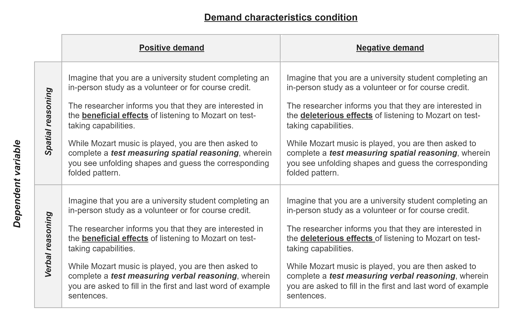

```{r setup, include = F}
# load writing and data processing packages
library("papaja")
library("tidyverse")
library("readxl")
library("cowplot")

# load meta-analyses packages
library("metafor")
library("weightr")
library("PublicationBias")

# load mixed-effect regression packages
library("lme4")
library("lmerTest")
library("emmeans")

# identify paper references
r_refs("r-references.bib")

# turn scientific notation off
options(scipen = 999)

# set seed to year of lead author's favorite [unfinished] album, SMiLE
set.seed(1967)

# set theme
theme_set(theme_classic())
```

```{r session.info, eval = F}
# note: this code is set to not evaluate. 
# for computational reproducibility purposes, the code exports package version info to a text file
# this will help others see which package versions were used when the code was written
writeLines(text = sessionInfo() %>% 
             capture.output(), 
           con = "sessionInfo.txt")
```

Imagine that one day a mysterious person approaches you and begins telling you about a new method they invented for understanding humans. They tell you that their method is useful for estimating causal relationships, but add that there is one issue: it can sometimes be thrown off by a *methodological artifact*. They explain that this artifact sometimes causes researchers to detect an effect that's not real, and other times causes them to miss an effect that is real; that it sometimes biases estimates upward and other times downward. Then, they offer a confession: the artifact doesn't always impact their conclusions, and they don't know why. Sometimes the artifact seems to matter, other times it doesn't -- and its underlying mechanisms are poorly understood.

If the above scenario was real, the noted limitations would likely call their whole method into question. However, perhaps experimental psychologists should not be so quick to judge. After all, we too deal with a difficult-to-understand methodological artifact: *demand characteristics*.

In a seminal paper, Martin @orne1962social argued that human subjects are perceptive to demand characteristics -- "cues which convey an experimental hypothesis" -- and generally use these cues to help the experimenter confirm their hypothesis [-@orne1962social, p. 779]. Orne initially focused on evidence that demand characteristics can lead to false positives, such as patients exhibiting sham symptoms of hypnosis [@orne1959nature]. However, demand characteristics can also lead to false negatives. For example, participants will ignore visual cues of depth when they believe that disregarding them is the purpose of the experiment [@hayes1967two]. In addition to creating inferential errors, demand characteristics can bias estimates of causal relationships. For example, the effects of facial poses on self-reported emotion can be amplified *or* attenuated depending on whether the experimenter communicates expectations of positive or nil effects [@coles2022fact]. Puzzlingly, though, demand characteristics do not always seem to matter. For example, in a set of large replications of classic studies in behavioral economics, direct manipulations of demand characteristics consistently failed to impact participants' responses [@mummolo2019demand].

As this brief review shows, demand characteristics are uncomfortably close to the mysterious methodological artifact described in the opening of the paper. Demand effects are a literal textbook methodological concern in experimental psychology [@sharpe2016frightened], but their magnitude, direction, and consistency remain unclear. Further, as we review next, psychologists do not yet understand which mechanism(s) underlie their effects.

## How do demand characteristics alter participant responses?

Historically, there has been little agreement about how demand characteristics alter participant responses. An exhaustive review of such disagreements is outside the scope of our review. Instead, we focus our review on one of the most historically influential frameworks [@rosnow1997people] and two recent extensions of this framework [@coles2022fact; @corneille2022sixty].

## Rosnow and Rosenthal (1997)

@rosnow1997people developed one of the most influential frameworks for conceptualizing demand effects. In this framework, they characterized demand effects as *faking* and proposed three three key moderators: (1) receptivity to cues, (2) motivation to provide hypothesis-consistent responses, and (3) opportunity to alter responses (Figure \@ref(fig:framework)). 

To start, @rosnow1997people reasoned that participants must be receptive to demand characteristics for there to be subsequent shifts in participants' responses [see also @rosnow1973mediation; @strohmetz2008research]. As an extreme example, imagine that a researcher hands an infant a sheet of paper that precisely explains the study hypothesis. Demand characteristics are certainly present, but they are not predicted to have an impact because the infant is not receptive to the cues. We mention this moderator for the sake of comprehensiveness, but will not discuss it further.

If and when participants correctly interpret demand characteristics, @rosnow1997people theorized that subsequent changes in participants' responses would be driven by their motivation (or lack thereof) to provide hypothesis-consistent responses. Early work on demand characteristics was marked by debates about whether participants are motivated to adjust their responses to (a) help the researcher confirm their hypothesis [@orne1962social], (b) receive positive evaluations [@riecken1962program; @rosenberg1969conditions; @sigall1970cooperative], (c) interfere with the purpose of the study [@cook1970demand; @masling1966role], or (d) follow directions as closely as possible [@fillenbaun1970more]. @rosnow1997people advanced this line of thinking by demonstrating that participants have *multiple* shifting motivations in mind when they conceptualize their roles as subjects [@rosnow1997people]. For example, participants appear to be motivated to increase performance on simple tasks when told that this is the experimenter's expectation -- but not when the experimenter adds that the increase in performance will be indicative of a negative personality trait [@sigall1970cooperative]. @rosnow1997people, thus, suggested that participants in any given context can be characterized as being overall motivated to either: (a) non-acquiesce (i.e., not change their responses based on knowledge about the hypothesis), (b) acquiesce (i.e., provide hypothesis-consistent responses), or (c) counter-acquiesce (i.e., provide hypothesis-inconsistent responses).

If participants are motivated to adjust their response, @rosnow1997people theorized that subsequent changes in participants' responses would then be driven by their ability to alter the outcome of interest. For example, participants can more readily alter responses to self-report measures of prejudice, as opposed to reaction-time-based measures like the Implicit Association Test [@greenwald1998measuring]. Taking this third moderator -- opportunity -- into account, Rosnow and Rosenthal concluded that demand characteristics only produce faking when participants (1) notice the cues, (2) are motivated to adjust their responses, and (3) can adjust their responses. This influential framework directly maps onto psychologists' playbook for avoiding the impact of demand characteristics: use deception (reduce receptivity), incentivize honest reporting (reduce motivation), and/or deploy difficult-to-control outcome measures (reduce opportunity to adjust responses). However, modern extensions to @rosnow1997people's model suggest that such playbooks may be out-of-date.

## Modern extensions to Rosnow and Rosenthal (1997)
@coles2022fact and @corneille2022sixty recently proposed extensions to @rosnow1997people's framework. These extensions may appear modest. However, as we highlight in Figure \@ref(fig:framework), they lead to diverging predictions in the majority of contexts described by @rosnow1997people -- further illustrating experimental psychologists' inability to explain the worrisome effects of demand characteristics.

In addition to the faking mechanism described by @rosnow1997people, @coles2022fact suggested that demand effects may be mediated by placebo effects. Ironically, though, @coles2022fact did not precisely specify how such placebo effects operate [@zion2018mindsets] -- essentially increasing theoretical ambiguity in the demand characteristics literature. Nonetheless, for illustrative purposes, one can consider two oft-discussed mechanisms: conditioned responses and expectancies. @stewart2004placebo theorized that conditioned responses operate nonconsciously and automatically, whereas expectancies operate consciously via both automatic and controlled processes. For example, participants may intentionally act upon their expectancies, in which case motivation and opportunity to adjust responses should serve as moderators. However, @stewart2004placebo also discussed how expectancy effects may be direct and unmediated -- an idea sometimes referred to as the immediacy hypothesis.

@corneille2022sixty present yet another extension of @rosnow1997's framework. Like @rosnow1997people, @corneille2022sixty emphasized that receptivity[^1] and motivation to adjust responses. @corneille2022sixty agreed that participants may act upon their motivations by faking responses, in which case demand effects may be moderated by participants' opportunity to adjust responses. However, they extended @rosnow1997people's framework by introducing two mechanisms that do not rely on participants' opportunity to adjust responses: *imagination* and *phenomenological control*. 

They agreed that participants may act upon their motivations by faking responses, in which case the effect is expected to be moderated by participants' opportunity to adjust responses. 

[^2]: In regards to receptivity, @corneille2022sixty's framework emphasizes that participants can form incorrect impressions of the researcher's hypothesis. In some cases, they may not form any impressions at all.

importance of receptivity (particularly the extent to which participants' correctly interpret demand characteristics) and motivation to adjust responses. 

Phenomenological control is similar to the expectancy mechanisms described by @coles2022fact, with two exceptions.

1. As characterized by Cornielle and Lush (2023), phenomenological control occurs when participants are motivated to adjust their responses. coles2022fact, on the other hand, suggested that the effects of expectancies can sometimes be unmoderated by motivation (e.g., in the case of classical conditioning).

2. Participants are theorized to be unaware of the effects of phenomenological control. coles2022fact, on the other hand, suggested that participants are sometimes aware that their expectancies shaped their responses.


If one accepts this integration between mechanisms commonly discussed in research on demand and placebo effects, it paints an even more worrisome picture -- suggesting


these mechanisms, respectively, operate nonconsciously 

-- which are posited to operate nonconsciously and consciously respectively [@stewart2004placebo].

proposed a modest extension of @rosnow1997people: that demand effects could also be mediated the extent to which participants expect the hypothesized effect to emerge. We refer this mechanism as *expectancies*, which could be informed both by previously-learned associations (e.g., via classical conditioning) and newly presented information (e.g., demand characteristics) [@stewart2004placebo]. Expectancies are theorized to operate both consciosuly and non-consciously (e.g., in the case of classical conditioning). Further, expectancies are theorized to operate via both controlled and automatic processes. For example, participants may intentionally act upon expectancies, in which case motivation and opportunity to adjust responses might serve as moderators. However, sometimes expectancies can impact outcomes via automatic processes -- and idea sometimes referred to as the "immediacy hypothesis" [@stewart2004placebo].

The main contribution? Demand characteristics can impact responses even when participants have neither the motivation nor opportunity to adjust their responses. Further, participants may be unaware of their effects.

## Cornielle and Lush (2023)


```{r framework, fig.cap = "Examples of expectancy (Stewart-Williams & Podd, 2004), motivation (Rosnow and Rosenthal, 1997) and hybrid (Coles, Gaertner, et al., 2022) frameworks for conceptualizing how demand characteristics can lead to increases (green), decreases (red), or no shift (light grey) in hypothesis-consistent responding."}
knitr::include_graphics("images/metaware_framework.png")
```

## The current paper

The goal of the current paper is to take stock of the literature on demand characteristics via meta-analysis. Although several excellent *narrative reviews* exist [@rosnow1997people; @corneille2022sixty; @sharpe2016frightened; @strohmetz2008research], meta-analysis allows us to quantitatively evaluate the magnitude, consistency, and potential moderators of demand effects. In Study 1, we report a meta-analysis of strict experimental tests of demand effects by examining studies that manipulated the hypothesis communicated to participants. We then examine several study features (e.g., whether participants are paid) that may moderate these effects. In Study 2, we report an extension of the meta-analysis that examines whether observed effect size variability can be explained by factors commonly discussed in motivation accounts (i.e., motivation and opportunity to adjust responses) and expectancy accounts (i.e., expectations about the hypothesized effect). To conduct this moderation analysis, we derived estimates of these constructs from a new set of raters. These raters read descriptions of each study in the meta-analysis and then reported the extent to which they hypothetically would have (a) been motivated to confirm the experimenter's hypothesis, (b) had the opportunity to adjust their responses, and (c) believed the hypothesized effect would occur. We also examined how well these raters could predict the effects of demand characteristic manipulations in the meta-analysis.

Although meta-analysis allows us to bring a large body of data to bear on questions about demand characteristics, heterogeneity and an inability to directly measure motivation and expectations in the existing literature limit any conclusions [@simonsohn2022above]. Thus, in Study 3, we report a replication experiment that re-examines motivation and expectancy accounts. In this replication, we manipulated the hypothesis communicated in an experiment on the effects of facial poses on emotional experience [@coles2019meta; @coles2022multi]. We then examined the extent to which the effect was moderated by motivation to adjust responses, opportunity to adjust responses, and expectations about the hypothesized effect -- allowing us to gather measurements directly related to motivation and expectancy accounts of demand effects.

# Study 1

Study 1 was designed to provide a quantitative synthesis of demand effects via meta-analysis.

## Methodology

We defined the scope of the meta-analysis using the Population, Intervention, Comparison, Outcome framework [@schardt2007utilization]. Our population-of-interest was human subjects participating in non-clinical studies. We excluded clinical studies so that we could focus on research that better isolates the discipline (experimental psychology) and mechanisms (motivation accounts) most *conventionally* discussed in the demand characteristics literature. Given that there is a sizable literature on placebo effects, excluding clinical studies also improved the feasibility of the meta-analysis.

The intervention-of-interest was explicit manipulations of the hypothesis communicated to participants -- i.e., scenarios where a researcher tells participants about the effect of an independent variable on a dependent variable. Demand characteristics are sometimes defined as *any* cue that may impact participants' beliefs about the purpose of the study, including instructions, rumors, and experimenter behavior [@orne1962social]. However, such a definition creates a potentially boundless conceptual space where any systematic change in a research design might be considered a test of demand characteristics. To bound and simplify the conceptual space, we focused on explicit manipulations of the hypothesis communicated to participants.

Our comparison-of-interest were conditions where either no hypothesis or a different hypothesis was communicated to participants. Our outcome-of-interest was the dependent variable described in the communicated hypothesis. For example, in a study that manipulated whether the intervention is described as "mood-boosting", the outcome-of-interest would be any measure of mood.

### Literature search

```{r literature search, include = F}
# open and process literature search data
DF.s <- 
  # open data
  read_xlsx(path = "data/metaware_EsData_raw.xlsx",
            sheet = "records.screening") %>% 
  
  # identify unpublished dissertations by identifying links that contain the word 'dissertation'
  mutate(dissertation = 
           if_else(condition = grepl("dissertation", link),
                   true = 1,
                   false = 0)
         )

# calculate number of records from PsycInfo by removing all records with no known database (i.e., ones that were personally found)
r.pi <- DF.s %>% 
  filter(!is.na(database)) %>% 
  nrow()

# calculate number of unpublished records (i.e., dissertations)
r.unp <- DF.s %>% 
  filter(dissertation == 1) %>% 
  nrow()
```

Our literature search strategy was initially developed in consultation with a librarian at (anonymous for peer review) and then later expanded based on reviewer feedback.

On January 12, 2022, we searched APA PsycInfo using broad search terms: "demand characteristics" OR "hypothesis awareness". On April 17, 2024, we repeated the search to identify records published after the initial search. At that time, we also expanded the search to include conceptually similar terms found in the appendix of an influential book on study artifacts [@rosnow1997people]: “participant role” OR “demand effects” OR “good subject effect” OR “expectancy effect” OR “evaluative apprehension”.

Our search did not have language restrictions and went as far back as 1840, which yielded `r r.pi` records. We also released a call for unpublished studies on the Society for Personality and Social Psychology Open Forum; Twitter; the Facebook Psychological Methods Discussion group; and the Facebook PsychMAP group. This call yielded `r nrow(DF.s) - r.pi` additional records. In total, `r r.unp` of the records were unpublished.

### Screening

```{r final.df, include = F}
# open clean effect size data
DF.es <- 
  read_csv(file = "data/metaware_meta_clean.csv")

# identify total number of studies (denoted by id.study column)
num.s <- DF.es$id.study %>% 
  unique() %>% 
  length()

# identify total number of papers (denoted by name column)
num.p <- DF.es$name %>% 
  unique() %>% 
  length()

# for the known outlier (id = 18), give an example of the largest effect size
outlier.es <- DF.es %>% 
  filter(id.study == 18) %>% 
  summarise(max.es = min(es)) %>% #  using min because largest value is neg
  round(2)
```

To be eligible for inclusion in the meta-analysis, the following criteria must have been met:

-   The researcher manipulated what participants were told about the effect of an independent variable on a dependent variable. This criterion included both *positive demand* (participants told that the dependent variable will increase), *negative demand* (participants told that the dependent variable will decrease) and *nil demand* (participants told the dependent variable will be unaffected) conditions. Often, these conditions were compared to a *control* condition, where participants were not told about an effect of an independent variable on a dependent variable.[^2] In most cases, the effect-of-interest was described explicitly, but there were some records where it was strongly implied.

-   The demand characteristics manipulation was not strongly confounded with another manipulation. For example, we excluded a study by @sigall1970cooperative because the manipulation of the stated hypothesis was confounded with a disclosure about the meaning of the behavior (i.e., that confirming the hypothesis would be indicative of an obsessive-compulsive personality disorder).

-   A non-clinical population was studied.[^3]

-   Information necessary for computing at least one effect size was included.

[^2]: We excluded conditions where the researcher communicated a *non-directional* effect. We did so because participants in these scenarios could not unambiguously infer how their responses were expected to change. For example, if participants were told that an independent variable would "impact mood", it is not clear if participants should infer that the mood will be boosted or dampened.

[^3]: After completing the meta-analysis, we learned that one included record by @lana1971subject did include a clinical population: patients who suffered pulmonary or cerebrovascular accidents. Excluding their results does not change the general pattern of results.

N. C. and a research assistant screened records independently, reviewed potentially relevant records together, and worked together to code the information for moderator analyses and effect size computations. Disagreements were resolved through discussion. In total, `r num.s` studies from `r num.p` records were eligible for inclusion. However, one record [@allen2012demand] was removed because the information provided led to implausibly large effect size estimates (e.g., $d$ = `r outlier.es`).

```{r clean.env.1, include = F}
# remove outlier and re-initialize id factors
DF.es <- DF.es %>% 
  filter(id.study != 18) %>% 
  mutate(id.study = factor(id.study),
         id.es = factor(id.es))

# clean environment
rm(DF.s, r.pi, r.unp, num.s, num.p, outlier.es)
```

### Effect size index

We used standardized mean difference scores with small-sample correction (Hedge's $g$) as our effect size index [@borenstein2009effect; @cohen1988statistical].

In most scenarios, we estimated the main effect of explicit demand characteristics. For example, @coles2022fact manipulated whether participants were told that posing smiles would increase happiness. Here, the main effect of explicit demand characteristics can be computed by comparing happiness ratings from smiling participants who were either informed or not informed of the mood-boosting effect of smiling. In other scenarios, we estimated the *interactive* effect of explicit demand characteristics. For example, in the same @coles2022fact study, participants provided happiness ratings both after smiling and scowling. Participants' mood generally improved when smiling vs. scowling (i.e., there was a main effect of facial pose). However, the difference was more pronounced when participants were told about the mood-boosting effects of smiling. In other words, there was an interaction between facial pose and explicit demand characteristics. In this scenario, the interactive effect of explicit demand characteristics was computed by calculating a standardized difference-in-differences score.

Effect sizes were calculated so that positive values indicated an effect consistent with the communicated hypothesis. For example, if participants were told that an intervention should be mood boosting, an increase in mood would be coded as a positive effect. If, however, participants were told that the intervention should be mood *dampening*, that same increase in mood would be coded as a negative effect.

```{r corr.sens, include = F}
# examine how assumed repeated measures correlation impacts general pattern of results

# get list of sensitivity dataframes
sens.df.list <- list.files(path = "./data/r_sensitivity")

# (1) open dataframe, (2) compute intercept-only model, (3) extract overall es
sens.res <- 
  sapply(X = sens.df.list, 
         FUN = function(i){
           # open data
           df <- read.csv(paste0("data/r_sensitivity/",
                                    i)
                             ) 
           # fit model
           m <- rma.mv(yi = es,
                       V = es.var,
                       data = DF.es,
                       random = ~ 1 | id.study / id.es)
           
           # return overall es as a number
           m$b %>% 
             as.numeric() %>% 
             return()
           }
         )

# compute range of es values
sens.range <- max(sens.res) - min(sens.res)

# delete vestigial
rm(sens.df.list, sens.res)
```

We calculated Hedge's $g$ by applying a small sample correction to Cohen's $d{s}$ (for between-subject designs) and $d{rm}$ (for within-subject designs) estimates. Whenever possible, we used the *M*'s and *SD*'s reported in a paper to compute Cohen's *d*. If these values were not reported, we used (in order of preference), (1) *t*-values, (2) descriptive statistics extracted from figures (e.g, bar charts) using the WebPlotDigitizer [@drevon2017intercoder], (3) *F*-values, or (4) *p*-values. In instances where this information was not provided but the significance and direction of the effect was described, we assumed *p*-values of .04 and .50 for significant and non-significant effects respectively [e.g., @kenealy1988validation]. In a few instances, the outcome variable in a study was discrete (as opposed to continuous). In these cases, we approximated a Cohen's *d* score based on a transformation of the log odds ratio [@borenstein2011introduction].

For repeated-measure comparisons, the correlation between the repeated measures is needed to calculate Cohen's $d_{rm}$. This correlation is rarely reported, so we followed a recommendation by @borenstein2009effect and performed sensitivity analyses on an assumed correlation. We preregistered a default correlation of $r$ = .50 but performed sensitivity analysis with $r$ = .10, .30, .50, .70, and .90. These sensitivity analyses produced virtually no change in overall effect size estimates, so we do not discuss them further.

```{r mult.eff, include = F}
# calculate percentage of studies with multiple effect sizes
mult.eff.per <- DF.es %>% 
  # identify number of effect sizes for each study (id)
  group_by(id.study) %>% 
  count() %>% 
  
  # code whether each study has more than one effect size
  mutate(dep = if_else(condition = n > 1,
                       true = 1,
                       false = 0)
         ) %>% 
  
  # calculate proportion of studies with more than one effect size 
  ungroup() %>% 
  summarise(mult.eff = mean(dep)) %>% 
  
  # export as percentage
  as.numeric() %>% 
  round(digits = 2) * 100
```

Nearly all studies (`r mult.eff.per`%) contained multiple effect sizes of interest. For example, the full design in @coles2022fact included a positive demand, nil demand, and control condition. Participants also completed several facial expression poses (happy, angry, and neutral) and self-reported several emotions (happiness and anger). To be comprehensive, we recorded all reported effect sizes and accounted for dependencies using three-level meta-analysis (described later).

### Potential study feature moderators

We coded several study feature moderators that may help explain variability in demand effects:

-   *Control vs. non-control group comparison group.* Demand effects should presumably be additive. For example, imagine a study where the effect of a task is either (a) not described at all (a control condition), (b) described as mood-boosting (positive demand) or (c) described as mood-dampening (negative demand). Compared to the control condition, mood is typically predicted to be boosted in the positive demand condition and dampened in the negative demand condition. If this is the case, the mean difference in mood should be larger when the positive demand condition is compared to the negative demand condition (as opposed to the control condition). To test this, we coded whether comparisons were made to a control group or a different demand condition.

-   *Positive, negative, or nil demand manipulation.* Instances where a demand characteristic condition was compared to a control group also allowed us to test whether participants responses shift more when the researcher hypothesizes an increase (positive demand), a decrease (negative demand), or no change in the dependent variable (nil demand).

-   *Participant pool.* Whether students, non-students (e.g., MTurk workers), or a mix of students and non-students were sampled.

-   *Setting.* Whether the study was conducted online or in-person.

-   *Study design.* Whether demand characteristics were manipulation within- vs. between-subjects.

-   *Payment.* Whether participants were paid or unpaid.

### Meta-analytic approach

For our meta-analytic approach, we used three-level meta-analysis (3LMA; also referred to as "multilevel" meta-analysis). Rather than assume that there is a single true effect of demand characteristics, 3LMA assumes that there is a distribution containing *multiple true effects*. To separate variability in these true effects from mere sampling error, 3LMA models three sources of variability: sampling error of individual studies (level 1), variability within studies (level 2), and variability between studies (level 3; often referred to as "random effects"). 

We fit all models using the metafor package [@R-metafor] in R [version 4.1.2, @R-base]. We weighed effect sizes based on their inverse-variance and used cluster-robust methods for estimating variance-covariance matrixes [PUSTEJOVSKY AND TIPTON, 2018]. To estimate the overall effect size, we fit an intercept-only 3LMA model. Unless otherwise specified, we conducted moderator analyses by separately entering dummy-coded categorical factors into a new model. Doing so allowed us to avoid issues of collinearity. To test the significance of each moderators, we used model comparison *F*-tests. To estimate effect sizes within each subgroup of the moderator, we used model-derived estimates. 

```{r clean.env.2, include = F}
# delete vestigial
rm(mult.eff.per, sens.range)
```

#### Publication bias analyses

Publication bias refers to the well-documented propensity for hypothesis-inconsistent findings to be disproportionately omitted from the published scientific record [@franco2014publication]. When present, publication bias can lead to inaccurate effect size estimates and inferential errors in meta-analysis. Consequently, we used three main approaches for assessing and correcting for potential publication bias in our estimation of the overall effect of demand characteristics.

First, we visually examined *funnel plots,* wherein observed effect sizes are plotted against a measure of their precision (e.g., standard error). In the absence of publication bias, the distribution typically resembles a funnel; relatively large studies estimate the effect with high precision, and effect sizes fan out in *both* directions as the studies become smaller. If, however, non-significant findings are disproportionately omitted from the scientific record (i.e., there is publication bias), the distribution is often asymmetric/sloped. Funnel plots traditionally contain one effect size per study, but many of our studies included multiple relevant effect sizes. Thus, we examined two funnel plots: one with all effect sizes and one with the dependent effect sizes aggregated[^4].

[^4]: For effect size aggregation, we assumed a default dependent effect size correlation of $r$ = .50 but performed sensitivity analysis with $r$ = .10, .30, .50, .70, and .90. These sensitivity analyses did not change our overall conclusion about publication bias, so we do not discuss them.

Second, we conducted precision-effect tests [@stanley2014meta]. In precision-effect tests, the relationship between observed effect sizes and their standard errors -- which is typically absent when there is no publication bias -- is estimated and controlled for in a meta-regression model. The slope of this model is often interpreted as an estimate of publication bias, and the intercept is often interpreted as the bias-corrected overall effect. These precision-effect tests were developed and validated for meta-analyses with independent effect sizes. Nonetheless, @rodgers2021evaluating demonstrated that the method retains fairly good statistical properties when (1) 3LMA is used or (2) dependent effect sizes are aggregated and modeled using random-effects (i.e., two level) meta-regression. We used both approaches[^5].

[^5]: When assessing publication bias using 3LMA, we also fit an exploratory model that included cluster-robust estimates of the variance covariance matrix. Cluster-robust estimation procedures did not change our inferences.

Third, we deployed weight-function modeling using the weightR package [@R-weightr]. In weight-function modeling, weighted distribution theory is used to model biased selection based on the significance of observed effects [@vevea1995general]. If the adjusted model provides increased fit, publication bias is a concern and the model can be used to estimate the bias-corrected overall effect size. Once again, weight-function modeling was designed for independent effect sizes. Nonetheless, it has fairly good statistical properties when non-independent effect sizes are aggregated, which we did here [@rodgers2021evaluating].

As a sensitivity analysis, we included publication status (published or unpublished) as a dummy-coded moderator. This moderator allowed us to estimate the difference in the magnitude of published vs. unpublished effects.

### Transparency and openness

All materials, data, and code are openly available at <https://osf.io/3hkre/?view_only=2dc92af53f194e5eab0d7aecafaf01c2>. This link also contains the pre-registration plan and documented amendments. Sample size was determined by the availability of relevant records (i.e., not via power analysis). All code, including the script used to generate a computationally reproducible manuscript using the papaja R package [@R-papaja],  has been checked for reproducibility. Ethics approval was not requested because no new data were collected.

## Results

```{r overall, include = F}
# estimate overall effect size
overall <- 
  rma.mv(yi = es,
         V = es.var,
         data = DF.es,
         random = ~ 1 | id.study / id.es) %>% 
  robust(x = .,
         cluster = id.study,
         clubSandwich = T)

# estimate standard deviation of effect size distribution (i.e., Tau)
# to do so, combine both sources of estimated variability in the model
tau <- sqrt(overall$sigma2[1] + overall$sigma2[2])

# estimate proportion of hypothesis-consistent and inconsistent responding
# -0.10 < d > 0.10 is the arbitrary threshold for saying it's neither consistent or inconsistent
h.c <- pnorm(q = .10,
             mean = overall$b,
             sd = tau, 
             lower.tail = F) %>% 
  round(digits = 2) * 100

h.i <- pnorm(q = (-.10),
             mean = overall$b,
             sd = tau,
             lower.tail = T) %>% 
  round(digits = 2) * 100

# estimate lower and upper bound of effect size distribution
dist <- rnorm(n = 1000000,
              mean = overall$b,
              sd = tau)

dist.min <- dist %>% 
  min() %>% 
  round(digits = 2)

dist.max <- dist %>% 
  max() %>% 
  round(digits = 2)

rm(dist)
```

```{r lovakov, include = F, eval = F}
# temporary code for a figure that probably won't make it into the final manuscript. This figure attempts to compare the distribution of demand effects to the distribution of published effects in social psychology
# open and process Cohen's d data from Lovakov & Agadullina, 2021; EJSP
## file and codebook available at https://osf.io/8cgfe/
DF.la <- read.csv(file = 'https://osf.io/download/sk4qz/') %>% 
  
  # correct class of variables
  ## Note: you will lose observations where there are no values here
  mutate(n1 = as.numeric(n1),
         n2= as.numeric(n2),
         study.id = factor(study.id),
         es.id = factor(es.id)) %>% 

  # limit to observations where you can compute d and var.d
  filter(!is.na(d),
         !is.na(n1),
         !is.na(n2)) %>% 
  
  # limit to observations where you can identify study
  filter(!is.na(study.id)) %>% 
  
  # correct sign of cohen's d
  mutate(d = if_else(condition = sign.dir == 'neg',
                     true = d * -1,
                     false = d)) %>% 
  
  # calculate variance of d
  mutate(d.var = 
           ((n1 + n2) / (n1 * n2)) +
           (d^2 / (2 * (n1 + n2)))
         )

# perform 3LMA on Lovakov & Agadullina data
overall.la <- 
  rma.mv(yi = d,
         V = d.var,
         data = DF.la,
         random = ~ 1 | study.id / es.id)


tau.la <- sqrt(overall.la$sigma2[1] + overall.la$sigma2[2])

# quick viz
ggplot() +
  
  # demand distribution
  stat_function(fun = dnorm, 
                n = 1000000, 
                args = list(mean = overall$b, 
                            sd = tau),
                xlim = c(-2, 2)) +
  
  # nondemand dist
  stat_function(fun = dnorm,
                n = 1000000,
                args = list(mean = overall.la$b,
                            sd = tau.la),
                xlim = c(-2, 2)
  )

```

Overall, results indicated that explicit manipulations of demand characteristics cause participants' responses to shift in a manner consistent with the communicated hypothesis, $g$ = `r overall$b`, 95% CI [`r overall$ci.lb`, `r overall$ci.ub`], $t$ = `r overall$zval`, $p$ `r printp(overall$pval)`. As a hypothetical example, if participants were told that the researcher hypothesizes that an intervention will improve mood (positive demand), they would generally report slightly improved moods; if told that the researcher hypothesizes that an intervention will worsen mood (negative demand), they would generally report slightly worsened moods.

```{r forest, fig.cap = "Forest plot of effect sizes (grey diamonds), their 95% confidence intervals (grey error bars), and their citations (left; see openly-available data for more information). The estimated effect size distribution is also shown and colored based on whether demand characteristics produce more hypothesis-consistent responding (green; g > 0.10), more hypothesis-inconsistent responding (red; g < -0.10), or negligible shifts in responding (grey; |g| < 0.10).", fig.height = 7, fig.width = 6.5, warning = F}
# create a temporary dataset containing effect sizes and 95% CI's
tmp <- DF.es %>%
  rowwise() %>% 
  mutate(se = sqrt(es.var),
         ub = es + (se * 1.96),
         ub = round(ub, 2),
         lb = es - (se * 1.96),
         lb = round(lb, 2),
         es = round(es, 2)) %>% 
  ungroup() %>% 
  arrange(es, id.study)

# create a forest plot w/ distribution overlay
ggplot(data= tmp, 
       aes(y = rev(1: nrow(tmp)) * 0.007692308, 
           x = es,
           xmin = lb,
           xmax = ub)) +
  
  #hypothesis inconsistent effects
  ## area
  geom_area(stat = "function", 
            fun = dnorm,
            args = list(mean = overall$b, 
                        sd = tau),
            fill = "#F8766D", 
            alpha = .25,
            xlim = c(-2, -.10)) +
  
  # negligible effects
  ## area
  geom_area(stat = "function", 
            fun = dnorm,
            args = list(mean = overall$b, 
                        sd = tau),
            fill = "grey80", 
            alpha = .25,
            xlim = c(-.10, .10)) +
  
  # hypothesis consistent effects
  ## area
  geom_area(stat = "function", 
            fun = dnorm,
            args = list(mean = overall$b, 
                        sd = tau),
            fill = "#00998a", 
            alpha = .25,
            xlim = c(.10, 2)) +
  
  # create dotted line at d = 0
  geom_vline(xintercept = 0, 
             color = "black", 
             linetype = "dotted", 
             alpha = .5, 
             size =.5)  +

  # add points and error bars
  geom_point(shape = "diamond",
             size = 1,
             alpha = .8,
             color = "dark grey") +
  geom_errorbarh(height = .005,
                 size = .1,
                 alpha = .8,
                 color = "dark grey") +
  
  # add citation label
  geom_text(aes(label = citation),
            x = -2.7,
            hjust = 0,
            size = 1) +
  
  # add CI label
  geom_text(aes(label = paste0(es,
                               " [", lb, ", ", ub, "]")),
            x = 3.9,
            size = 1,
            hjust = 1) +
  
  labs(x = expression(paste("Hedge's ", italic("g"))),
       y = "density") +
  
  # increase plotting area
  scale_x_continuous(limits = c(-2.7, 4),
                     breaks = seq(from = -2, to = 3, by = 1),
                     expand = c(.01, .01)) +
  scale_y_continuous(expand = c(.005, 0))
```

As a reminder, rather than assume that there is a single true effect of demand characteristics, 3LMA assumes that there are *multiple true effects.* Consistent with this assumption, observed variability in demand effects drastically exceeded what would be expected from sampling error alone (between-study $\tau$ = `r sqrt(overall$sigma2[1])`; within-study $\sigma$ = `r sqrt(overall$sigma2[2])`; $Q$(`r overall$k - 1`) = `r overall$QE`, $p$ `r printp(overall$QEp)`). 3LMA assumes that the multiple true effects form a normal distribution, which we recreated based on estimates of the average effect size and variability attributed to sources other than sampling error (between-study $\tau$ + within-study $\sigma$). As shown in Figure \@ref(fig:forest), this estimated distribution suggests that demand effects can range from approximately $g$ = `r dist.min` to $g$ = `r dist.max` --- covering the range of most conceivable effects in psychology. As a heuristic, we arbitrarily classified any effect size less than 0.10 standard deviation in either direction as "negligible". Based on this classification, the recreated distribution suggested that demand characteristics most often produce hypothesis-consistent shifts (`r h.c`%), but sometimes produce negligible shifts (`r 100 - h.c - h.i`%) or shifts in the *opposite* direction of the communicated hypothesis (`r h.i`%).

### Moderator analyses

```{r mod, include = F}
# create moderator analysis function
ModAnalysis = function(m, df = DF.es) {
  
  # set dataset
  df <- df
  
  # moderator analysis
  mod.m <- rma.mv(yi = es,
                  V = es.var,
                  data = df,
                  random = ~ 1 | id.study / id.es,
                  mods = as.formula(paste0("~ ", m)),
                  test= "t") %>% 
  robust(x = .,
         cluster = id.study,
         clubSandwich = T)
  
  sub.m <- rma.mv(yi = es,
                  V = es.var,
                  data = df,
                  random = ~ 1 | id.study / id.es,
                  mods = as.formula(paste0("~ 0 + ", m)),
                  test= "t") %>%
  robust(x = .,
         cluster = id.study,
         clubSandwich = T)
  
  # return results as list
  return(list(mod = mod.m,
              sub = sub.m)) 
}

# conduct moderator and subgroup analyses for moderators assessed with full dataset 
mod.l <- c("student", "paid", "online", 
           "design", "ref.r", "published",
           "year")
mod.r <- 
  sapply(X = mod.l,
         simplify = F,
         FUN = ModAnalysis)

rm(mod.l)

# test ref.type moderator in scenarios where there is a control comparison (i.e., ref.r == single)
mod.r[["ref.type"]] <- 
  ModAnalysis(m = "ref.type",
              df = DF.es[DF.es$ref.r == "single", ])

# test all ref.type
mod.r[["ref.type.full"]] <- 
  ModAnalysis(m = "ref.type")

# add motivation, opportunity, belief, and prediction moderators
## Note: comparisons with nil-demand conditions are excluded
mod.r.2 <- 
  sapply(X = c("mot", "opp", "bel", "pre"),
         simplify = F,
         FUN = ModAnalysis,
         df = DF.es %>% 
               filter(ref.type != "cvz" &
                        ref.type != "pvz"))

## combine results
mod.r = c(mod.r, mod.r.2)

# delete vestigial 
rm(mod.r.2)
```

```{r modtable}
rbind(
  ################
  # student status
  ################
  cbind(
    `Moderator (bolded) and level` = "Student Status",
    s = mod.r$student$mod$s.nlevels.f[[1]],
    k = mod.r$student$mod$s.nlevels.f[[2]],
    g =  "--",
    B1 = "--",
    `95% CI` = "--",
    `F` = mod.r$student$mod$QM %>% round(2),
    p = mod.r$student$mod$QMp %>% as.numeric %>% apa_p()
  ),
  
  ## student: yes
  cbind(
    `Moderator (bolded) and level` = "     yes",
    s = DF.es[DF.es$student == 'yes',]$id.study %>%
      unique() %>%
      length(),
    k = DF.es[DF.es$student == 'yes',]$id.es %>%
      unique() %>%
      length(),
    g =  mod.r$student$sub$b[[3]] %>% round(2),
    B1 = "--",
    `95% CI` =
      paste0(
        "[",
        mod.r$student$sub$ci.lb[[3]] %>% round(2),
        ", ",
        mod.r$student$sub$ci.ub[[3]] %>% round(2),
        "]"
      ),
    `F` = mod.r$student$sub$zval[[3]] ^ 2 %>%
      round(2),
    p = mod.r$student$sub$pval[[3]] %>% as.numeric %>% apa_p()
  ),
  
  ## student: no
  cbind(
    `Moderator (bolded) and level` = "     no",
    s = DF.es[DF.es$student == 'no',]$id.study %>%
      unique() %>%
      length(),
    k = DF.es[DF.es$student == 'no',]$id.es %>%
      unique() %>%
      length(),
    g =  mod.r$student$sub$b[[2]] %>% round(2),
    B1 = "--",
    `95% CI` =
      paste0(
        "[",
        mod.r$student$sub$ci.lb[[2]] %>% round(2),
        ", ",
        mod.r$student$sub$ci.ub[[2]] %>% round(2),
        "]"
      ),
    `F` = mod.r$student$sub$zval[[2]] ^ 2 %>%
      round(2),
    p = mod.r$student$sub$pval[[2]] %>% as.numeric %>% apa_p()
  ),
  
  ## student: mix
  cbind(
    `Moderator (bolded) and level` = "     mix",
    s = DF.es[DF.es$student == 'mix',]$id.study %>%
      unique() %>%
      length(),
    k = DF.es[DF.es$student == 'mix',]$id.es %>%
      unique() %>%
      length(),
    g =  mod.r$student$sub$b[[1]] %>% round(2),
    B1 = "--",
    `95% CI` =
      paste0(
        "[",
        mod.r$student$sub$ci.lb[[1]] %>% round(2),
        ", ",
        mod.r$student$sub$ci.ub[[1]] %>% round(2),
        "]"
      ),
    `F` = mod.r$student$sub$zval[[1]] ^ 2 %>%
      round(2),
    p = mod.r$student$sub$pval[[1]] %>% as.numeric %>% apa_p()
  ),
  
  ################
  # payment status
  ################
  cbind(
    `Moderator (bolded) and level` = "Payment Status",
    s = mod.r$paid$mod$s.nlevels.f[[1]],
    k = mod.r$paid$mod$s.nlevels.f[[2]],
    g =  "--",
    B1 = "--",
    `95% CI` = "--",
    `F` = mod.r$paid$mod$QM %>% round(2),
    p = mod.r$paid$mod$QMp %>% as.numeric %>% apa_p()
  ),
  
  ## yes
  cbind(
    `Moderator (bolded) and level` = "     yes",
    s = DF.es[DF.es$paid== 'yes',]$id.study %>%
      unique() %>%
      length(),
    k = DF.es[DF.es$paid == 'yes',]$id.es %>%
      unique() %>%
      length(),
    g =  mod.r$paid$sub$b[[2]] %>% round(2),
    B1 = "--",
    `95% CI` =
      paste0(
        "[",
        mod.r$paid$sub$ci.lb[[2]] %>% round(2),
        ", ",
        mod.r$paid$sub$ci.ub[[2]] %>% round(2),
        "]"
      ),
    `F` = mod.r$paid$sub$zval[[2]] ^ 2 %>%
      round(2),
    p = mod.r$paid$sub$pval[[2]] %>% as.numeric %>% apa_p()
  ),
  
  # no
  cbind(
    `Moderator (bolded) and level` = "     no",
    s = DF.es[DF.es$paid == 'no',]$id.study %>%
      unique() %>%
      length(),
    k = DF.es[DF.es$paid == 'no',]$id.es %>%
      unique() %>%
      length(),
    g =  mod.r$paid$sub$b[[1]] %>% round(2),
    B1 = "--",
    `95% CI` =
      paste0(
        "[",
        mod.r$paid$sub$ci.lb[[1]] %>% round(2),
        ", ",
        mod.r$paid$sub$ci.ub[[1]] %>% round(2),
        "]"
      ),
    `F` = mod.r$paid$sub$zval[[1]] ^ 2 %>%
      round(2),
    p = mod.r$paid$sub$pval[[1]] %>% as.numeric %>% apa_p()
  ),
  
  ################
  # Modality
  ################
  cbind(
    `Moderator (bolded) and level` = "Setting",
    s = mod.r$online$mod$s.nlevels.f[[1]],
    k = mod.r$online$mod$s.nlevels.f[[2]],
    g =  "--",
    B1 = "--",
    `95% CI` = "--",
    `F` = mod.r$online$mod$QM %>% round(2),
    p = mod.r$online$mod$QMp %>% as.numeric %>% apa_p()
  ),
  
  ## online
  cbind(
    `Moderator (bolded) and level` = "     online",
    s = DF.es[DF.es$online == 'yes',]$id.study %>%
      unique() %>%
      length(),
    k = DF.es[DF.es$online == 'yes',]$id.es %>%
      unique() %>%
      length(),
    g =  mod.r$online$sub$b[[2]] %>% round(2),
    B1 = "--",
    `95% CI` =
      paste0(
        "[",
        mod.r$online$sub$ci.lb[[2]] %>% round(2),
        ", ",
        mod.r$online$sub$ci.ub[[2]] %>% round(2),
        "]"
      ),
    `F` = mod.r$online$sub$zval[[2]] ^ 2 %>%
      round(2),
    p = mod.r$online$sub$pval[[2]] %>% as.numeric %>% apa_p()
  ),
  
  # in person
  cbind(
    `Moderator (bolded) and level` = "     in-person",
    s = DF.es[DF.es$online == 'no',]$id.study %>%
      unique() %>%
      length(),
    k = DF.es[DF.es$online == 'no',]$id.es %>%
      unique() %>%
      length(),
    g =  mod.r$online$sub$b[[1]] %>% round(2),
    B1 = "--",
    `95% CI` =
      paste0(
        "[",
        mod.r$online$sub$ci.lb[[1]] %>% round(2),
        ", ",
        mod.r$online$sub$ci.ub[[1]] %>% round(2),
        "]"
      ),
    `F` = mod.r$online$sub$zval[[1]] ^ 2 %>%
      round(2),
    p = mod.r$online$sub$pval[[1]] %>% as.numeric %>% apa_p()
  ),
  
  ################
  # Design
  ################
  cbind(
    `Moderator (bolded) and level` = "Design",
    s = mod.r$design$mod$s.nlevels.f[[1]],
    k = mod.r$design$mod$s.nlevels.f[[2]],
    g =  "--",
    B1 = "--",
    `95% CI` = "--",
    `F` = mod.r$design$mod$QM %>% round(2),
    p = mod.r$design$mod$QMp %>% as.numeric %>% apa_p()
  ),
  
  ## within
  cbind(
    `Moderator (bolded) and level` = "     within-subjects",
    s = DF.es[DF.es$design == 'within',]$id.study %>%
      unique() %>%
      length(),
    k = DF.es[DF.es$design == 'within',]$id.es %>%
      unique() %>%
      length(),
    g =  mod.r$design$sub$b[[2]] %>% round(2),
    B1 = "--",
    `95% CI` =
      paste0(
        "[",
        mod.r$design$sub$ci.lb[[2]] %>% round(2),
        ", ",
        mod.r$design$sub$ci.ub[[2]] %>% round(2),
        "]"
      ),
    `F` = mod.r$design$sub$zval[[2]] ^ 2 %>%
      round(2),
    p = mod.r$design$sub$pval[[2]] %>% as.numeric %>% apa_p()
  ),
  
  # in person
  cbind(
    `Moderator (bolded) and level` = "     between-subjects",
    s = DF.es[DF.es$design == 'between',]$id.study %>%
      unique() %>%
      length(),
    k = DF.es[DF.es$design == 'between',]$id.es %>%
      unique() %>%
      length(),
    g =  mod.r$design$sub$b[[1]] %>% round(2),
    B1 = "--",
    `95% CI` =
      paste0(
        "[",
        mod.r$design$sub$ci.lb[[1]] %>% round(2),
        ", ",
        mod.r$design$sub$ci.ub[[1]] %>% round(2),
        "]"
      ),
    `F` = mod.r$design$sub$zval[[1]] ^ 2 %>%
      round(2),
    p = mod.r$design$sub$pval[[1]] %>% as.numeric %>% apa_p()
  ),
  
  ################
  # Comparison
  ################
  cbind(
    `Moderator (bolded) and level` = "Comparison type",
    s = mod.r$ref.type.full$mod$s.nlevels.f[[1]],
    k = mod.r$ref.type.full$mod$s.nlevels.f[[2]],
    g =  "--",
    B1 = "--",
    `95% CI` = "--",
    `F` = mod.r$ref.type.full$mod$QM %>% round(2),
    p = mod.r$ref.type.full$mod$QMp %>% as.numeric %>% apa_p()
  ),
  
  ## cvp
  cbind(
    `Moderator (bolded) and level` = "     positive vs. control",
    s = DF.es[DF.es$ref.type == 'cvp', ]$id.study %>%
      unique() %>%
      length(),
    k = DF.es[DF.es$ref.type == 'cvp', ]$id.es %>%
      unique() %>%
      length(),
    g =  mod.r$ref.type.full$sub$b[[1]] %>% round(2),
    B1 = "--",
    `95% CI` =
      paste0(
        "[",
        mod.r$ref.type.full$sub$ci.lb[[1]] %>% round(2),
        ", ",
        mod.r$ref.type.full$sub$ci.ub[[1]] %>% round(2),
        "]"
      ),
    `F` = mod.r$ref.type.full$sub$zval[[1]] ^ 2 %>% 
      round(2),
    p = mod.r$ref.type.full$sub$pval[[1]] %>% as.numeric %>% apa_p()
  ),
  
  ## cvp
  cbind(
    `Moderator (bolded) and level` = "     nil vs. control",
    s = DF.es[DF.es$ref.type == 'cvz', ]$id.study %>%
      unique() %>%
      length(),
    k = DF.es[DF.es$ref.type == 'cvz', ]$id.es %>%
      unique() %>%
      length(),
    g =  mod.r$ref.type.full$sub$b[[2]] %>% round(2),
    B1 = "--",
    `95% CI` =
      paste0(
        "[",
        mod.r$ref.type.full$sub$ci.lb[[2]] %>% round(2),
        ", ",
        mod.r$ref.type.full$sub$ci.ub[[2]] %>% round(2),
        "]"
      ),
    `F` = mod.r$ref.type.full$sub$zval[[2]] ^ 2 %>% 
      round(2),
    p = mod.r$ref.type.full$sub$pval[[2]] %>% as.numeric %>% apa_p()
  ),
  
  ## cvn
  cbind(
    `Moderator (bolded) and level` = "     nil vs. control",
    s = DF.es[DF.es$ref.type == 'cvz', ]$id.study %>%
      unique() %>%
      length(),
    k = DF.es[DF.es$ref.type == 'cvz', ]$id.es %>%
      unique() %>%
      length(),
    g =  mod.r$ref.type.full$sub$b[[2]] %>% round(2),
    B1 = "--",
    `95% CI` =
      paste0(
        "[",
        mod.r$ref.type.full$sub$ci.lb[[2]] %>% round(2),
        ", ",
        mod.r$ref.type.full$sub$ci.ub[[2]] %>% round(2),
        "]"
      ),
    `F` = mod.r$ref.type.full$sub$zval[[2]] ^ 2 %>% 
      round(2),
    p = mod.r$ref.type.full$sub$pval[[2]] %>% as.numeric %>% apa_p()
  ),
  
  ## nvc
  cbind(
    `Moderator (bolded) and level` = "     negative vs. control",
    s = DF.es[DF.es$ref.type == 'nvc', ]$id.study %>%
      unique() %>%
      length(),
    k = DF.es[DF.es$ref.type == 'nvc', ]$id.es %>%
      unique() %>%
      length(),
    g =  mod.r$ref.type.full$sub$b[[3]] %>% round(2),
    B1 = "--",
    `95% CI` =
      paste0(
        "[",
        mod.r$ref.type.full$sub$ci.lb[[3]] %>% round(2),
        ", ",
        mod.r$ref.type.full$sub$ci.ub[[3]] %>% round(2),
        "]"
      ),
    `F` = mod.r$ref.type.full$sub$zval[[3]] ^ 2 %>% 
      round(2),
    p = mod.r$ref.type.full$sub$pval[[3]] %>% as.numeric %>% apa_p()
  ),
  
  ## pvz
  cbind(
    `Moderator (bolded) and level` = "     positive vs. nil",
    s = DF.es[DF.es$ref.type == 'pvz', ]$id.study %>%
      unique() %>%
      length(),
    k = DF.es[DF.es$ref.type == 'pvz', ]$id.es %>%
      unique() %>%
      length(),
    g =  mod.r$ref.type.full$sub$b[[5]] %>% round(2),
    B1 = "--",
    `95% CI` =
      paste0(
        "[",
        mod.r$ref.type.full$sub$ci.lb[[5]] %>% round(2),
        ", ",
        mod.r$ref.type.full$sub$ci.ub[[5]] %>% round(2),
        "]"
      ),
    `F` = mod.r$ref.type.full$sub$zval[[5]] ^ 2 %>% 
      round(2),
    p = mod.r$ref.type.full$sub$pval[[5]] %>% as.numeric %>% apa_p()
  ),
  
  ## pvz
  cbind(
    `Moderator (bolded) and level` = "     positive vs. negative",
    s = DF.es[DF.es$ref.type == 'pvn', ]$id.study %>%
      unique() %>%
      length(),
    k = DF.es[DF.es$ref.type == 'pvn', ]$id.es %>%
      unique() %>%
      length(),
    g =  mod.r$ref.type.full$sub$b[[4]] %>% round(2),
    B1 = "--",
    `95% CI` =
      paste0(
        "[",
        mod.r$ref.type.full$sub$ci.lb[[4]] %>% round(2),
        ", ",
        mod.r$ref.type.full$sub$ci.ub[[4]] %>% round(2),
        "]"
      ),
    `F` = mod.r$ref.type.full$sub$zval[[4]] ^ 2 %>% 
      round(2),
    p = mod.r$ref.type.full$sub$pval[[4]] %>% as.numeric %>% apa_p()
  ),
  
  ################
  # Publication status
  ################
  cbind(
    `Moderator (bolded) and level` = "Publication status",
    s = mod.r$published$mod$s.nlevels.f[[1]],
    k = mod.r$published$mod$s.nlevels.f[[2]],
    g =  "--",
    B1 = "--",
    `95% CI` = "--",
    `F` = mod.r$published$mod$QM %>% round(2),
    p = mod.r$published$mod$QMp %>% as.numeric %>% apa_p()
  ),
  
  ## published
  cbind(
    `Moderator (bolded) and level` = "     published",
    s = DF.es[DF.es$published == 'yes', ]$id.study %>%
      unique() %>%
      length(),
    k = DF.es[DF.es$published == 'yes', ]$id.es %>%
      unique() %>%
      length(),
    g =  mod.r$published$sub$b[[2]] %>% round(2),
    B1 = "--",
    `95% CI` =
      paste0(
        "[",
        mod.r$published$sub$ci.lb[[2]] %>% round(2),
        ", ",
        mod.r$published$sub$ci.ub[[2]] %>% round(2),
        "]"
      ),
    `F` = mod.r$published$sub$zval[[2]] ^ 2 %>% 
      round(2),
    p = mod.r$published$sub$pval[[2]] %>% as.numeric %>% apa_p()
  ),

  ## unpublished
  cbind(
    `Moderator (bolded) and level` = "     unpublished",
    s = DF.es[DF.es$published == 'no', ]$id.study %>%
      unique() %>%
      length(),
    k = DF.es[DF.es$published == 'no', ]$id.es %>%
      unique() %>%
      length(),
    g =  mod.r$published$sub$b[[1]] %>% round(2),
    B1 = "--",
    `95% CI` =
      paste0(
        "[",
        mod.r$published$sub$ci.lb[[1]] %>% round(2),
        ", ",
        mod.r$published$sub$ci.ub[[1]] %>% round(2),
        "]"
      ),
    `F` = mod.r$published$sub$zval[[1]] ^ 2 %>% 
      round(2),
    p = mod.r$published$sub$pval[[1]] %>% as.numeric %>% apa_p()
  )
) %>% 
  apa_table()
```

```{r modforest, fig.cap = "For each moderator, we fit a separate 3LMA and subsequently derived subgroup mean effect sizes (dots) and their 95% confidence intervals (error bars).", fig.height = 3.75, fig.width = 6.5, warning = F}
## list of moderators
mod.list <- c("student", "paid", "online", "ref.type", "design")

## function for extraction
mod.df <- map_df(mod.list, function(x) {
  tibble(mod = x,
         level = str_replace(rownames(mod.r[[x]]$sub$beta), mod, ""),
         beta = mod.r[[x]]$sub$beta %>% 
           as.numeric() %>% 
           round(2),
         lb = mod.r[[x]]$sub$ci.lb %>% 
           round(2),
         ub = mod.r[[x]]$sub$ci.ub %>% 
           round(2))
})

## manually update some labels
mod.df <- mod.df %>% 
  mutate(level = recode_factor(.x = level,
                               nvc = "negative",
                               cvp = "positive",
                               cvz = "nil"),
         mod = recode_factor(.x = mod,
                             ref.type = "demand"))

## reorder factors
mod.df$level <- fct_reorder(mod.df$level, 
                            mod.df$beta, 
                            .desc = TRUE)

## Create forest plot with effect size distribution superimposed
ggplot(mod.df, 
       aes(x = level, 
           y = beta)) + 
  
  # dotted line at d = 0
  geom_hline(yintercept = 0,
             linetype = "dotted", 
             alpha = .5, 
             size =.5) +
  
  # estimates and CI
  geom_pointrange(aes(ymin = lb, 
                      ymax = ub),
                  alpha = .8,
                  color = "dark grey") +

  # update labels
  xlab("") + 
  ylab(expression(paste("Estimated subgroup mean (Hedge's ", italic("g"), ")"))) +

  # clean up aesthetics
  coord_flip() + 
  facet_grid(mod ~ . , scales = "free_y") + 
  theme_classic() + 
  theme(axis.text.x = element_text(angle = 90, vjust = .5,  hjust=1))

# delete vestigial
rm(mod.df)
```

When variability in effect sizes exceeds what would be expected from sampling error alone, it suggests the presence of moderators. Next, we examine six potential study-level moderators.

Results indicated that the effects of demand characteristics tended to differ by participant pool, $F$(`r mod.r$student$mod$QMdf[1]`, `r mod.r$student$mod$QMdf[2]`) = `r mod.r$student$mod$QM`, $p$ = `r printp(mod.r$student$mod$QMp)`. As shown in Figure \@ref(fig:modforest), effects were generally positive and medium-to-large in studies with students ($g$ = `r mod.r$student$sub$b[3]`, 95% CI [`r mod.r$student$sub$ci.lb[3]`, `r mod.r$student$sub$ci.ub[3]`], $p$ `r printp(mod.r$student$sub$pval[3])`), and near-zero in studies with non-students ($g$ = `r mod.r$student$sub$b[2]`, 95% CI [`r mod.r$student$sub$ci.lb[2]`, `r mod.r$student$sub$ci.ub[2]`], $p$ = `r printp(mod.r$student$sub$pval[2])`) or a mix of students and non-students ($g$ = `r mod.r$student$sub$b[1]`, 95% CI [`r mod.r$student$sub$ci.lb[1]`, `r mod.r$student$sub$ci.ub[1]`], $p$ = `r printp(mod.r$student$sub$pval[1])`). The effects of demand characteristics also tended to be slightly more positive for in-person ($g$ = `r mod.r$online$sub$b[1]`, 95% CI [`r mod.r$online$sub$ci.lb[1]`, `r mod.r$online$sub$ci.ub[1]`], $p$ `r printp(mod.r$online$sub$pval[1])`) vs. online ($g$ = `r mod.r$online$sub$b[2]`, 95% CI [`r mod.r$online$sub$ci.lb[2]`, `r mod.r$online$sub$ci.ub[2]`], $p$ = `r printp(mod.r$online$sub$pval[2])`) studies; however, this difference was not significant, $F$(`r mod.r$online$mod$QMdf[1]`, `r mod.r$online$mod$QMdf[2]`) = `r mod.r$online$mod$QM`, $p$ = `r printp(mod.r$online$mod$QMp)` (Figure \@ref(fig:modforest)).

The effects of demand characteristics were additive. Compared to instances where a demand characteristic condition was compared to a control group ($g$ = `r mod.r$ref.r$sub$b[2]`, 95% CI [`r mod.r$ref.r$sub$ci.lb[2]`, `r mod.r$ref.r$sub$ci.ub[2]`], $p$ = `r printp(mod.r$ref.r$sub$pval[2])`), effect sizes were approximately twice as large when two demand characteristic conditions were compared ($g$ = `r mod.r$ref.r$sub$b[1]`, 95% CI [`r mod.r$ref.r$sub$ci.lb[1]`, `r mod.r$ref.r$sub$ci.ub[1]`], $p$ `r printp(mod.r$ref.r$sub$pval[1])`), $F$(`r mod.r$ref.r$mod$QMdf[1]`, `r mod.r$ref.r$mod$QMdf[2]`) = `r mod.r$ref.r$mod$QM`, $p$ `r printp(mod.r$ref.r$mod$QMp)`. Instances where a demand characteristic condition was compared to a control group allowed us to additionally test whether participants respond more strongly to positive, nil, or negative demand characteristics. Results indicated that they do, $F$(`r mod.r$ref.type$mod$QMdf[1]`, `r mod.r$ref.type$mod$QMdf[2]`) = `r mod.r$ref.type$mod$QM`, $p$ = `r printp(mod.r$ref.type$mod$QMp)`. As shown in Figure \@ref(fig:modforest), the effect of demand characteristics tended to be nearly twice as large in the nil ($g$ = `r mod.r$ref.type$sub$b[2]`, 95% CI [`r mod.r$ref.type$sub$ci.lb[2]`, `r mod.r$ref.type$sub$ci.ub[2]`], $p$ `r printp(mod.r$ref.type$sub$pval[2])`) vs. positive ($d$ = `r mod.r$ref.type$sub$b[1]`, 95% CI [`r mod.r$ref.type$sub$ci.lb[1]`, `r mod.r$ref.type$sub$ci.ub[1]`], $p$ = `r printp(mod.r$ref.type$sub$pval[1])`), and negative demand conditions ($g$ = `r mod.r$ref.type$sub$b[3]`, 95% CI [`r mod.r$ref.type$sub$ci.lb[3]`, `r mod.r$ref.type$sub$ci.ub[3]`], $p$ = `r printp(mod.r$ref.type$sub$pval[3])`). In other words, participants' responses most strongly shift when researchers communicate that they hypothesize *no* change in response

We did not find that the effects of demand characteristics tended to differ depending on whether they were manipulated within- ($g$ = `r mod.r$design$sub$b[1]`, 95% CI [`r mod.r$design$sub$ci.lb[1]`, `r mod.r$design$sub$ci.ub[1]`], $p$ `r printp(mod.r$design$sub$pval[1])`) vs. between-subjects ($g$ = `r mod.r$design$sub$b[2]`, 95% CI [`r mod.r$design$sub$ci.lb[2]`, `r mod.r$design$sub$ci.ub[2]`], $p$ = `r printp(mod.r$design$sub$pval[2])`), $F$(`r mod.r$design$mod$QMdf[1]`, `r mod.r$design$mod$QMdf[2]`) = `r mod.r$design$mod$QM`, $p$ = `r printp(mod.r$design$mod$QMp)` (Figure \@ref(fig:modforest)). We also did not find that the effects of demand characteristics differed depending on whether participants were unpaid ($g$ = `r mod.r$paid$sub$b[1]`, 95% CI [`r mod.r$paid$sub$ci.lb[1]`, `r mod.r$paid$sub$ci.ub[1]`], $p$ `r printp(mod.r$paid$sub$pval[1])`) vs. paid ($g$ = `r mod.r$paid$sub$b[2]`, 95% CI [`r mod.r$paid$sub$ci.lb[2]`, `r mod.r$paid$sub$ci.ub[2]`], $p$ = `r printp(mod.r$paid$sub$pval[2])`), $F$(`r mod.r$paid$mod$QMdf[1]`, `r mod.r$paid$mod$QMdf[2]`) = `r mod.r$paid$mod$QM`, $p$ = `r printp(mod.r$paid$mod$QMp)` (Figure \@ref(fig:modforest)).

### Estimating demand effects in specific study contexts

```{r predplot, fig.cap = "Estimated overall effects (dot) and 95% confidence intervals (error bars) of positive demand characteristics in a classic experimental setting (in-person studies testing positive effects with volunteer student samples) and an online worker setting (online studies testing positive effects with paid non-student samples).", fig.height = 3, fig.width = 6.5, warning = F}
# set R back to default contrasts
options(contrasts = c("contr.treatment", "contr.poly"))

# change reference levels for: 
## In-person study, no payment, students, positive demand
DF.es$student <- factor(DF.es$student, 
                        levels = c("yes", "mix", "no"))
## fit model
m.s1 <- rma.mv(yi = es,
               V = es.var,
               data = DF.es,
               random = ~ 1 | id.study / id.es,
               mods = ~ student + paid + online + ref.type,
               test = "t")

# change reference levels for: 
## Online study, payment, non-students, positive demand
DF.es$online <- factor(DF.es$online,
                       levels = c("yes", "no"))
DF.es$paid <- factor(DF.es$paid,
                     levels = c("yes", "no"))
DF.es$student <- factor(DF.es$student, 
                        levels = c("no", "mix", "yes"))

## fit model
m.s2 <- rma.mv(yi = es,
               V = es.var,
               data = DF.es,
               random = ~ 1 | id.study / id.es,
               mods = ~ student + paid + online + ref.type,
               test = "t")

# manually add output from the models that estimated effects in two common research scenarios
pred_df <- 
  bind_rows(tibble(level = "in-person\nstudents\nno payment",
                   mod = "custom",
                   beta = m.s1$beta[1] %>%
                     as.numeric %>%
                     round(2),
                   lb = m.s1$ci.lb[1] %>%
                     as.numeric %>%
                     round(2),
                   ub = m.s1$ci.ub[1] %>%
                     as.numeric %>%
                     round(2)), 
            tibble(level = "online\nnon-students\npayment",
                   mod = "custom",
                   beta = m.s2$beta[1] %>%
                     as.numeric %>%
                     round(2),
                   lb = m.s2$ci.lb[1] %>%
                     as.numeric %>%
                     round(2),
                   ub = m.s2$ci.ub[1] %>%
                     as.numeric %>%
                     round(2)
            ))
# plot
ggplot(pred_df, aes(x = level, y = beta)) + 
  
  # line at d = 0
  geom_hline(yintercept = 0, 
             lty = 2,
             alpha = .5, 
             size =.5) +
  
  # point estimate and 95% CI
  geom_pointrange(aes(ymin = lb, ymax = ub),
                  alpha = .8,
                  color = "dark grey") +
  
  # aes
  xlab("") + 
  coord_flip() + 
  ylab(expression(paste("Estimated overall effect (Hedge's ", italic("g"), ")"))) +
  theme_classic() + 
  theme(axis.text.x = element_text(angle = 90, vjust = .5,  hjust=1))
```

Our openly-available data allow researchers to estimate the effects of demand characteristics in various study contexts. To demonstrate this functionality, we fit a 3LMA with student status, data collection medium, payment status, and type of demand characteristic comparison entered as dummy-coded factors. By changing the reference level of these dummy-coded factors, we were able to derive estimates of demand effects in two common scenarios described below.

First, we estimated the overall impact of demand characteristics in what we call a "classic experimental setting": studies that (a) are run in-person, (b) sample students, (c) do not offer participant payment, and (d) are testing for a positive effect (i.e., positive demand). In this context, demand characteristics are estimated to produce, on average, a small increase in hypothesis-consistent responding, $g$ = `r m.s1$beta[1]`, 95% CI [`r m.s1$ci.lb[1]`, `r m.s1$ci.ub[1]`, $p$ = `r printp(m.s1$pval[1])`] (Figure \@ref(fig:predplot)). Second, we estimated the overall impact of demand characteristics in an "online worker experimental context": studies that (a) are run online, (b) sample non-students, (c) offer participant payment, and (d) test for a positive effect. Here, we did not find that demand characteristics, on average, produce changes in participants' responses, $g$ = `r m.s2$beta[1]`, 95% CI [`r m.s2$ci.lb[1]`, `r m.s2$ci.ub[1]`], $p$ = `r m.s2$pval[1]` (Figure \@ref(fig:predplot)).

### Publication bias analyses

```{r pub.bias, include = F}
# delete vestigial
rm(in.s, on.s, v.s, p.s,
   m.s1, m.s2,
   m.sens, m.sens.student, m.sens.online, m.sens.pay)

# Define publication bias analysis that
# 1. Mathur and VanderWeele 2020 sensitivity analyses
# 2. Fits three-level precision-effect test
# 3a. Aggregates dependent effect sizes (with given rho value)
# 3b. Aggregated precision-effect test
# 3b. Fits Vevea and Hedges (1995) Weight-Function Model w/ aggregated effects
# 4a. Fit funnel plot
# 4b. Fit funnel plot w/ aggregated dependencies
# 5. Organizes results into list
##########################

PubBias = function(rho.val = .5){
  # 1. sensitivity analyses
  ########################
  sens <- corrected_meta(yi = DF.es$es,
                         vi = DF.es$es.var,
                         eta = 49,
                         clustervar = DF.es$id.study,
                         model = "robust",
                         favor.positive = T)
  
  # 2a. three-level precision-effect test
  ########################
  pe.3l <- rma.mv(yi = es,
                  V = es.var,
                  mods = ~ sqrt(es.var),
                  data = DF.es,
                  random = ~ 1 | id.study / id.es)
  
  # 2b. cluster robust three-level precision-effect test
  ########################
  pe.3l.r <- rma.mv(yi = es,
                    V = es.var,
                    mods = ~ sqrt(es.var),
                    data = DF.es,
                    random = ~ 1 | id.study / id.es) %>%  
    robust(x = .,
           cluster = id.study,
           clubSandwich = T)
  
  # 3a. aggregate dependent effect sizes
  ########################
  DF.agg <- DF.es %>%
    
    # convert to an 'escalc' object so function can run
    escalc(yi = es,
           vi = es.var,
           data = DF.es,
           measure = "SMD") %>%
    
    # delete vestigial: es is now yi; es.var is now vi
    select(-c(es, es.var)) %>% 
    
    # aggregate dependencies
    aggregate(x = .,
              cluster = id.study,
              rho = rho.val)
  
  # 3b. aggregated precision-effect test
  ########################
  pe.a <- rma.uni(yi = yi,
                  vi = vi,
                  mods = ~ sqrt(vi),
                  data = DF.agg,
                  method = "REML")

  # 3c. Weight-function model
  ########################
  weight.funct <- weightfunct(effect = DF.agg$yi,
                              v = DF.agg$vi,
                              mods = NULL,
                              weights= NULL,
                              fe = FALSE,
                              table = TRUE,
                              pval = NULL)
  
  # 4a. funnel plot
  ########################
  par(mfrow=c(1,2))
  
  rma.uni(yi = es,
          vi = es.var,
          data = DF.es,
          method = "REML") %>%   
  metafor::funnel(hlines = "lightgray",
                  xlab = "Cohen's standardized d") 
  
  # 4b. funnel plot w/ aggregated dependencies
  ########################
  rma.uni(yi = yi,
          vi = vi,
          data = DF.agg,
          method = "REML") %>%   
    metafor::funnel(hlines = "lightgray",
                    xlab = "Cohen's standardized d (aggregated)")
  
  # save funnel plot as object
  funnel.plot <- recordPlot()
    
  # clear R environment
  plot.new()
  
  # 5. Organize results in list 
  ########################
  list(sens = sens,
       pe.3l = pe.3l,
       pe.3l.r = pe.3l.r,
       DF.agg = DF.agg,
       pe.a = pe.a,
       weight.funct = weight.funct,
       funnel = funnel.plot) %>%  
    return()
}

# for range of rho values, run publication bias analyses
rho.l = seq(from = .1,
            to = .9,
            by = .2)

pub.r <- lapply(X = rho.l,
                FUN = PubBias)

names(pub.r) = paste0("rho_", rho.l) #  name list

# delete vestigial 
rm(rho.l, PubBias)

# look at sensitivity analyses
## general story: often, but not always, find evidence of reverse publication bias (preference for negative effects)
# lapply(pub.r, function(x){x[["pe.a"]]})
# lapply(pub.r, function(x){x[["peese"]]})
# lapply(pub.r, function(x){x[["weight.funct"]]})
# lapply(pub.r, function(x){x[["funnel"]]})

# plot funnels
# overall %>% 
#   metafor::funnel(x = .,
#                   hlines = "lightgray",
#                   xlab = "Cohen's standardized d")
# 
# pub.r$rho_0.5$pe.3l$b[2]
# 
# pub.r$rho_0.5$weight.funct %>% View()
```

Overall, publication bias analyses were inconclusive. A funnel plot containing all effect sizes indicated that publication bias favored instances where participants' responses shifted in a hypothesis-consistent manner. However, a funnel plot where non-independent effect sizes were aggregated indicated the opposite: that publication bias favored non-significant or hypothesis-inconsistent shifts in participants' responses.

Precision-effect tests similarly yielded opposite conclusions depending on whether we used (a) 3LMA with non-aggregated effect size estimates, or (b) two-level meta-analysis with aggregated dependent effect size estimates. On one hand, precision-effect tests with 3LMA yielded a non-significant estimate of publication bias that favored hypothesis-consistent shifts in participants' responses, $\beta$ = `r pub.r$rho_0.5$pe.3l$b[2]`, 95% CI [`r pub.r$rho_0.5$pe.3l$ci.lb[2]`, `r pub.r$rho_0.5$pe.3l$ci.ub[2]`], $p$ = `r printp(pub.r$rho_0.5$pe.3l$pval[2])`. The bias-corrected overall effect size estimate did not significantly differ from zero, $g$ = `r pub.r$rho_0.5$pe.3l$b[1]`, 95% CI [`r pub.r$rho_0.5$pe.3l$ci.lb[1]`, `r pub.r$rho_0.5$pe.3l$ci.ub[1]`], $p$ = `r printp(pub.r$rho_0.5$pe.3l$pval[1])`. On the other hand, two-level precision-effect tests with aggregated dependent effect size estimates yielded an opposite pattern: that there was a slight (but not statistically significant) preference for non-significant or hypothesis-inconsistent shifts in participants' responses, $\beta$ = `r pub.r$rho_0.5$pe.a$b[2]`, 95% CI [`r pub.r$rho_0.5$pe.a$ci.lb[2]`, `r pub.r$rho_0.5$pe.a$ci.ub[2]`], $p$ = `r printp(pub.r$rho_0.5$pe.a$pval[2])`. The bias-corrected overall effect size estimate was virtually unchanged, $g$ = `r pub.r$rho_0.5$pe.a$b[1]`, 95% CI [`r pub.r$rho_0.5$pe.a$ci.lb[1]`, `r pub.r$rho_0.5$pe.a$ci.ub[1]`], $p$ = `r printp(pub.r$rho_0.5$pe.a$pval[1])`. In other words, depending on how dependencies were handled, precision-effect tests yielded opposite conclusions about the direction of publication bias and the significance of the bias-corrected overall effect of demand characteristics.

Weight-function modeling suggested that better fit was achieved in a model where publication bias favored non-significant or hypothesis-inconsistent shifts in participants' responses, $\chi^2$(1) = 10.80, $p$ = .001. The bias-corrected overall effect size was thus upward-adjusted, $g$ = 0.41, 95% CI [0.19, 0.62], $p$ \< .001. A comparison of unpublished ($g$ = `r mod.r$published$sub$b[1]`, 95% CI [`r mod.r$published$sub$ci.lb[1]`, `r mod.r$published$sub$ci.ub[1]`], $p$ = `r printp(mod.r$published$sub$pval[1])`) and published ($g$ = `r mod.r$published$sub$b[2]`, 95% CI [`r mod.r$published$sub$ci.lb[2]`, `r mod.r$published$sub$ci.ub[2]`], $p$ = `r printp(mod.r$published$sub$pval[2])`) studies yielded a similar pattern, although the difference was not significant, $F$(`r mod.r$published$mod$QMdf[1]`, `r mod.r$published$mod$QMdf[2]`) = `r mod.r$published$mod$QM`, $p$ = `r printp(mod.r$published$mod$QMp)`.

```{r funnel, fig.cap = "Raw (Panel A) or aggregated (Panel B) effect sizes plotted against their corresponding standard errors.", fig.height = 3.75, fig.width = 6.5}
########## 
# Funnel plot with non-aggregated dependencies
########## 
# create a temporary dataset with standard error (se) values
tmp <- DF.es %>%  
  rowwise() %>% 
  mutate(se = sqrt(es.var)) %>% 
  ungroup()

# create temporary sequence of ses
se.seq = seq(0, max(tmp$se), 
             length.out = nrow(DF.es))

ll95 = overall$b[1] - (1.96 * se.seq)
ul95 = overall$b[1] + (1.96 * se.seq)

# create coordinates for polygon
t.coord <- rbind(cbind(x = overall$b[1],
                       y = 0),
                 
                 cbind(x = min(ll95),
                       y = max(tmp$se)),
                 
                 cbind(x = max(ul95),
                       y = max(tmp$se))
                 ) %>% 
  as.data.frame()
  
# plot
a <- ggplot(data = tmp,
            aes(x = es,
                y = se)) +
  geom_polygon(data = t.coord,
               aes(x = x,
                   y = y),
               fill = "#3366FF",
               alpha = .1) +
  geom_jitter(alpha = .8,
              fill = "dark grey",
              color = "dark grey") +
  scale_y_reverse(expand = c(.01, 0)) +
  scale_x_continuous(limits = c(-1.5, 2.1),
                     expand = c(.01, .01)) +
  geom_vline(xintercept = overall$b[1],
             linetype = "dotted") +
  labs(x = expression(paste("Hedge's ", italic("g"))), 
       y = "Standard error")

# delete vestigial
rm(tmp, ll95, ul95, se.seq, t.coord)

########## 
# Funnel plot with aggregated dependencies
########## 
# create a temporary dataset with standard error (se) values
tmp <- pub.r$rho_0.5$DF.agg %>% 
  rowwise() %>% 
  mutate(es = yi,
         se = sqrt(vi)) %>% 
  ungroup()

# calculate overall effect size
tmp.meta <- rma.uni(yi = yi,
                    vi = vi,
                    data = tmp,
                    method = "REML")

# create temporary sequence of ses
se.seq = seq(0, max(tmp$se), 
             length.out = nrow(tmp))

ll95 = tmp.meta$b[1] - (1.96 * se.seq)
ul95 = tmp.meta$b[1] + (1.96 * se.seq)

# create coordinates for polygon
t.coord <- rbind(cbind(x = tmp.meta$b[1],
                       y = 0),
                 
                 cbind(x = min(ll95),
                       y = max(tmp$se)),
                 
                 cbind(x = max(ul95),
                       y = max(tmp$se))
                 ) %>% 
  as.data.frame()

b <- ggplot(data = tmp,
       aes(x = es,
           y = se)) +
  geom_polygon(data = t.coord,
               aes(x = x,
                   y = y),
               fill = "#3366FF",
               alpha = .1) +
  geom_jitter(alpha = .8,
              fill = "dark grey",
              color = "dark grey") +
  scale_y_reverse(expand = c(.01, 0)) +
  scale_x_continuous(limits = c(-1.5, 2.1),
                     expand = c(.01, .01)) +
  geom_vline(xintercept = tmp.meta$b[1],
             linetype = "dotted") +
  labs(x = expression(paste("Hedge's ", italic("g"))),
       y = "")

# delete vestigial
rm(tmp, ll95, ul95, se.seq, t.coord, tmp.meta)
  
########## 
# Plot funnels next to each other plot with aggregated dependencies
##########
plot_grid(a, b,
          labels = c("A", "B"))

rm(a, b)
```

## Discussion

Overall, explicit manipulations of demand characteristics caused participants' responses to shift in a manner consistent with the communicated hypothesis. However, high levels of heterogeneity were observed. As an illustration, we estimated the true distribution of demand effects, which suggested that `r h.c`% of demand characteristic manipulations produce hypothesis-consistent shifts ($g$ \> 0.10); `r h.i`% produce hypothesis-*in*consistent shifts ($g$ \< -0.10), and `r 100 - h.c - h.i`% produce negligible shifts in either direction (-0.10 \< $g$ \> 0.10). Moderator analyses revealed two study features that were associated with more hypothesis-consistent shifts in responses: (1) sampling student populations, and (2) communicating that the researchers hypothesizes there will be *no* shift in responses (i.e., using nil demand manipulations).

More practically, we estimated that demand characteristics produce small increases in hypothesis-consistent responding in "classic experimental settings": in-person studies testing positive effects with unpaid student samples. In contrast, when these studies are run online with paid workers -- an "online worker experimental setting" -- we estimated that demand effects are near zero. However, these results are ultimately preliminary given the high heterogeneity and inconsistent evidence of the direction and impact of publication bias.

Study 1 provides preliminary insights on the magnitude, consistency, and contextual moderators of demand effects. However, it was not designed to examine mechanisms often discussed in motivation and expectancy accounts of demand characteristics. For example, consider our finding that demand characteristics tend to produce more hypothesis-consistent shifts in responses when students (vs. workers) are sampled. If this is true, it may occur because students are more motivated to help the experimenter confirm their hypothesis (motivation account). Alternatively, it may occur because students are more likely to *believe* the communicated hypothesis (expectancy account). In other words, although we have preliminary evidence of contextual modifiers of demand effects, we still lack an explanation of why these contexts matter and how demand effects work more broadly. In Study 2, we begin investigating this outstanding issue through an extension of the meta-analysis.

# Study 2

Study 2 was designed to examine whether observed variability in effect sizes can be explained by mechanisms often discussed in motivation accounts (i.e., motivation and opportunity to adjust responses) and expectancy accounts (i.e., expectations about the hypothesized effect; Figure \@ref(fig:framework)). Unfortunately, these factors were rarely measured in the studies included in the meta-analysis. We thus estimated their values by soliciting judgments from a set of naïve raters. Using these measurements, we then tested their moderating role by entering them separately into new meta-regression models. Also through meta-regression, we examined whether this new set of raters could retroactively predict the effects of the demand characteristic manipulations in the Study 1 meta-analysis.

## Methodology

```{r vig.desc, include = F}
# identify total number of vignettes
vig.n <- read.csv(file = "admin/vig/metaware_VigCombined.csv") %>% 
  nrow()
```

For each study in the meta-analysis[^6], we created vignettes that described the key details for each demand characteristic condition and dependent variable combination. For example, @standing2008demonstration had two demand characteristic manipulations (positive and negative demand) and two dependent variables (measures of verbal and spatial reasoning). Thus, we created four vignettes for this study (Figure \@ref(fig:vig)).

[^6]: For Study 2, we did not create a vignette for @larsen2011further because this record was identified after the study was complete.

In total, there were `r vig.n` vignettes. We did not create vignettes for control conditions because participants were not given information about the experimenter's hypothesis. Because there were no explicit demand characteristics to act upon, we left motivation, belief, and opportunity values blank for this condition.

```{r vig, fig.cap = "Vignettes for Standing et al. (2008), which described the key details for each demand characteristic condition (bolded and underlined) and dependent variable (bolded and italicized) combination."}

```

```{r survey.dem, include = F}
# describe participant demographics
survey.DF <- 
  # open survey
  read.csv("data/metaware_replication_clean.csv") %>% 
  
  # get one observation per participant
  distinct(sub,
           .keep_all = T)

# get participant demographics
survey.n <- nrow(survey.DF)

survey.gend <- 
  survey.DF$indiv_gend_var %>% 
  table() %>% 
  prop.table() %>% 
  round(2) * 100

survey.eth <-
  survey.DF$ethnicity %>% 
  table() %>% 
  prop.table() %>% 
  round(2) * 100

survey.age.m <- mean(survey.DF$indiv_agee_var,
                     na.rm = T) %>% 
  round(2)

survey.age.sd <- sd(survey.DF$indiv_agee_var,
                    na.rm = T) %>% 
  round(2)

# put demographics into table
survey.dem = list(n = survey.n,
                  gend = survey.gend,
                  ethnicity = survey.eth,
                  age.m = survey.age.m,
                  age.sd = survey.age.sd)

# remove vestigial
rm(survey.DF, survey.n, survey.gend,
   survey.eth, survey.age.m, survey.age.sd)
```

Using a web-based Qualtrics survey, a convenience sample of `r survey.dem$n` undergraduates from (anonymous for peer review) reviewed 10 randomly selected vignettes in exchange for course credit (`r survey.dem$gend[1]`% female; `r survey.dem$gend[3]`% male, `r survey.dem$gend[6] %>% round(0)`% did not report gender; `r survey.dem$gend[2] + survey.dem$gend[4] + survey.dem$gend[5]`% transgender or gender non-conforming). `r survey.dem$ethnicity[7]`% of participants reported they were White/Caucasian, `r survey.dem$ethnicity[2] %>% round(0)`% Asian, `r survey.dem$ethnicity[3]`% Black/African American, and `r survey.dem$ethnicity[4] %>% round(0)`% Native Hawaiian or Other Pacific Islander. `r survey.dem$ethnicity[5]`% of participants indicated that their ethnicity could not be described by any single provided category, and `r survey.dem$ethnicity[6] %>% round(0)`% did not report ethnicity. The average participant age was `r survey.dem$age.m` ($SD$ = `r survey.dem$age.sd`). Sample size was based on availability of resources (i.e., we collected as much data as possible in a single semester).

For each vignette, raters were asked to first identify the researcher's hypothesis. Here, participants chose between four options that described a filler effect (usually involving an irrelevant dependent variable) or a positive, negative, or nil effect of the independent variable on the dependent variable. Afterwards, they rated the extent to which they would hypothetically (1) be motivated to adjust responses based on the researcher's stated hypothesis (-3 = "extremely motivated to adjust responses to be inconsistent" to 3 = "extremely motivated to adjust responses to be consistent"), (2) be able to adjust their responses on the outcome-of-interest (0 = "extremely incapable" to 4 = "extremely capable), and (3) expect the hypothesized effect to occur (-3 ="strong disbelief" to 3 = "strong belief"). Raters also indicated whether they believed participants would change their responses to confirm the hypothesis. These questions were presented in random order.

Ratings were removed in instances where the rater (a) did not respond, or (b) did not correctly identify the hypothesis communicated in the vignette. The remaining ratings were averaged across raters to provide mean estimates of motivation, opportunity, and belief for each vignette.

### Accounting for different demand comparisons

As mentioned before, Hedge's $g$ represents the standardized difference between *two* groups. Thus, for each effect size estimate, we summed the motivation, opportunity, and belief ratings for the two groups being compared. Doing so allowed us to accommodate the fact that some comparisons involved two demand characteristics conditions. For example, imagine a study where participants are told a procedure will boost mood (positive demand), told a procedure will dampen mood (negative demand), or not told about an expected effect (control). Compared to a control condition, participants who are motivated to confirm the hypothesis are theorized to have upward-biased responses in the positive demand condition and downward-biased responses in the negative demand condition (see Figure \@ref(fig:mods), Column 1). When comparing the two demand conditions, the size of the demand effect should be doubled because the motivational forces in the two conditions produce an additive effect. In a different hypothetical context, these motivational forces could cancel each other out. This might happen if participants were (a) motivated to confirm the hypothesis in the positive demand condition, and (b) motivated to *dis*confirm the hypothesis in the negative demand condition (see Figure \@ref(fig:mods), Column 2). Summing motivation scores allowed us to accommodate this possibility, and we used the same approach for opportunity and expectation ratings.

We did not include nil-hypothesis comparisons in our analyses because our coding strategy could not accommodate the potential moderating role of motivation and belief in these conditions. For example, imagine that a participant is (a) told that an intervention will not impact mood (nil demand), and (b) is motivated to disconfirm the hypothesis. Relative to a control condition, this participant could disconfirm the hypothesis by either increasing *or* decreasing their mood report. Thus, even if motivation does moderate the effects of demand characteristics, we would not expect a systematic pattern to emerge with our coding scheme.

```{r mods, fig.cap = "Hypothetical data from a study where a procedure is either described as mood-boosting (positive demand), described as mood-dampening (negative demand), or not described at all (control). Data provides examples of how the effects of demand characteristics (*d*) on self-reported mood are moderating by participants' reports of their motivation to confirm the stated hypothesis (*m*). Separate examples are provided for scenarios where motivation is invariant (Column 1) and variant (Column 2) across demand characteristic manipulations.", fig.height = 4.06, fig.width = 5}
knitr::include_graphics("images/metaware_mods.png")
```

### Rater forecasts of demand effects

Even if researchers cannot explain how demand characteristics work, it might be valuable to be able to predict their effects [@yarkoni2017choosing]. @orne1969demand suggested that one group that may be particularly good at predicting these effects is participants themselves. To examine this, raters also predicted whether other participants would confirm vs. disconfirm the researcher's hypothesis (-3 = "extremely likely to adjust responses to be inconsistent" to 3 = "extremely likely to adjust responses to be consistent"). We processed these data using the same approach as the motivation, opportunity, and belief scores (e.g., summed ratings when comparing two demand conditions).

### Transparency and openness

All materials, data, and code are openly available at <https://osf.io/3hkre/?view_only=2dc92af53f194e5eab0d7aecafaf01c2>. This link also contains analysis pre-registration plan, as well as documented amendments. Sample size was based on availability of resources (i.e., we collected as much data as possible in a single semester). All code has been checked for reproducibility. The study was reviewed and approved by the (anonymous for peer review) IRB (protocol #: anonymous for peer review; protocol title: anonymous for peer review).

## Results

```{r modfig, fig.cap= "Scatterplots of relationships between the observed effects of demand characteristics (y-axis) and motivation (Panel A), opportunity (Panel B), expectancy (Panel C), and prediction (Panel D) ratings (x-axis). Grey dots represent jittered observations, black lines represent estimated linear relationships, and blue ribbons represent 95% confidence intervals for estimated linear relationships.", fig.height = 4.5, fig.width = 6.5}
#################
# motivation plot
#################
# get predicted (for the regression line) and actual values into a single dataset
mot.df <- predict(mod.r$mot$mod,
                  addx = T) %>% 
  as.data.frame() %>% 
  cbind(.,
        yi = mod.r$mot$mod$yi)

# plot
m <- ggplot(data = mot.df,
            aes(x = X.mot,
                y = yi)) +
  
  # jittered raw data
  geom_jitter(alpha = .8,
              fill = "dark grey",
              color = "dark grey") +
  
  # model derived prediction line
  geom_line(aes(y = pred)) +
  
  # model derived CI
  geom_ribbon(aes(ymin = ci.lb, 
                  ymax = ci.ub), 
              alpha = .10,
              fill = "#3366FF") +
  
  # adjust labels
  labs(y = expression(paste("Hedge's ", italic("g"))), 
       x = "motivation ratings")

rm(mot.df)

#################
# opportunity plot
#################
# get predicted and actual values into a single dataset
opp.df <- predict(mod.r$opp$mod,
                  addx = T) %>% 
  as.data.frame() %>% 
  cbind(.,
        yi = mod.r$opp$mod$yi)

# plot
o <- ggplot(data = opp.df,
            aes(x = X.opp,
                y = yi)) +
  
  # jittered raw data
  geom_jitter(alpha = .8,
              fill = "dark grey",
              color = "dark grey") +
  
  # model derived prediction line
  geom_line(aes(y = pred)) +
  
  # model derived CI
  geom_ribbon(aes(ymin = ci.lb, 
                  ymax = ci.ub), 
              alpha = .10,
              fill = "#3366FF") +
  
  # adjust labels
  labs(y = "", 
       x = "opportunity ratings")

rm(opp.df)

#################
# belief  plot
#################
# get predicted and actual values into a single dataset
bel.df <- predict(mod.r$bel$mod,
                  addx = T) %>% 
  as.data.frame() %>% 
  cbind(.,
        yi = mod.r$bel$mod$yi)

# plot
b <- ggplot(data = bel.df,
            aes(x = X.bel,
                y = yi)) +
  
  # jittered raw data
  geom_jitter(alpha = .8,
              fill = "dark grey",
              color = "dark grey") +
  
  # model derived prediction line
  geom_line(aes(y = pred)) +
  
  # model derived CI
  geom_ribbon(aes(ymin = ci.lb, 
                  ymax = ci.ub), 
              alpha = .10,
              fill = "#3366FF") +
  
  # adjust labels
  labs(y = expression(paste("Hedge's ", italic("g"))),
       x = "expectancy ratings")

rm(bel.df)

#################
# prediction plot
#################
# get predicted and actual values into a single dataset
pre.df <- predict(mod.r$pre$mod,
                  addx = T) %>% 
  as.data.frame() %>% 
  cbind(.,
        yi = mod.r$pre$mod$yi)

# plot
p <- ggplot(data = pre.df,
            aes(x = X.pre,
                y = yi)) +
  
  # jittered raw data
  geom_jitter(alpha = .8,
              fill = "dark grey",
              color = "dark grey") +
  
  # model derived prediction line
  geom_line(aes(y = pred)) +
  
  # model derived CI
  geom_ribbon(aes(ymin = ci.lb, 
                  ymax = ci.ub), 
              alpha = .10,
              fill = "#3366FF") +
  
  # adjust labels
  labs(y = "", 
       x = "prediction ratings")

rm(pre.df)

#################
# merge plots
#################
plot_grid(m, o, b, p,
          labels = c("A", "B", "C", "D"))

rm(m, o, b, p, survey.dem)
```

We did not find that raters' predictions were significantly associated with observed demand effects, $\beta$ = `r mod.r$pre$mod$b["pre", ]`, 95% CI [`r mod.r$pre$mod$ci.lb[2]`, `r mod.r$pre$mod$ci.ub[2]`], $t$(`r mod.r$pre$mod$dfs[2]`) = `r mod.r$pre$mod$zval[2]`, $p$ = `r printp(mod.r$pre$mod$pval[2])` (Figure \@ref(fig:modfig), Panel D). In other words, in the absence of theory, it is challenging to predict the impact of demand characteristics. Thus, we next turned our attention to the motivation and expectancy accounts. 

Inconsistent with motivation accounts, we did not find that demand effects were moderated by ratings of motivation, $\beta$ = `r mod.r$mot$mod$b["mot", ]`, 95% CI [`r mod.r$mot$mod$ci.lb[2]`, `r mod.r$mot$mod$ci.ub[2]`], $t$(`r mod.r$mot$mod$dfs[2]`) = `r mod.r$mot$mod$zval[2]`, $p$ = `r printp(mod.r$mot$mod$pval[2])`, or opportunity to adjust responses, $\beta$ = `r mod.r$opp$mod$b["opp", ]`, 95% CI [`r mod.r$opp$mod$ci.lb[2]`, `r mod.r$opp$mod$ci.ub[2]`], $t$(`r mod.r$opp$mod$dfs[2]`) = `r mod.r$opp$mod$zval[2]`, $p$ = `r printp(mod.r$opp$mod$pval[2])` (Figure \@ref(fig:modfig), Panels A and B). However, consistent with expectancy accounts, demand effects were positively associated with expectations about whether the hypothesized effect will occur, $\beta$ = `r mod.r$bel$mod$b["bel"]`, 95% CI [`r mod.r$bel$mod$ci.lb[2]`, `r mod.r$bel$mod$ci.ub[2]`], $t$(`r mod.r$bel$mod$dfs[2]`) = `r mod.r$bel$mod$zval[2]`, $p$ = `r printp(mod.r$bel$mod$pval[2])` (Figure \@ref(fig:modfig), Panel C).

```{r}
# evaluate whether the difference in significance is significant

# prep data
dif.in.sig.df <- DF.es %>% 
  filter(ref.type != "cvz" &
           ref.type != "pvz") %>% 
  pivot_longer(cols = c('mot', 'bel'),
               names_to = "mech",
               values_to = "mech.value") %>% 
  mutate(mech = factor(mech))

# fit model
dif.in.sig.df.m <- rma.mv(yi = es,
                          V = es.var,
                          data = dif.in.sig.df,
                          random = ~ 1 | id.study / id.es,
                          mods = ~ mech.value * mech,
                          test= "t")
```

The above results provide evidence of an association between demand effects and expectancies -- but fails to provide evidence of an association with motivation. However, follow-up exploratory analyses did not indicate that expectancies are a significantly *stronger* predictor of demand effects. To examine this, we fit a 3LMA with (1) the type of mechanism (i.e., motivation or belief) entered as a factor, (2) the value of the mechanism (e.g., motivation or belief ratings), and (3) their higher-order interaction. Results did not indicate that the two-way interaction was significant, *t*(`r dif.in.sig.df.m[["ddf"]][['mech.value:mechmot']]`) = `r dif.in.sig.df.m[["zval"]][4]`, $p$ = `r printp(dif.in.sig.df.m$pval[4])`. In other words, the difference in significance was not itself statistically significant [@gelman2006difference].

```{r}
rm(dif.in.sig.df, dif.in.sig.df.m)
```

### Residual variability

```{r r2, include = F}
# calculate a pseudo-R2
## see this page for a discussion of the method:
## https://stackoverflow.com/questions/22356450/getting-r-squared-from-a-mixed-effects-multilevel-model-in-metafor

## pairwise delete observations where we don't have information for moderator analyses
## this is to ensure that the two models we are comparing have the same observations
DF.cmplt <- DF.es %>% 
  filter(!is.na(student),
         !is.na(paid),
         !is.na(online),
         !is.na(ref.type),
         !is.na(bel),
         !is.na(mot),
         !is.na(opp))

## fit intercept-only model
m.int <- rma.mv(yi = es,
                V = es.var,
                data = DF.cmplt,
                random = ~ 1 | id.study / id.es,
                test = "t")

# fit study 1 moderator model and calculate r2
m.s1 <- rma.mv(yi = es,
               V = es.var,
               data = DF.cmplt,
               random = ~ 1 | id.study / id.es,
               mods = ~ student + online + ref.type + design + paid,
               test = "t")

s1.r2 <- (sum(m.int$sigma2) - sum(m.s1$sigma2)) / sum(m.int$sigma2) 


# fit study 2 moderator model and calculate r2
m.s2 <- rma.mv(yi = es,
               V = es.var,
               data = DF.cmplt,
               random = ~ 1 | id.study / id.es,
               mods = ~ bel + mot + opp,
               test = "t")

s2.r2 <- (sum(m.int$sigma2) - sum(m.s2$sigma2)) / sum(m.int$sigma2)

# fit full moderator model and calculate r2
m.full <- rma.mv(yi = es,
                 V = es.var,
                 data = DF.cmplt,
                 random = ~ 1 | id.study / id.es,
                 mods = ~ student + paid + online + ref.type +
                   bel + mot + opp,
                 test = "t")

full.r2 <- (sum(m.int$sigma2) - sum(m.full$sigma2)) / sum(m.int$sigma2)

# compile into list
r2 <- list(s1.r2 = s1.r2, 
           s2.r2 = s2.r2, 
           full.r2 = full.r2)

rm(s1.r2, s2.r2, full.r2)
rm(DF.cmplt, m.int, m.s1, m.s2, m.full)
```

To evaluate how much variability in demand effects is currently accounted for by the moderators examined in Studies 1 and 2, we calculated a pseudo-$R^2$ statistic. We did so by comparing the sum of the variance components (between-study $\tau^2$ + within-study $\sigma^2$) in a model containing only an intercept and (1) a model containing Study 1 moderators (type of demand characteristics manipulation, participant pool, setting, study design, and payment), (2) a model containing Study 2 moderators (motivation, opportunity, and expectations), and (3) a model containing both Study 1 and 2 moderators. To ensure comparability, all models included the same set of observations (e.g., any incomplete observations were removed). Results indicated that the Study 1 and 2 moderators respectively accounted for `r round(r2$s1.r2 * 100, 2)`% and `r round(r2$s2.r2 * 100, 2)`% of observed variability in demand effects. This might suggest that study features are more powerful predictors of demand effects than the theorized underlying psychological mechanisms; however, we caution against such interpretations given the imperfect ad-hoc measurement of motivations and expectations.

Including all moderators increased the pseudo-$R^2$ to `r round(r2$full.r2 * 100, 2)`%, indicating that the majority of observed variability in demand effects is still unaccounted.

## Discussion

Contrary to a motivation account of demand characteristics [e.g., @rosnow1997people], we did not find evidence that demand effects are moderated by ratings of participants' motivation and opportunity to adjust responses. However, consistent with an expectancy account, we did find that such effects are moderated by participants' expectations about the hypothesized effect. The difference in significance was not itself statistically significant, but the pattern of results was subsequently replicated in Study 3 (described below).

In the current study, we estimated motivation, opportunity, and expectation scores using a naïve set of raters. This strategy was necessary because researchers have rarely measured these proposed moderators. However, the approach has several limitations. First, raters may not have had enough information to make an accurate estimate of these factors. For the sake of feasibility, we gave participants a short summary of the study; however, we don't know how well participants could imagine the reality of being in these studies. Indeed, to gauge the impact of demand characteristics, other researchers have provided participants with extensive information about the study -- even running them through the full procedure [@orne1969demand]. Thus, participants might have provided more valid ratings if they had more information about the studies (e.g., video recreations of the procedures).

Second, our specific sample of raters -- or maybe even modern-day participants in general -- may not be representative of the people sampled in previous research [@gergen1973social]. To test this idea, we re-ran our motivation, opportunity, and expectation moderator analyses focusing only on studies completed in the *past decade*. The idea is that doing so helps minimize differences between the participants who completed the original studies and the raters who completed our rating task. The patterns of results in this sensitivity analysis were largely the same as those from the full dataset.

```{r mod.sensitivity, include = F}
# sensitivity analysis
mod.year.sens <-
  sapply(X = c("mot", "opp", "bel"),
         simplify = F,
         FUN = ModAnalysis,
         df = DF.es %>% 
               filter(year > 2012 & # only include studies from past decade
                        ref.type != "cvz" &
                        ref.type != "pvz"))

# inspect results
mod.year.sens$mot$mod
mod.year.sens$opp$mod
mod.year.sens$bel$mod

# delete sensitivity analysis
rm(mod.year.sens, survey.n, vig.n)
```

To address the two aforementioned limitations via a different strategy, we re-examined the mechanisms underlying demand effects in a small exploratory replication of an experiment in the meta-analysis.

# Study 3

In addition to the vignette rating task, Study 2 participants also completed an exploratory close replication of an experiment in the meta-analysis [@coles2022fact]. This experiment examined the extent to which demand characteristics moderate the effect of facial poses on feelings of happiness. The order in which participants completed Studies 2 and 3 was randomized.

## Methodology

```{r s2.data, include = F}
# open and clean data
DF.s2 <- 
  # open data
  read_csv(file = "data/metaware_replication_clean.csv") %>% 
  
  # fix variable class
  mutate_at(.vars = c("sub", "demand",
                      "trial", "block.num"),
            .funs = as.factor) %>% 
  
  # refactor demand  make it easier to interpret
  mutate(demand = factor(demand,
                         levels = c("pos", "nil")))

# summarize manipulation checks failures
manip.fail <- DF.s2[DF.s2$manip.chk == 0, ]$demand %>% 
  table() %>% 
  prop.table()
```

We told `r length(unique(DF.s2$sub))` participants that we hypothesized posed smiles will either increase (positive demand, n = `r length(unique(DF.s2[DF.s2$demand == "pos", ]$sub))`) or not impact (nil demand, n = `r length(unique(DF.s2[DF.s2$demand == "nil", ]$sub))`) feelings of happiness. Participants then posed happy and neutral expressions across two blocks. For happy poses, participants were instructed to move the corner of their lips toward their ears, elevating their cheeks. For neutral poses, participants were instructed to maintain a blank expression. Participants held each pose for 5 seconds with the assistance of an on-screen timer. After each pose, participants self-reported the extent to which they experienced happiness, satisfaction, and enjoyment (0 = "not at all" to 6 = "maximally"), which were averaged to form a happiness composite score. As filler items, participants also self-reported the extent to which they experienced fear (alarmed, scared, and fear) and anger (irritation, aggravation, and annoyance).

Using a similar procedure as Study 2, participants were excluded if they did not fully complete the experiment or correctly identify the stated hypothesis at the end of the study (final n = `r length(unique(DF.s2[DF.s2$manip.chk == 1, ]$sub))`). Almost all participants who completed the experiment correctly inferred that we were interested in links between facial poses and emotional experience. However, particularly in the nil hypothesis condition (`r manip.fail[2] %>% round(2) * 100`% of manipulation check exclusions), they did not correct specify whether we expected a positive or nil effect. Afterwards, participants reported the extent to which they were motivated to confirm the hypothesis, had the opportunity to adjust their responses, and expected facial feedback effects to emerge. These measures were similar to those used in Study 2. Altogether, the study used a 2 (facial pose: happy or neutral) × 2 (block: first or second) × 2 (demand characteristics: positive demand or nil demand) mixed design, with demand characteristics manipulated between subjects.

### Transparency and openness

All materials (including exploratory items not described in the manuscript), data, and code are openly available at <https://osf.io/3hkre/?view_only=2dc92af53f194e5eab0d7aecafaf01c2>. Sample size was based on availability of resources (i.e., we collected as much data as possible in a single semester). Because the study was exploratory, there was no pre-registration. All code has been checked for reproducibility. The study was reviewed and approved by the (anonymous for peer review) IRB (protocol #: anonymous for peer review; protocol title: anonymous for peer review).

## Results

```{r s2.d.int, include = F}
# allow for Type III Sums of Square
options(contrasts = c('contr.sum', 'contr.poly'))

# test facial feedback by demand interaction
## fit mixed-effects model
m.d <- lmer(happy ~ trial * block.num * demand + 
            (1 | sub),
          data = DF.s2,
          subset = manip.chk == 1)

m.d.main <- emmeans(m.d,
                    pairwise ~ trial,
                    infer = c(T, F))$contrasts %>% 
  as.data.frame()

## omnibus tests
m.d.aov <- anova(m.d)

# simple effect of pose within each level of demand
m.d.joint <- emmeans(m.d, 
                     pairwise ~ trial | demand,
                     infer = c(T, F))$contrasts %>% 
  as.data.frame()
```

Following @coles2022fact, we used the lme4 R package [@R-lme4] to fit a mixed-effect regression with (a) facial pose, demand characteristics, and block number entered as effect-coded factors and (b) random-intercepts for participants. *F*-values were estimated through ANOVA tables with Type 3 Sums of Squares and Satterthwaite degrees of freedom. Mean-difference scores were estimated using the emmeans R package [@R-emmeans].

Replicating @coles2022fact, participants reported higher levels of happiness after posing happy vs. neutral expressions, *M~diff~* = `r m.d.main$estimate`, 95% CI [`r m.d.main$lower.CL`, `r m.d.main$upper.CL`], *F*(`r m.d.aov["trial",]$NumDF`, `r m.d.aov["trial",]$DenDF`) = `r m.d.aov["trial", 5]`, *p* `r printp(m.d.aov["trial", 6])`. Also replicating @coles2022fact, this effect was more pronounced in the positive (*M~diff~* = `r m.d.joint[m.d.joint$demand == "pos", ]$estimate`, 95% CI [`r m.d.joint[m.d.joint$demand == "pos", ]$lower.CL`, `r m.d.joint[m.d.joint$demand == "pos", ]$upper.CL`]) vs. nil (*M~diff~* = `r m.d.joint[m.d.joint$demand == "nil", ]$estimate`, 95% CI [`r m.d.joint[m.d.joint$demand == "nil", ]$lower.CL`, `r m.d.joint[m.d.joint$demand == "nil", ]$upper.CL`]) demand conditions, *F*(`r m.d.aov["trial:demand",]$NumDF`, `r m.d.aov["trial:demand",]$DenDF`) = `r m.d.aov["trial:demand", 5]`, *p =* `r printp(m.d.aov["trial:demand", 6])`.

```{r s2.t.mod, include = F}
# delete vestigial from last moderator analysis
rm(m.d, m.d.aov, m.d.joint, m.d.main)

# moderation by motivation
m.m <- lmer(happy ~ trial + block.num + mot.c +
              (trial:mot.c) +
              (1 | sub),
            data = DF.s2,
            subset = manip.chk == 1)

m.m.conf <- confint(m.m) %>% 
  as.data.frame() %>% 
  rownames_to_column(var = "param") %>% 
  rename(lb = '2.5 %', ub = '97.5 %')

m.m <- m.m %>% summary()

## sensitivty analysis
m.m.sens <- lmer(happy ~ trial + block.num + mot.c +
                   (trial:mot.c) +
                   (1 | sub),
                 data = DF.s2)

m.m.sens.conf <- confint(m.m.sens) %>% 
  as.data.frame() %>% 
  rownames_to_column(var = "param") %>% 
  rename(lb = '2.5 %', ub = '97.5 %')

m.m.sens <- summary(m.m.sens)

# moderation by opportunity
m.o <- lmer(happy ~ trial + block.num + opp.c +
              (trial:opp.c) +
              (1 | sub),
            data = DF.s2, 
            subset = manip.chk == 1)

m.o.conf <- confint(m.o) %>% 
  as.data.frame() %>% 
  rownames_to_column(var = "param") %>% 
  rename(lb = '2.5 %', ub = '97.5 %')

m.o <- summary(m.o)

# moderation by belief
m.b <- lmer(happy ~ trial + block.num + bel.c + 
              (trial : bel.c) +
              (1 | sub),
            data = DF.s2,
            subset = manip.chk == 1)

m.b.conf <- confint(m.b) %>% 
  as.data.frame() %>% 
  rownames_to_column(var = "param") %>% 
  rename(lb = '2.5 %', ub = '97.5 %')

m.b <- summary(m.b)

# difference in difference analysis
diff.DF <- DF.s2 %>% 
  pivot_longer(cols = c('mot.c', 'bel.c'),
               names_to = 'mech',
               values_to = 'mech.val')

diff.m <- lmer(happy ~ trial + mech.val + 
                 (trial : mech.val) + (trial : mech.val : mech) +
                 (1 | sub),
               data = diff.DF,
               subset = manip.chk == 1) %>% 
  anova()

 # Like Study 2, though, the difference in the significance of the moderating effects of motivation and expectations was not statistically significant, *F*(`r diff.m$NumDF[4]`, `r diff.m$DenDF[4]`) = `r diff.m[4,5]`, *p* = `r printp(diff.m[4,6])`. This suggests that we still cannot conclude that expectations are stronger moderators than motivations.
```

Next, we examined the role of motivation, opportunity, and expectations. For each of these potential moderators, we fit mixed-effect regressions containing (a) facial pose and block number as effect-coded factors, (b) the moderator entered mean-centered as a continuous variable, (c) a higher-order facial pose by moderator interaction term, and (d) random intercepts for participants. Results indicated that the effect of facial poses on happiness tended to be *slightly* larger among participants who reported being more motivated to confirm the hypothesis, $\beta$ = `r m.m[["coefficients"]]["trial1:mot.c", "Estimate"]`, 95% CI [`r m.m.conf[m.m.conf$param == 'trial1:mot.c', ]$lb`, `r m.m.conf[m.m.conf$param == 'trial1:mot.c', ]$ub`]. However, the estimated moderating relationship was not statistically significant, *t*(`r m.m[["coefficients"]]["trial1:mot.c", "df"]`) = `r m.m[["coefficients"]]["trial1:mot.c", "t value"]`, *p* = `r printp(m.m[["coefficients"]]["trial1:mot.c", "Pr(>|t|)"])`, and was less robust when including participants who did not correctly identify the communicated hypothesis, $\beta$ = `r m.m.sens[["coefficients"]]["trial1:mot.c", "Estimate"]`, 95% CI [`r m.m.sens.conf[m.m.sens.conf$param == 'trial1:mot.c', ]$lb`, `r m.m.sens.conf[m.m.sens.conf$param == 'trial1:mot.c', ]$ub`], *t*(`r m.m.sens[["coefficients"]]["trial1:mot.c", "df"]`) = `r m.m.sens[["coefficients"]]["trial1:mot.c", "t value"]`, *p =* `r printp(m.m.sens[["coefficients"]]["trial1:mot.c", "Pr(>|t|)"])`. For ratings of perceived opportunity to adjust responses, we did not find evidence that they moderated the facial pose effect, $\beta$ = `r m.o[["coefficients"]]["trial1:opp.c", "Estimate"]`, 95% CI [`r m.o.conf[m.o.conf$param == 'trial1:opp.c', ]$lb`, `r m.o.conf[m.o.conf$param == 'trial1:opp.c', ]$ub`], *t*(`r m.o[["coefficients"]]["trial1:opp.c", "df"] %>% round(2)`) = `r m.o[["coefficients"]]["trial1:opp.c", "t value"] %>% round(2)`, *p* = `r printp(m.o[["coefficients"]]["trial1:opp.c", "Pr(>|t|)"])`. However, consistent with previous evidence of expectancy effects in facial feedback research [@coles2022multi; @coles2022fact], the effect of facial poses tended to be larger among participants who expected the effect to emerge, $\beta$ = `r m.b[["coefficients"]]["trial1:bel.c", "Estimate"]`, 95% CI[`r m.b.conf[m.b.conf$param == 'trial1:bel.c', ]$lb`, `r m.b.conf[m.b.conf$param == 'trial1:bel.c', ]$ub`], *t*(`r m.b[["coefficients"]]["trial1:bel.c", "df"] %>% round(2)`) = `r m.b[["coefficients"]]["trial1:bel.c", "t value"] %>% round(2)`, *p* = `r printp(m.b[["coefficients"]]["trial1:bel.c", "Pr(>|t|)"])`.

```{r s2.t.d.mod, include = F}
# delete vestigial
rm(m.b, m.b.conf, m.m, m.m.conf, 
   m.m.sens, m.m.sens.conf, 
   m.o, m.o.conf, diff.DF, diff.m)

# motivation
m.m <- lmer(happy ~ trial * demand * mot.c +
              (1 | sub),
            data = DF.s2,
            subset = manip.chk == 1)

m.m.conf <- confint(m.m) %>% 
  as.data.frame() %>% 
  rownames_to_column(var = "param") %>% 
  rename(lb = '2.5 %', ub = '97.5 %')

m.m <- m.m %>% summary()

# opportunity
m.o <- lmer(happy ~ trial * demand * opp.c +
              (1 | sub),
            data = DF.s2,
            #subset = att.chk == 1) %>%
            subset = manip.chk == 1)

m.o.conf <- confint(m.o) %>% 
  as.data.frame() %>% 
  rownames_to_column(var = "param") %>% 
  rename(lb = '2.5 %', ub = '97.5 %')

m.o <- m.o %>% summary()

m.o.conf[m.o.conf$param == 'trial1:demand1:opp.c', ]$lb

# belief
m.b <- lmer(happy ~ trial * demand * bel.c +
              (1 | sub),
            data = DF.s2,
            subset = manip.chk == 1)

m.b.conf <- confint(m.b) %>% 
  as.data.frame() %>% 
  rownames_to_column(var = "param") %>% 
  rename(lb = '2.5 %', ub = '97.5 %')

m.b <- m.b %>% summary()

m.b.conf[m.b.conf$param == 'trial1:demand1:bel.c', ]$lb
```

The previous analyses provide evidence that participants' expectations -- and potentially also their motivation to provide hypothesis consistent responses -- moderate facial feedback effects. They do not, however, test whether these factors drive the effects of *demand characteristics*. In other words, are there three-way interactions between (1) facial poses, (2) demand characteristics, and (3) ratings of motivation, opportunity, and/or belief? To test this, we fit separate mixed-effect regressions containing (a) facial pose and demand characteristics as effect-coded factors, (b) the potential moderator entered mean-centered as a continuous variable, (c) all higher-order interactions, and (d) random intercepts for participants.

Results did not indicate that that there was a three-way interaction between facial poses, demand characteristics, and participants' self-reported motivation to provide hypothesis-consistent responses, $\beta$ = `r m.m[["coefficients"]]["trial1:demand1:mot.c", "Estimate"]`, 95% CI [`r m.m.conf[m.m.conf$param == 'trial1:demand1:mot.c', ]$lb`, `r m.m.conf[m.m.conf$param == 'trial1:demand1:mot.c', ]$ub`], *t*(`r m.m[["coefficients"]]["trial1:demand1:mot.c", "df"]`) = `r m.m[["coefficients"]]["trial1:demand1:mot.c", "t value"]`, *p* = `r printp(m.m[["coefficients"]]["trial1:demand1:mot.c", "Pr(>|t|)"])`. We also did not find evidence of a three-way interaction between facial poses, demand characteristics, and participants' self-reported opportunity to adjust responses, $\beta$ = `r m.o[["coefficients"]]["trial1:demand1:opp.c", "Estimate"]`, 95% CI [`r m.o.conf[m.o.conf$param == 'trial1:demand1:opp.c', ]$lb`, `r m.o.conf[m.o.conf$param == 'trial1:demand1:opp.c', ]$ub`], *t*(`r m.o[["coefficients"]]["trial1:demand1:opp.c", "df"]`) = `r m.o[["coefficients"]]["trial1:demand1:opp.c", "t value"]`, *p* = `r printp(m.o[["coefficients"]]["trial1:demand1:opp.c", "Pr(>|t|)"])`. We did, however, find evidence of a three-way interaction involving expectations about facial feedback effects. Specifically, the interaction between facial poses and demand characteristics ($\beta$ = `r m.b[["coefficients"]]["trial1:demand1", "Estimate"]`, 95% CI [`r m.b.conf[m.b.conf$param == 'trial1:demand1', ]$lb`, `r m.b.conf[m.b.conf$param == 'trial1:demand1', ]$ub`], *t*(`r m.b[["coefficients"]]["trial1:demand1", "df"]`) = `r m.b[["coefficients"]]["trial1:demand1", "t value"] %>% round(2)`, *p* = `r printp(m.b[["coefficients"]]["trial1:demand1", "Pr(>|t|)"])`) tended to be larger among participants who expected facial feedback effects to occur, $\beta$ = `r m.b[["coefficients"]]["trial1:demand1:bel.c", "Estimate"]`, 95% CI [`r m.b.conf[m.b.conf$param == 'trial1:demand1:bel.c', ]$lb`, `r m.b.conf[m.b.conf$param == 'trial1:demand1:bel.c', ]$ub`], *t*(`r m.b[["coefficients"]]["trial1:demand1:bel.c", "df"]`) = `r m.b[["coefficients"]]["trial1:demand1:bel.c", "t value"]`, *p* `r printp(m.b[["coefficients"]]["trial1:demand1:bel.c", "Pr(>|t|)"])`.

To summarize, Study 3 provided little support for a motivation account of demand effects. We found some evidence that facial feedback effects are moderated by self-reported motivation to provide hypothesis-consistent responses -- but this finding was not robust. Furthermore, we consistently failed to find evidence that these effects were moderated by self-reported opportunity to adjust responses. We did, however, find consistent support for an expectancy account: facial feedback and demand effects were moderated by expectations about the communicated hypothesis.

```{r clean.env.3, include = F}
# delete vestigial
rm(m.b, m.m, m.m.sens, m.o, r2, manip.fail, tau)
```

# General Discussion

Demand characteristics are a puzzling methodological artifact in experimental psychology. Using meta-analysis and a replication of a recent study, we sought to consolidate knowledge about the magnitude, reliability, and mechanisms underlying these effects. The meta-analysis revealed that demand characteristics typically led participants to slightly shift their responses in the direction of the communicated hypothesis. However, publication bias analyses were inconclusive, and the estimated effects were heterogeneous. This heterogeneity led us to estimate the true *distribution* of demand effects. This distribution suggests that approximately `r h.c`% of demand characteristic manipulations produce hypothesis-consistent shifts in participants' responses ($g$ \> 0.10), `r h.i`% produce hypothesis-*in*consistent shifts in participants' responses ($g$ \< -0.10), and `r 100 - h.c - h.i`% produce negligible shifts in either direction (-0.10 \< $g$ \> 0.10). Most worrisome, the estimated distribution of demand effects ranges from approximately $g$ = `r dist.min` to $g$ = `r dist.max` -- remarkable similar to the distribution of theory-relevant effects in experimental psychology [@lovakov2021empirically]. Thus, to distinguish theory-relevant effects from artifactual demand effects, it is essential that experimental psychologists better understand the latter [@boot2013pervasive; @corneille2022sixty; @sharpe2016frightened].

Participants themselves appeared to have little ability to predict the impact of demand characteristics in the studies they reviewed, although it is possible that their performance would improve if they were provided with more information, given better measures, and/or better incentivized to provide accurate predictions. Fortunately, our meta-analysis allows us to make some predictions. Moderator analyses provided preliminary evidence that some methodological factors -- such as student samples -- are associated with increases in hypothesis-consistent responding. We also found that demand characteristics tended to be more impactful when a nil (as opposed to negative or positive) hypothesis was communicated. Nonetheless, most of the variability we observed in the meta-analysis was not explained.

Although motivation accounts are popular in in the demand characteristics literature [@rosnow1997people; @orne1962social; @riecken1962program; @rosenberg1969conditions; @sigall1970cooperative; @cook1970demand], we found little support for this view. In the Study 2 meta-analysis, we did not find that external ratings of two factors oft-discussed in motivation accounts -- motivation and opportunity to adjust responses -- moderated demand effects. We found some evidence in Study 3 that motivation (but not opportunity) ratings moderated demand effects, but the evidence was weak.

Consistent with expectancy accounts, our results consistently indicated that participants' expectations about hypothesized effects partially drive demand effects. This may occur because demand characteristics activate pre-existing beliefs about a phenomenon being investigated. It is also possible that demand characteristics cause participants to update or form new expectations. If true, research on how beliefs are formed, updated, and impact participant responses may help explain the heterogeneous effects of demand characteristic manipulations. For example, if expectations are governed by Bayesian principles [for a review, see @kube2021beliefs], demand characteristics should exert larger effects in contexts where participants have relatively uncertain pre-existing expectations.

Expectancy effects can certainly be reduced -- but it is not clear if they can be fully avoided [@boot2013pervasive]. Indeed, participants possess a rich array of pre-existing expectations *before* they enter our studies [@dweck2012implicit]. For example, @coles2022fact estimated that 44% of sampled undergraduates and 34% of sampled online workers believed -- before entering the study -- that facial poses impact emotion. Even with deception about the purpose of the study, these pre-existing beliefs appear to shape the extent to which participants exhibit facial feedback effects. Similar observations have been made elsewhere, for example in literature examining the effects of videogame training on cognitive tasks [@boot2013pervasive]. In other words, deception about the purpose of the study does not guarantee an unbiased estimate of a mechanism-of-interest. In the real world, the mechanisms that psychologists theorize about may be naturalistically confounded with participants' beliefs.

We end on a note of concern. We estimated that experimentally manipulated demand characteristics have a similar distribution of effects as the theory-relevant phenomena that many psychologists study [@lovakov2021empirically]. These demand effects appear to be most reliably predicted by participant expectations about the hypothesized effects (i.e., expectancy effects). Even when specific demand characteristics are eliminated, participants have expectations about the phenomena we study -- and these expectations may be naturalistically confounded with the theory-relevant mechanisms we wish to study. Thus, if (a) demand characteristics are present or (b) participants are likely to have pre-existing expectations about the phenomenon being studied, researchers should be wary of concluding that an observed effect is not compromised by methodological artifacts [@boot2013pervasive; @corneille2022sixty].

# References
References marked with an asterisk indicate studies included in the meta-analysis.

::: {#refs custom-style="Bibliography"}
:::
