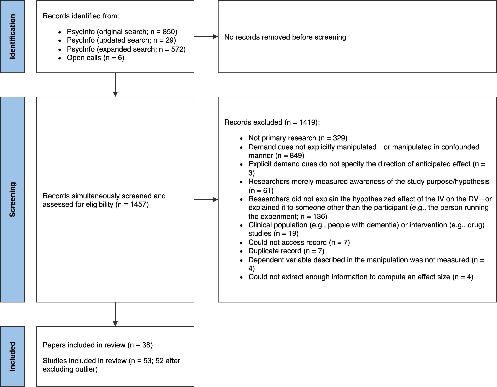

```{r setup, include = F}
# load writing and data processing packages
library("papaja")
library("tidyverse")
library("readxl")
library("cowplot")

# load meta-analyses packages
library("metafor")
library("weightr")
library("PublicationBias")
library("dmetar")

# load mixed-effect regression packages
library("lme4")
library("lmerTest")
library("emmeans")

# identify paper references
r_refs("r-references.bib")

# turn scientific notation off
options(scipen = 999)

# set seed to year of lead author's favorite [unfinished] album, SMiLE
set.seed(1967)

# set theme
theme_set(theme_classic())
```

```{r session.info, eval = F}
# note: this code is set to not evaluate. 
# for computational reproducibility purposes, the code exports package version info to a text file
# this will help others see which package versions were used when the code was written
writeLines(text = sessionInfo() %>% 
             capture.output(), 
           con = "sessionInfo.txt")
```

"All scientific inquiry is subject to error, and it is far better to be aware of this, to study the sources in an attempt to reduce it, and to estimate the magnitude of such errors in our findings, than to be ignorant of the errors concealed in the data" [@hyman1954interviewing, p. 4]

Imagine that one day a mysterious group of people approach you and begin telling you about a method they invented for understanding humans. They tell you that their method is useful for estimating causal relationships, but add that there is an issue: it can sometimes be thrown off by a *methodological artifact*. They explain that this artifact sometimes causes them to detect an effect that is not real, and other times miss an effect that *is* real; that it sometimes makes an effect appear bigger than it actually is, and other times smaller. And that, in general, it is unclear when, why, and to what extent this artifact impacts their conclusions.

The above scenario, we argue, serves as an abstraction of a methodological puzzle in experimental psychology: the role of *demand characteristics*.

In a seminal paper published over a half century ago, Martin Orne argued that human subjects are perceptive to demand characteristics -- "cues which convey an experimental hypothesis" -- and generally use these cues to help the experimenter confirm their hypothesis [-@orne1962social, p. 779]. Orne initially presented evidence that demand characteristics can lead to false positives, such as patients exhibiting sham symptoms of hypnosis. However, later research helped establish that demand characteristics can also lead to false negatives. For example, participants will ignore visual cues of depth when they believe that disregarding them is the purpose of the experiment [@hayes1967two]. In addition to creating inferential errors, demand characteristics can bias estimates of causal relationships. For example, the effects of facial poses on self-reported emotion can be exaggerated *or* underestimated depending on whether the experimenter communicates expectations of positive or nil effects [@coles2022fact]. Puzzlingly, though, demand characteristics do not always seem to matter. For example, in a set of large replications of classic studies in behavioral economics, explicit manipulations of demand characteristics consistently failed to produce significant changes in participants' responses (Mummolo & Peterson, 2019).

As this short review illustrates, demand characteristics presents several similarities to the methodological artifact described in the opening of this paper. Demand characteristics are a literal textbook methodological concern in experimental psychology [@sharpe2016frightened] that (a) can lead to both false positives and false negatives, (b) can create both upward bias and downward bias, but (c) don’t always appear to matter. In the present work, we take stock of progress on this puzzle via a meta-analysis of a unique methodological response: experiments *on* explicit demand characteristics. To begin, we review the theoretical and conceptual frameworks that guided the investigation.

## How do demand characteristics alter participant responses?

One of the most influential frameworks for conceptualizing the effects of demand characteristics was developed by Rosnow and colleagues [@rosnow1997people; @rosnow1973mediation; @strohmetz2008research]. In this framework, they identified three factors that create heterogeneity in the effects of demand characteristics: (1) receptivity to cues, (2) motivation to provide hypothesis-consistent responses, and (3) opportunity to alter responses.

To start, Rosnow and colleagues reasoned that participants must be receptive to demand characteristics for there to be subsequent shifts in participants' responses. As an extreme example, imagine that a researcher hands an infant a sheet of paper that precisely explains the study hypothesis. Demand characteristics are certainly present, but they are not predicted to have an impact because the infant is not receptive to the cues. Furthermore, even if the infant possessed the astonishing ability to read, it's possible they would misunderstand the cues [@corneille2022sixty] -- which could be considered another form of non-receptivity.

If participants correctly interpret demand characteristics, Rosnow and colleagues theorized that subsequent changes in participants' responses would be driven by their motivation (or lack thereof) to provide hypothesis-consistent responses. For historical context, early work on demand characteristics was marked by debates about the extent to which participants are motivated to (a) help the researcher confirm their hypothesis [@orne1962social], (b) receive positive evaluations [@riecken1962program; @sigall1970cooperative], (c) interfere with the purpose of the study [@cook1970demand; @masling1966role], or (d) follow directions as closely as possible [@fillenbaun1970more]. Rosnow and colleagues advanced this line of thinking by illustrating that participants have *multiple* shifting motivations in mind when they conceptualize their roles as subjects [@rosnow1997people; see also @silverman1965demand]. For example, participants appear to be motivated to increase performance on simple tasks when told that this is the experimenter's expectation -- but not when the experimenter adds that the increase in performance will be indicative of a negative personality trait [@sigall1970cooperative]. Rosnow and colleagues, thus, suggested that participants in any given context can be characterized as being overall motivated to either: (a) *non-acquiesce* (i.e., not change their responses based on knowledge about the hypothesis), (b) *acquiesce* (i.e., provide hypothesis-consistent responses), or (c) *counter-acquiesce* (i.e., provide hypothesis-inconsistent responses).

If participants are motivated to adjust their response, Rosnow and colleagues theorized that subsequent changes in participants' responses would then be driven by their ability to alter the outcome of interest. As elaborated by @corneille2022sixty, this could occur through faking, imagination, or phenomenological control (voluntary changes experienced by the participant as involuntary). Taking this third moderator -- opportunity -- into account, Rosnow and colleagues concluded that demand characteristics bias responses when participants (1) notice the cues, (2) are motivated to adjust their responses, and (3) can adjust their responses.

Other researchers have since expanded upon and/or challenged parts of Rosnow and colleagues' framework. For example, by elaborating upon underlying mechanisms like imagination, @corneille2022sixty more explicitly highlighted that participants can willingly change many outcomes that may initially seem outside their control. For example, a participant who wants to help a researcher confirm that a manuscript reviewing research artifacts is physiologically arousing could likely do so by simply imagining a physiologically arousing context. Relatedly, @coles2022fact argued that demand characteristics may sometimes impact participants in motivation-irrelevant manners -– e.g., via conditioned responses or other mechanisms discussed in conceptually-related work on placebo effects [@stewart2004placebo]. Regardless of proposed mechanisms, these frameworks converge on a prediction: the effects of demand characteristics will be heterogeneous.

## Experiments on demand characteristics

Rosnow and colleagues’ framework emerged during a time when researchers increasingly began conducting experiments on demand characteristics [@mcguire2009suspiciousness]. For example, @orne1964contribution reported that participants were more likely to report sensory deprivation side-effects (e.g., hallucinations) when told that "...Such experiences are not unusual under the conditions to which you are to be subjected". Similarly, @perry1978demand found that participants were more likely to exhibit film-induced aggressive behavior when told that the researcher anticipated such a response.

Experiments like these manipulate what we will call *explicit demand characteristics* (EDCs). @orne1962social defined demand characteristics broadly – as *any* cue that impacts participants’ beliefs about the purpose of the study. This not only includes explicit information from the experimenter (i.e., EDCs), but also more subtle information, like rumors, television shows, and courses. These more subtle sources are, of course, important to study – but more difficult to precisely manipulate. Thus, we suspect that the choice to study EDC’s is more so based on methodologically convenience.

Despite their convenience, EDCs have a notable limitation: they are not representative of the typical experimental context, wherein experimenters usually refrain from disclosing their hypotheses. Thus, the methodology has been adopted with some trepidation. For example, Orne warned that EDCs may cause participants to “lean over backwards to be honest” (i.e., non-acquiesce; 1962, p. 779) or engage in “paradoxical action” (i.e., possibly counter-acquiesce; 2009, p. 116). However, Orne also used the method in his own work – often finding that participants’ responses are indeed influenced by EDCs (e.g., Orne and Scheibe, 1964). Over the next few decades, dozen more studies would follow, providing an opportunity to evaluate the magnitude, consistency, and potential moderators of such effects via meta-analysis. 

# Methodology

We defined the scope of the meta-analysis using the Population, Intervention, Comparison, Outcome framework for structuring research questions [@schardt2007utilization].

Our population-of-interest was human subjects participating in non-clinical psychology experiments. Given that there is a sizable literature and number of reviews on conceptually-related placebo effects, excluding clinical studies improved the feasibility and reduced the redundancy of our work. The intervention-of-interest was explicit demand characteristics (EDCs) -- operationalized as scenarios where a researcher tells participants about the effect of an independent variable on a dependent variable. Our comparison-of-interest were conditions where either no hypothesis or a different hypothesis was communicated to participants. Last, the outcome-of-interest was the dependent variable described in the communicated hypothesis. For example, in a study that manipulated whether the intervention is described as "mood-boosting", the outcome-of-interest would be any measure of mood.

### Literature search

```{r literature search, include = F}
# open and process literature search data
DF.s <- 
  # open data
  read_xlsx(path = "data/metaware_EsData_raw.xlsx",
            sheet = "records.screening") %>% 
  
  # identify:
  # unpublished dissertations by identifying links that contain the word 'dissertation' AND
  # records identified manually by identify links that contain 'NA'
  mutate(unpub = 
           if_else(condition = grepl("dissertation", link) |
                     link == "NA",
                   true = 1,
                   false = 0)
         )

# calculate number of records from PsycInfo by removing all records with no known database (i.e., ones that were personally found)
r.pub <- DF.s %>% 
  filter(unpub == 0) %>% 
  nrow()

# calculate number of unpublished records (i.e., dissertations)
r.unp <- DF.s %>% 
  filter(unpub == 1) %>% 
  nrow()
```

```{r prisma.info, include = F}
records.per.search <- DF.s %>% 
  group_by(database) %>% 
  summarise(n = n())
```

Figure \@ref(fig:prisma) provides a PRISMA-style flowchart summarizing our literature search and screening process [@page2021prisma].

The literature search was initially developed in consultation with a librarian at (anonymous for peer review) and later expanded based on reviewer feedback. On January 12, 2022, we searched APA PsycInfo using broad search terms: "demand characteristics" OR "hypothesis awareness" (*n* = `r records.per.search[1,2]` records identified). On April 17, 2024, we repeated the search to identify records published after the initial search (*n* = `r records.per.search[4,2]` records identified). At that time, we also expanded the search to include conceptually similar terms found in the appendix of Rosnow and Rosenthal's [-@rosnow1997people] book on experimental artifacts: “participant role” OR “demand effects” OR “good subject effect” OR “expectancy effect” OR “evaluative apprehension” (*n* = `r records.per.search[3,2]` records identified). We also released a call for unpublished studies on the Society for Personality and Social Psychology Open Forum, Twitter, the Facebook Psychological Methods Discussion group, and the Facebook PsychMAP group (*n* = `r records.per.search[2,2]` records identified).

Our search did not have language or date restrictions, and ultimately yielded `r r.pub + r.unp` records (`r r.unp` of which were unpublished).

```{r prisma, fig.cap = "PRISMA-style flowchart illustrating the identification, screening, and selection of studies."}

```

### Screening

```{r final.df, include = F}
# open clean effect size data
DF.es <- 
  read_csv(file = "data/metaware_meta_clean.csv")

# identify total number of studies (denoted by id.study column)
num.s <- DF.es$id.study %>% 
  unique() %>% 
  length()

# identify total number of papers (denoted by name column)
num.p <- DF.es$name %>% 
  unique() %>% 
  length()

# for the known outlier (id = 18), give an example of the largest effect size
outlier.es <- DF.es %>% 
  filter(id.study == 18) %>% 
  summarise(max.es = min(es)) %>% #  using min because largest value is neg
  round(2)
```

Records must have met the following criteria to be eligible for inclusion:

-   The researcher manipulated what participants were told about the effect of an independent variable on a dependent variable.[^2] In most cases, the effect of the independent variable was described explicitly, but there were some included studies where it was strongly implied.

-   The demand characteristics manipulation was not strongly confounded with another manipulation. For example, we excluded a study by @sigall1970cooperative because the manipulation of the stated hypothesis was confounded with a disclosure about the meaning of the behavior (i.e., that confirming the hypothesis would be indicative of an obsessive-compulsive personality disorder).

-   A non-clinical population was studied.

-   Information necessary for computing at least one effect size was included.

[^2]: We excluded conditions where the researcher communicated a *non-directional* effect. We did so because we worried participants in these scenarios could not unambiguously infer how the researcher expected their response to change. For example, if participants were told that an independent variable would "impact mood", it is not clear if participants should infer that the mood will be boosted or dampened.

Figure \@ref(fig:prisma) more thoroughly summarizes exclusion criteria. In instances where multiple exclusion criteria applied, coders were asked to choose only one option.

N. C. and M. W. screened records independently, reviewed potentially relevant records together, and worked together to code the information for moderator analyses and effect size computations. Any disagreements were resolved through discussion. Abstracts and (if necessary) full texts were reviewed in a single step so that records did not have to be reviewed twice during screening. In total, `r num.s` studies from `r num.p` records were eligible for inclusion. However, one record [@allen2012demand] was removed because the information provided led to implausibly large effect size estimates (e.g., $d$ = `r outlier.es`).

```{r clean.env.1, include = F}
# remove outlier and re-initialize id factors
DF.es <- DF.es %>% 
  filter(id.study != 18) %>% 
  mutate(id.study = factor(id.study),
         id.es = factor(id.es))

# clean environment
rm(DF.s, r.pub, r.unp, num.s, 
   num.p, outlier.es, records.per.search)
```

### Effect size index

We used standardized mean difference scores with small-sample correction (Hedge's $g$) as our effect size index [@borenstein2009effect; @cohen1988statistical].

In most cases (67%), we estimated the main effect of EDCs. For example, @coles2022fact manipulated whether participants were told that posing smiles would increase happiness. Here, the main effect of EDCs was computed by comparing happiness ratings from smiling participants who were either informed or not informed of the mood-boosting effect of smiling.

In other cases (33%), we estimated the *interactive* effect of EDCs. For example, in the same @coles2022fact study, participants provided happiness ratings both after smiling and scowling. Participants' mood generally improved when smiling vs. scowling (i.e., there was a main effect of facial pose). However, the difference was more pronounced when participants were told about the mood-boosting effects of smiling. In other words, there was an interaction between facial pose and EDCs. In this scenario, the interactive effect of EDCs was computed by calculating a standardized difference-in-differences score.

Effect sizes were calculated so that positive values indicated an effect consistent with the communicated hypothesis. For example, if participants were told that an intervention would be mood boosting, an increase in mood would be coded as a positive effect. If, however, participants were told that the intervention would be mood *dampening*, that same increase in mood would be coded as a negative effect.

```{r corr.sens, include = F}
# examine how assumed repeated measures correlation impacts general pattern of results

# get list of sensitivity dataframes
sens.df.list <- list.files(path = "./data/r_sensitivity")

# (1) open dataframe, (2) compute intercept-only model, (3) extract overall es
sens.res <- 
  sapply(X = sens.df.list, 
         FUN = function(i){
           # open data
           df <- read.csv(paste0("data/r_sensitivity/",
                                    i)
                             ) 
           # fit model
           m <- rma.mv(yi = es,
                       V = es.var,
                       data = DF.es,
                       random = ~ 1 | id.study / id.es) %>% 
             robust(x = .,
                    cluster = id.study,
                    clubSandwich = T)
           
           # return overall es as a number
           m$b %>% 
             as.numeric() %>% 
             return()
           }
         )

# compute range of es values
sens.range <- max(sens.res) - min(sens.res)

# delete vestigial
rm(sens.df.list, sens.res)
```

We calculated Hedge's $g$ by applying a small sample correction to Cohen's $d_{s}$ (for between-subject designs) and $d_{rm}$ (for within-subject designs[^3]) estimates. Whenever possible, we used the *M*'s and *SD*'s reported in a paper to compute Cohen's *d*. If these values were not reported, we used (in order of preference), (1) *t*-values, (2) descriptive statistics extracted from figures (e.g., bar charts) using the WebPlotDigitizer [@drevon2017intercoder], (3) *F*-values, or (4) *p*-values. In instances where relevant information was not provided but the statistical significance and direction of the effect was described, we assumed *p*-values of .04 and .50 for statistically significant and non-significant effects respectively [e.g., @kenealy1988validation]. In a few instances, an outcome variable in a study was discrete, as opposed to continuous [e.g., @orne1964contribution]. In these cases, we approximated a Cohen's *d* score based on a transformation of the log odds ratio [@borenstein2011introduction].

[^3]: For repeated-measure comparisons, the correlation between the repeated measures is needed to calculate Cohen's $d_{rm}$. This correlation is rarely reported, so we followed a recommendation by @borenstein2009effect and performed sensitivity analyses on an assumed correlation. We preregistered a default correlation of $r$ = .50 but performed sensitivity analysis with $r$ = .10, .30, .50, .70, and .90. These sensitivity analyses produced virtually no change in overall effect size estimates, so we do not discuss them further.

```{r mult.eff, include = F}
# calculate percentage of studies with multiple effect sizes
mult.eff.per <- DF.es %>% 
  # identify number of effect sizes for each study (id)
  group_by(id.study) %>% 
  count() %>% 
  
  # code whether each study has more than one effect size
  mutate(dep = if_else(condition = n > 1,
                       true = 1,
                       false = 0)
         ) %>% 
  
  # calculate proportion of studies with more than one effect size 
  ungroup() %>% 
  summarise(mult.eff = mean(dep)) %>% 
  
  # export as percentage
  as.numeric() %>% 
  round(digits = 2) * 100
```

Nearly all studies (`r mult.eff.per`%) contained multiple effect sizes of interest. For example, the full design in @coles2022fact included a positive demand, nil demand, and control condition. Participants also completed several facial expression poses (happy, angry, and neutral) and self-reported several emotions (happiness and anger). To be comprehensive, we recorded all reported effect sizes and accounted for dependencies using three-level meta-analysis (described later).

### Potential study feature moderators

The studies we included in our meta-analysis were methodologically varied (for more information, see *Results* and *Limitations*). Below, we describe study features we coded as potential moderators of the effects of EDCs:

-   *Group comparison.* Most studies included in our meta-analysis examined the effects of *positive demand*, wherein participants were told that the dependent variable will increase. However, a notable subset of studies examined the impact of *negative demand* (participants told that the dependent variable will decrease) or *nil demand* (participants told the dependent variable will be unaffected). Often these conditions were compared to a *control* condition, wherein participants were not told about an effect of an independent variable on a dependent variable. Less often, one demand condition was compared to another.

-   *Control vs. non-control group comparison.* Demand effects should presumably be additive. For example, imagine a study where the effect of a task is either (a) not described at all (a control condition), (b) described as mood-boosting (positive demand) or (c) described as mood-dampening (negative demand). Further imagine that participants are motivated and able to adjust their responses. Compared to the control condition, participants' moods are predicted to be boosted in the positive demand condition and dampened in the negative demand condition. If this is the case, the mean difference in mood should be larger when the positive demand condition is compared to the negative demand condition (as opposed to the control condition). To test this, we coded whether comparisons were made to a control group or a different demand condition. 

-   *Control group comparison.* Instances where a demand characteristic condition was compared to a control group also allowed us to test whether participants' responses shift more when the researcher hypothesizes an increase (positive demand), a decrease (negative demand), or no change in the dependent variable (nil demand).

-   *Design of demand characteristics manipulation.* Whether EDCs were manipulated within- vs. between-subjects.

-   *Participant pool.* Whether students, non-students (e.g., MTurk workers), or a mix of students and non-students were sampled.

-   *Setting.* Whether the study was conducted online or in-person.

-   *Payment.* Whether participants were paid or unpaid.

-   *Publication status.* Whether the study was published or unpublished.

For descriptive purposes, we also coded the country where the investigation was performed. 

### Meta-analytic approach

For our meta-analytic approach, we used three-level meta-analysis (3LMA; also referred to as "multilevel" meta-analysis). Rather than assume that there is a single true effect of EDCs, 3LMA assumes that there is a distribution containing *multiple true effects*. To separate variability in these true effects from sampling error, 3LMA models three sources of variability: sampling error of individual studies (level 1), variability within studies (level 2), and variability between studies (level 3).

We fit all models using the metafor package [@R-metafor] in R [@R-base]. We weighed effect sizes based on their inverse-variance and used cluster-robust methods for estimating variance-covariance matrices [@pustejovsky2018small]. To estimate the overall effect size, we fit an intercept-only 3LMA model. We conducted moderator analyses by separately entering variables into a new model. In doing so, we hoped to avoid issues with collinearity and overfitting. Categorical moderators were dummy coded. To test the statistical significance of each moderator, we used model comparison *F*-tests. To estimate effect sizes within each subgroup of the moderator, we used model-derived estimates.

```{r clean.env.2, include = F}
# delete vestigial
rm(mult.eff.per, sens.range)
```

#### Publication bias analyses

We used three main approaches for assessing and correcting for potential publication bias in our estimation of the overall effect of EDCs.

First, we visually examined *funnel plots,* wherein observed effect sizes are plotted against a measure of their precision (e.g., standard error). In the absence of publication bias, the distribution typically resembles a funnel; relatively large studies estimate the effect with high precision, and effect sizes fan out in *both* directions as the studies become smaller. If, however, statistically non-significant findings are disproportionately omitted from the scientific record (i.e., there is publication bias), the distribution is often asymmetric/sloped. Funnel plots traditionally contain one effect size per study, but many of our studies included multiple relevant effect sizes. Thus, we examined two funnel plots: one with all effect sizes and one with the dependent effect sizes aggregated[^6].

[^6]: For effect size aggregation, we assumed a default dependent effect size correlation of $r$ = .50 but performed sensitivity analysis with $r$ = .10, .30, .50, .70, and .90. These sensitivity analyses did not change our overall conclusion about publication bias, so we do not discuss them further.

Second, we conducted precision-effect tests (PET). In PET, the relationship between observed effect sizes and their standard errors -- which is often absent when there is no publication bias -- is estimated and controlled for in a meta-regression model [@stanley2014meta]. The slope of this model is often interpreted as an estimate of publication bias, and the intercept is often interpreted as the bias-corrected overall effect. These precision-effect tests were developed and validated for meta-analyses with independent effect sizes. Nonetheless, @rodgers2021evaluating demonstrated that the method retains fairly good statistical properties when (1) 3LMA is used, or (2) dependent effect sizes are aggregated and modeled using random-effects (i.e., two level) meta-regression. We used both approaches.

Third, we deployed weight-function modeling using the weightR package [@R-weightr]. In weight-function modeling, weighted distribution theory is used to model biased selection based on the statistical significance of observed effects [@vevea1995general]. If the adjusted model provides increased fit, publication bias is a concern and the model can be used to estimate the bias-corrected overall effect size. Once again, weight-function modeling was designed for independent effect sizes. Nonetheless, it has fairly good statistical properties when non-independent effect sizes are aggregated, which we did here [@rodgers2021evaluating].

As a sensitivity analysis, we used the PublicationBias package in R [@R-PublicationBias] to estimate the ratio in which publication bias would have to favor affirmative studies in order make the overall effect size in a robust random effects model non-significant [@mathur2020sensitivity]. We also estimated the difference in the magnitude of published vs. unpublished effects in a moderator analysis.

### Transparency and openness

The project pre-registration, materials, data, and code are openly available at <https://osf.io/3hkre/?view_only=2dc92af53f194e5eab0d7aecafaf01c2>. This link also contains a list of amendments/deviations we made to our pre-registration as the project evolved and we responded to reviewer feedback. Sample size was determined by the availability of relevant records. All code has been checked for reproducibility, including a script that creates a computationally reproducible manuscript using the papaja R package [@R-papaja].

## Results

```{r overall, include = F}
# estimate overall effect size
overall <- 
  rma.mv(yi = es,
         V = es.var,
         data = DF.es,
         random = ~ 1 | id.study / id.es)

# calculate I2
overall.i2 <- overall %>% 
  mlm.variance.distribution()

# make overall effect size results robust
overall <- overall %>% 
  robust(x = .,
         cluster = id.study,
         clubSandwich = T)

# estimate standard deviation of effect size distribution (i.e., Tau)
# to do so, combine both sources of estimated variability in the model
tau <- sqrt(overall$sigma2[1] + overall$sigma2[2])

# estimate proportion of hypothesis-consistent and inconsistent responding
# -0.10 < d > 0.10 is the arbitrary threshold for saying it's neither consistent or inconsistent
h.c <- pnorm(q = .10,
             mean = overall$b,
             sd = tau, 
             lower.tail = F) %>% 
  round(digits = 2) * 100

h.i <- pnorm(q = (-.10),
             mean = overall$b,
             sd = tau,
             lower.tail = T) %>% 
  round(digits = 2) * 100

# prediction interval
pi <- predict(overall)
```

In total, we analyzed `r overall$k` effect sizes from `r overall$n` studies from between the years `r DF.es$year %>% min()` and `r DF.es$year %>% max()` (*M* = `r DF.es$year %>% mean() %>% round(0)`, *SD* = `r DF.es$year %>% sd()`). Of these studies, `r DF.es %>% filter(published == 'no') %>% reframe(n.study = unique(id.study)) %>% nrow()` were unpublished.

In order of frequency, effect sizes represented a positive demand compared to a control group (*k* = `r DF.es %>% filter(ref.type == 'cvp') %>% nrow()`), positive demand to negative demand (*k* = `r DF.es %>% filter(ref.type == 'pvn') %>% nrow()`), negative demand to a control group (*k* = `r DF.es %>% filter(ref.type == 'nvc') %>% nrow()`), positive demand to a nil demand group (*k* = `r DF.es %>% filter(ref.type == 'pvz') %>% nrow()`), or nil demand to a control group (*k* = `r DF.es %>% filter(ref.type == 'cvz') %>% nrow()`).Effect sizes tended to compare one demand condition to a control group (*k* = `r DF.es %>% filter(ref.r == "single") %>% nrow()`) – as opposed to a group exposed to a different type of demand condition (*k* = `r DF.es %>% filter(ref.r == "double") %>% nrow()`). Regardless of what type of demand manipulation was used, it was more common to manipulate the cues between (*k* = `r DF.es %>% filter(design == "between") %>% nrow()`) vs. within subjects (*k* = `r DF.es %>% filter(design == "within") %>% nrow()`).

Most effect sizes came from student samples (*k* = `r DF.es %>% filter(student == "yes") %>% nrow()`), although some samples were non-students (*k* = `r DF.es %>% filter(student == "no") %>% nrow()`), a mix of students and non-students (*k* = `r DF.es %>% filter(student == "mix") %>% nrow()`), or not described thoroughly enough to make a determination (*k* = `r DF.es %>% filter(is.na(student)) %>% nrow()`). Most effect sizes came from unpaid samples (*k* = `r DF.es %>% filter(paid == "no") %>% nrow()`), although some were paid (*k* = `r DF.es %>% filter(paid == "yes") %>% nrow()`) and some were not described thoroughly enough to make a determination (*k* = `r DF.es %>% filter(is.na(paid)) %>% nrow()`). Most effect sizes came from in-person studies (*k* = `r DF.es %>% filter(online == "no") %>% nrow()`), but some were from online studies (*k* = `r DF.es %>% filter(online == "yes") %>% nrow()`) or not described thoroughly enough to make a determination (*k* = `r DF.es %>% filter(is.na(online)) %>% nrow()`). Most research was conducted in the United States (*k* = 127), United Kingdom (*k* = 49), Canada (*k* = 21), and the Netherlands (*k* = 18). However, occasionally, we found work conducted in France (*k* = 9), Kenya (*k* = 6), Australia (*k* = 3), Belgium (*k* = 2), Turkey, Poland, Malaysia, and Denmark (all *k* = 1).

### Overall results

Overall, results indicated that EDCs cause participants' responses to shift in a manner consistent with the communicated hypothesis, $g$ = `r overall$b`, 95% CI [`r overall$ci.lb`, `r overall$ci.ub`], $t$(`r overall$dfs %>% round(2)`) = `r overall$zval`, $p$ `r printp(overall$pval)`. As a hypothetical example, if participants were told that the researcher hypothesizes that an intervention will improve mood (positive demand), they would generally report slightly improved moods; if told that the researcher hypothesizes that an intervention will worsen mood (negative demand), they would generally report slightly worsened moods.

```{r forest, fig.cap = "Forest plot of effect sizes (grey diamonds), their 95% confidence intervals (grey error bars), and their citations (left). For visualization purposes, effect sizes are aggregated within-studies (see openly-available data for non-aggregated effect sizes). The estimated effect size distribution is also shown and colored based on whether EDCs produce more hypothesis-consistent responding (green; g > 0.10), more hypothesis-inconsistent responding (red; g < -0.10), or negligible shifts in responding (grey; |g| < 0.10).", fig.height = 6.64, fig.width = 6.5, warning = F}
# create a temporary dataset that (a) aggregates dependent effect sizes, and (b) computes 95% CI's
tmp <- DF.es %>%
  # convert to an 'escalc' object so function can run
  escalc(yi = es,
         vi = es.var,
         data = DF.es,
         measure = "SMD") %>% 
  
  # delete vestigial: es is now yi; es.var is now vi
  select(-c(es, es.var)) %>% 
  
  # aggregate dependencies
  aggregate(x = .,
            cluster = id.study,
            rho = .5) %>% 
  
  # compute CI's
  rowwise() %>% 
  mutate(se = sqrt(vi),
         ub = yi + (se * 1.96),
         ub = round(ub, 2),
         lb = yi - (se * 1.96),
         lb = round(lb, 2),
         yi = round(yi, 2)) %>% 
  ungroup() %>% 
  arrange(yi, id.study)

# create a forest plot w/ distribution overlay
ggplot(data = tmp, 
       aes(y = rev(1: nrow(tmp)) * .05, 
           x = yi,
           xmin = lb,
           xmax = ub)) +
  
  #hypothesis inconsistent effects
  ## area
  geom_area(stat = "function", 
            fun = dnorm,
            args = list(mean = overall$b, 
                        sd = tau),
            fill = "#F8766D", 
            alpha = .25,
            xlim = c(-2, -.10)) +
  
  # negligible effects
  ## area
  geom_area(stat = "function", 
            fun = dnorm,
            args = list(mean = overall$b, 
                        sd = tau),
            fill = "grey80", 
            alpha = .25,
            xlim = c(-.10, .10)) +
  
  # hypothesis consistent effects
  ## area
  geom_area(stat = "function", 
            fun = dnorm,
            args = list(mean = overall$b, 
                        sd = tau),
            fill = "#00998a", 
            alpha = .25,
            xlim = c(.10, 2)) +
  
  # create dotted line at d = 0
  geom_vline(xintercept = 0, 
             color = "black", 
             linetype = "dotted", 
             alpha = .5, 
             size =.5)  +

  # add points and error bars
  geom_point(shape = "diamond",
             size = 2.5,
             alpha = .8,
             color = "dark grey") +
  geom_errorbarh(height = .005,
                 size = .75,
                 alpha = .8,
                 color = "dark grey") +
  
  # add citation label
  geom_text(aes(label = citation),
            x = -3.15,
            hjust = 0,
            size = 2.5) +
  
  # add CI label
  geom_text(aes(label = paste0(yi,
                               " [", lb, ", ", ub, "]")),
            x = 3.6,
            size = 2.5,
            hjust = 1) +
  
  labs(x = expression(paste("Hedge's ", italic("g"))),
       y = "density") +
  
  # increase plotting area
  scale_x_continuous(limits = c(-3.25, 3.75),
                     breaks = seq(from = -2, to = 2, by = 1),
                     expand = c(.01, .01)) +
  scale_y_continuous(expand = c(.005, 0))

```

As a reminder, rather than assuming that there is a *single true effect* of EDCs, 3LMA assumes a distribution of *multiple true effects.* Consistent with this assumption, observed variability in the effects of EDCs exceeded what would be expected from sampling error alone (between-study $\tau$ = `r sqrt(overall$sigma2[1])`, $I^2$ = `r overall.i2[["results"]][["I2"]][3]`; within-study $\sigma$ = `r sqrt(overall$sigma2[2])`, $I^2$ = `r overall.i2[["results"]][["I2"]][2]`; total $Q$(`r overall$k - 1`) = `r overall$QE`, $p$ `r printp(overall$QEp)`, total $I^2$ = `r overall.i2$totalI2`). 3LMA often assumes that the multiple true effects form a normal distribution, which we recreated based on estimates of the average effect size and variability attributed to sources other than sampling error (between-study $\tau$ + within-study $\sigma$). As shown in Figure \@ref(fig:forest), this estimated distribution suggests that EDCs can have a wide range of effects. Indeed, the 95% prediction interval for a single future study ranges from $g$ = `r pi$pi.lb %>% round(2)` to $g$ = `r pi$pi.ub %>% round(2)`.

```{r neg.demand, include = F}
# compute number of effect sizes that were negative and significant
neg.demand.raw <- DF.es %>% 
  filter(ub < 0) %>% 
  nrow()

# compute number of *aggregated* effect sizes that were negative and significant
neg.demand.agg <- tmp %>%
  filter(ub < 0) %>% 
  nrow()
  
rm(tmp)
```

As a heuristic, we arbitrarily classified any effect size less than 0.10 standard deviation in either direction (i.e., \|$g$\| \< .10) as "negligible". Based on this classification, the estimated distribution of effects suggested that EDCs most often produce hypothesis-consistent shifts (`r h.c`%), but sometimes produce negligible shifts (`r 100 - h.c - h.i`%) or shifts in the *opposite* direction of the communicated hypothesis (`r h.i`%). Such results are consistent with Rosnow and colleagues' prediction that demand characteristics can lead to both hypothesis-consistent and hypothesis-*inconsistent* shifts in participants' responses.

```{r clean.env.99, include = F}
rm(neg.demand.raw, neg.demand.agg)
```

### Moderator analyses

```{r mod, include = F}
# create moderator analysis function
ModAnalysis = function(m, df = DF.es) {
  
  # set dataset
  df <- df
  
  # moderator analysis
  mod.m <- rma.mv(yi = es,
                  V = es.var,
                  data = df,
                  random = ~ 1 | id.study / id.es,
                  mods = as.formula(paste0("~ ", m)),
                  test= "t") %>% 
    robust(x = .,
           cluster = id.study,
           clubSandwich = T)
  
  sub.m <- rma.mv(yi = es,
                  V = es.var,
                  data = df,
                  random = ~ 1 | id.study / id.es,
                  mods = as.formula(paste0("~ 0 + ", m)),
                  test= "t") %>%
  robust(x = .,
         cluster = id.study,
         clubSandwich = T)
  
  # return results as list
  return(list(mod = mod.m,
              sub = sub.m)) 
}

# conduct moderator and subgroup analyses for moderators assessed with full dataset 
mod.l <- c("student", "paid", "online", 
           "design", "ref.r", "published",
           "year", #"att",
           
           # exploratory quality control measures
           'report', 'internal',
           
           # exploratory type of effect size
           "comparison")
mod.r <- 
  sapply(X = mod.l,
         simplify = F,
         FUN = ModAnalysis)

rm(mod.l)

# test ref.type moderator in scenarios where there is a control comparison (i.e., ref.r == single)
mod.r[["ref.type"]] <- 
  ModAnalysis(m = "ref.type",
              df = DF.es[DF.es$ref.r == "single", ])

# test all ref.type
mod.r[["ref.type.full"]] <- 
  ModAnalysis(m = "ref.type")

# add attention, motivation, opportunity, belief, and prediction moderators
## Note: comparisons with nil-demand conditions are excluded
mod.r.2 <- 
  sapply(X = c("att", "mot", "opp", "bel", "pre"),
         simplify = F,
         FUN = ModAnalysis,
         df = DF.es %>% 
               filter(ref.type != "cvz",
                      ref.type != "pvz"))

# retest attention, motivation, opportunity, belief, and prediction moderators in situations where there is only a control group
mod.r[["att.control"]] <- 
  ModAnalysis(m = "att",
              df = DF.es %>% 
                filter(ref.r == "single",
                       ref.type != "cvz",
                       ref.type != "pvz"))

mod.r[["mot.control"]] <- 
  ModAnalysis(m = "mot",
              df = DF.es %>% 
                filter(ref.r == "single",
                       ref.type != "cvz",
                       ref.type != "pvz"))

mod.r[["opp.control"]] <- 
  ModAnalysis(m = "opp",
              df = DF.es %>% 
                filter(ref.r == "single",
                       ref.type != "cvz",
                       ref.type != "pvz"))

mod.r[["bel.control"]] <- 
  ModAnalysis(m = "bel",
              df = DF.es %>% 
                filter(ref.r == "single",
                       ref.type != "cvz",
                       ref.type != "pvz"))

mod.r[["pre.control"]] <- 
  ModAnalysis(m = "pre",
              df = DF.es %>% 
                filter(ref.r == "single",
                       ref.type != "cvz",
                       ref.type != "pvz"))

# explore possible higher-order interactions
## center continuous variables
mod.r[["att.mot.opp.int"]] <- 
  ModAnalysis(m = "att * mot * opp",
              df = DF.es %>% 
                filter(ref.type != "cvz" &
                         ref.type != "pvz"))

## combine results
mod.r = c(mod.r, mod.r.2)

# delete vestigial 
rm(mod.r.2)
```

When variability in effect sizes exceeds what would be expected from sampling error alone, it suggests the presence of moderators. Below, we examine several potential candidates.

#### Study features

In general, we did not find much evidence that the effects of EDCs are moderated by study features (see Table 1). The two exceptions were (1) whether the demand characteristics condition was compared to a control group (vs. another condition with EDCs), and (2) whether the study was conducted in-person (vs. online).

The effects of EDCs were estimated to be twice as large when two demand characteristic conditions were compared ($g$ = `r mod.r$ref.r$sub$b[1]`, 95% CI [`r mod.r$ref.r$sub$ci.lb[1]`, `r mod.r$ref.r$sub$ci.ub[1]`], $p$ `r printp(mod.r$ref.r$sub$pval[1])`), as opposed to one demand characteristic condition being compared to a control group ($g$ = `r mod.r$ref.r$sub$b[2]`, 95% CI [`r mod.r$ref.r$sub$ci.lb[2]`, `r mod.r$ref.r$sub$ci.ub[2]`], $p$ = `r printp(mod.r$ref.r$sub$pval[2])`), $F$(`r mod.r$ref.r$mod$QMdf[1]`, `r mod.r$ref.r$mod$QMdf[2]`) = `r mod.r$ref.r$mod$QM`, $p$ = `r printp(mod.r$ref.r$mod$QMp)`. This suggests that the effects of EDCs are additive. However, these results should be interpreted with some caution, as a broader test of whether *all* specific types of comparisons varied was not statistically significant, $F$(`r mod.r$ref.type.full$mod$QMdf[1]`, `r mod.r$ref.type.full$mod$QMdf[2]`) = `r mod.r$ref.type.full$mod$QM`, $p$ = `r printp(mod.r$ref.type.full$mod$QMp)`.

Instances where a demand characteristic condition was compared to a control group allowed us to test whether participants' responses shift more when they expect that the researcher hypothesizes an increase (i.e., positive demand; $g$ = `r mod.r$ref.type$sub$b[1]`, 95% CI [`r mod.r$ref.type$sub$ci.lb[1]`, `r mod.r$ref.type$sub$ci.ub[1]`], $p$ = `r printp(mod.r$ref.type$sub$pval[1])`), a decrease (i.e., negative demand; $g$ = `r mod.r$ref.type$sub$b[3]`, 95% CI [`r mod.r$ref.type$sub$ci.lb[3]`, `r mod.r$ref.type$sub$ci.ub[3]`], $p$ = `r printp(mod.r$ref.type$sub$pval[3])`), or no change in the dependent variable (i.e., nil demand; $g$ = `r mod.r$ref.type$sub$b[2]`, 95% CI [`r mod.r$ref.type$sub$ci.lb[2]`, `r mod.r$ref.type$sub$ci.ub[2]`], $p$ = `r printp(mod.r$ref.type$sub$pval[2])`). We did not find this to be the case, $F$(`r mod.r$ref.type$mod$QMdf[1]`, `r mod.r$ref.type$mod$QMdf[2]`) = `r mod.r$ref.type$mod$QM`, $p$ = `r printp(mod.r$ref.type$mod$QMp)`. We also did not find that the effects of EDCs varied depending on whether they were manipulated within- ($g$ = `r mod.r$design$sub$b[1]`, 95% CI [`r mod.r$design$sub$ci.lb[1]`, `r mod.r$design$sub$ci.ub[1]`], $p$ `r printp(mod.r$design$sub$pval[1])`) vs. between-subjects ($g$ = `r mod.r$design$sub$b[2]`, 95% CI [`r mod.r$design$sub$ci.lb[2]`, `r mod.r$design$sub$ci.ub[2]`], $p$ = `r printp(mod.r$design$sub$pval[2])`), $F$(`r mod.r$design$mod$QMdf[1]`, `r mod.r$design$mod$QMdf[2]`) = `r mod.r$design$mod$QM`, $p$ = `r printp(mod.r$design$mod$QMp)`

The effects of EDCs tended to be slightly more positive for in-person ($g$ = `r mod.r$online$sub$b[1]`, 95% CI [`r mod.r$online$sub$ci.lb[1]`, `r mod.r$online$sub$ci.ub[1]`], $p$ `r printp(mod.r$online$sub$pval[1])`) vs. online ($g$ = `r mod.r$online$sub$b[2]`, 95% CI [`r mod.r$online$sub$ci.lb[2]`, `r mod.r$online$sub$ci.ub[2]`], $p$ = `r printp(mod.r$online$sub$pval[2])`) studies, $F$(`r mod.r$online$mod$QMdf[1]`, `r mod.r$online$mod$QMdf[2]`) = `r mod.r$online$mod$QM`, $p$ = `r printp(mod.r$online$mod$QMp)`. However, we did not find that demand effects significantly varied depending on whether students ($g$ = `r mod.r$student$sub$b[3]`, 95% CI [`r mod.r$student$sub$ci.lb[3]`, `r mod.r$student$sub$ci.ub[3]`], $p$ `r printp(mod.r$student$sub$pval[3])`), non-students ($g$ = `r mod.r$student$sub$b[2]`, 95% CI [`r mod.r$student$sub$ci.lb[2]`, `r mod.r$student$sub$ci.ub[2]`], $p$ = `r printp(mod.r$student$sub$pval[2])`), or a mix of students and non-students ($g$ = `r mod.r$student$sub$b[1]`, 95% CI [`r mod.r$student$sub$ci.lb[1]`, `r mod.r$student$sub$ci.ub[1]`], $p$ = `r printp(mod.r$student$sub$pval[1])`) were sampled, $F$(`r mod.r$student$mod$QMdf[1]`, `r mod.r$student$mod$QMdf[2]`) = `r mod.r$student$mod$QM`, $p$ = `r printp(mod.r$student$mod$QMp)`. We also did not find that the effects of EDCs varied depending on whether those participants were paid ($g$ = `r mod.r$paid$sub$b[2]`, 95% CI [`r mod.r$paid$sub$ci.lb[2]`, `r mod.r$paid$sub$ci.ub[2]`], $p$ = `r printp(mod.r$paid$sub$pval[2])`) vs. unpaid ($g$ = `r mod.r$paid$sub$b[1]`, 95% CI [`r mod.r$paid$sub$ci.lb[1]`, `r mod.r$paid$sub$ci.ub[1]`], $p$ = `r printp(mod.r$paid$sub$pval[1])`), $F$(`r mod.r$paid$mod$QMdf[1]`, `r mod.r$paid$mod$QMdf[2]`) = `r mod.r$paid$mod$QM`, $p$ = `r printp(mod.r$paid$mod$QMp)`.

```{r f.mod.table}
feature.mod.table <- rbind(
  ################
  # Group comparison
  ################
  cbind(
    `Moderator (bolded) and level` = "Group comparison",
    s = mod.r$ref.type.full$mod$n,
    k = mod.r$ref.type.full$mod$k,
    g =  "--",
    `95% CI` = "--",
    `F` = mod.r$ref.type.full$mod$QM %>% round(2),
    p = mod.r$ref.type.full$mod$QMp %>% as.numeric %>% apa_p()
  ),
  
  ## cvp
  cbind(
    `Moderator (bolded) and level` = "     positive vs. control",
    s = DF.es %>% 
      filter(ref.type == 'cvp') %>%
      reframe(n.study = unique(id.study)) %>% 
      nrow(),
    k = DF.es %>% 
      filter(ref.type == 'cvp') %>% 
      nrow(),
    g =  mod.r$ref.type.full$sub$b[[1]] %>% round(2),
    `95% CI` =
      paste0(
        "[",
        mod.r$ref.type.full$sub$ci.lb[[1]] %>% round(2),
        ", ",
        mod.r$ref.type.full$sub$ci.ub[[1]] %>% round(2),
        "]"
      ),
    `F` = mod.r$ref.type.full$sub$zval[[1]] ^ 2 %>% 
      round(2),
    p = mod.r$ref.type.full$sub$pval[[1]] %>% as.numeric %>% apa_p()
  ),
  
  ## cvz
  cbind(
    `Moderator (bolded) and level` = "     nil vs. control",
    s = DF.es %>% 
      filter(ref.type == 'cvz') %>%
      reframe(n.study = unique(id.study)) %>% 
      nrow(),
    k = DF.es %>% 
      filter(ref.type == 'cvz') %>% 
      nrow(),
    g =  mod.r$ref.type.full$sub$b[[2]] %>% round(2),
    `95% CI` =
      paste0(
        "[",
        mod.r$ref.type.full$sub$ci.lb[[2]] %>% round(2),
        ", ",
        mod.r$ref.type.full$sub$ci.ub[[2]] %>% round(2),
        "]"
      ),
    `F` = mod.r$ref.type.full$sub$zval[[2]] ^ 2 %>% 
      round(2),
    p = mod.r$ref.type.full$sub$pval[[2]] %>% as.numeric %>% apa_p()
  ),
  
  ## nvc
  cbind(
    `Moderator (bolded) and level` = "     negative vs. control",
    s = DF.es %>% 
      filter(ref.type == 'nvc') %>%
      reframe(n.study = unique(id.study)) %>% 
      nrow(),
    k = DF.es %>% 
      filter(ref.type == 'nvc') %>% 
      nrow(),
    g =  mod.r$ref.type.full$sub$b[[3]] %>% round(2),
    `95% CI` =
      paste0(
        "[",
        mod.r$ref.type.full$sub$ci.lb[[3]] %>% round(2),
        ", ",
        mod.r$ref.type.full$sub$ci.ub[[3]] %>% round(2),
        "]"
      ),
    `F` = mod.r$ref.type.full$sub$zval[[3]] ^ 2 %>% 
      round(2),
    p = mod.r$ref.type.full$sub$pval[[3]] %>% as.numeric %>% apa_p()
  ),
  
  ## pvz
  cbind(
    `Moderator (bolded) and level` = "     positive vs. nil",
    s = DF.es %>% 
      filter(ref.type == 'pvz') %>%
      reframe(n.study = unique(id.study)) %>% 
      nrow(),
    k = DF.es %>% 
      filter(ref.type == 'pvz') %>% 
      nrow(),
    g =  mod.r$ref.type.full$sub$b[[5]] %>% round(2),
    `95% CI` =
      paste0(
        "[",
        mod.r$ref.type.full$sub$ci.lb[[5]] %>% round(2),
        ", ",
        mod.r$ref.type.full$sub$ci.ub[[5]] %>% round(2),
        "]"
      ),
    `F` = mod.r$ref.type.full$sub$zval[[5]] ^ 2 %>% 
      round(2),
    p = mod.r$ref.type.full$sub$pval[[5]] %>% as.numeric %>% apa_p()
  ),
  
  ## pvn
  cbind(
    `Moderator (bolded) and level` = "     positive vs. negative",
    s = DF.es %>% 
      filter(ref.type == 'pvn') %>%
      reframe(n.study = unique(id.study)) %>% 
      nrow(),
    k = DF.es %>% 
      filter(ref.type == 'pvn') %>% 
      nrow(),
    g =  mod.r$ref.type.full$sub$b[[4]] %>% round(2),
    `95% CI` =
      paste0(
        "[",
        mod.r$ref.type.full$sub$ci.lb[[4]] %>% round(2),
        ", ",
        mod.r$ref.type.full$sub$ci.ub[[4]] %>% round(2),
        "]"
      ),
    `F` = mod.r$ref.type.full$sub$zval[[4]] ^ 2 %>% 
      round(2),
    p = mod.r$ref.type.full$sub$pval[[4]] %>% as.numeric %>% apa_p()
  ),
  
  ################
  # Control vs. non-control group comparison
  ################
  cbind(
    `Moderator (bolded) and level` = "Control vs. non-control group comparison",
    s = mod.r$ref.r$mod$n,
    k = mod.r$ref.r$mod$k,
    g =  "--",
    `95% CI` = "--",
    `F` = mod.r$ref.r$mod$QM %>% round(2),
    p = mod.r$ref.r$mod$QMp %>% as.numeric %>% apa_p()
  ),
  
  ## control
  cbind(
    `Moderator (bolded) and level` = "     control",
    s = DF.es %>% 
      filter(ref.r == "single") %>%
      reframe(n.study = unique(id.study)) %>% 
      nrow(),
    k = DF.es %>% 
      filter(ref.r == "single") %>% 
      nrow(),
    g =  mod.r$ref.r$sub$b[[2]] %>% round(2),
    `95% CI` =
      paste0(
        "[",
        mod.r$ref.r$sub$ci.lb[[2]] %>% round(2),
        ", ",
        mod.r$ref.r$sub$ci.ub[[2]] %>% round(2),
        "]"
      ),
    `F` = mod.r$ref.r$sub$zval[[2]] ^ 2 %>%
      round(2),
    p = mod.r$ref.r$sub$pval[[2]] %>% as.numeric %>% apa_p()
  ), 
  
  ## non-control
  cbind(
    `Moderator (bolded) and level` = "     non-control",
    s = DF.es %>% 
      filter(ref.r == "double") %>%
      reframe(n.study = unique(id.study)) %>% 
      nrow(),
    k = DF.es %>% 
      filter(ref.r == "double") %>% 
      nrow(),
    g =  mod.r$ref.r$sub$b[[1]] %>% round(2),
    `95% CI` =
      paste0(
        "[",
        mod.r$ref.r$sub$ci.lb[[1]] %>% round(2),
        ", ",
        mod.r$ref.r$sub$ci.ub[[1]] %>% round(2),
        "]"
      ),
    `F` = mod.r$ref.r$sub$zval[[1]] ^ 2 %>%
      round(2),
    p = mod.r$ref.r$sub$pval[[1]] %>% as.numeric %>% apa_p()
  ),
  
  ###############
  # Control group comparison
  ################
  cbind(
    `Moderator (bolded) and level` = "Control group comparison (see levels above)",
    s = mod.r$ref.type$mod$n,
    k = mod.r$ref.type$mod$k,
    g =  "--",
    `95% CI` = "--",
    `F` = mod.r$ref.type$mod$QM %>% round(2),
    p = mod.r$ref.type$mod$QMp %>% as.numeric %>% apa_p()
  ),
  
  ################
  # Design of demand characteristics manipulation
  ################
  cbind(
    `Moderator (bolded) and level` = "Design of demand characteristics manipulation",
    s = mod.r$design$mod$n,
    k = mod.r$design$mod$k,
    g =  "--",
    `95% CI` = "--",
    `F` = mod.r$design$mod$QM %>% round(2),
    p = mod.r$design$mod$QMp %>% as.numeric %>% apa_p()
  ),
  
  ## within
  cbind(
    `Moderator (bolded) and level` = "     within-subjects",
    s = DF.es %>% 
      filter(design == "within") %>%
      reframe(n.study = unique(id.study)) %>% 
      nrow(),
    k = DF.es %>% 
      filter(design == 'within') %>% 
      nrow(),
    g =  mod.r$design$sub$b[[2]] %>% round(2),
    `95% CI` =
      paste0(
        "[",
        mod.r$design$sub$ci.lb[[2]] %>% round(2),
        ", ",
        mod.r$design$sub$ci.ub[[2]] %>% round(2),
        "]"
      ),
    `F` = mod.r$design$sub$zval[[2]] ^ 2 %>%
      round(2),
    p = mod.r$design$sub$pval[[2]] %>% as.numeric %>% apa_p()
  ),
  
  # in person
  cbind(
    `Moderator (bolded) and level` = "     between-subjects",
    s = DF.es %>% 
      filter(design == "between") %>%
      reframe(n.study = unique(id.study)) %>% 
      nrow(),
    k = DF.es %>% 
      filter(design == 'between') %>% 
      nrow(),
    g =  mod.r$design$sub$b[[1]] %>% round(2),
    `95% CI` =
      paste0(
        "[",
        mod.r$design$sub$ci.lb[[1]] %>% round(2),
        ", ",
        mod.r$design$sub$ci.ub[[1]] %>% round(2),
        "]"
      ),
    `F` = mod.r$design$sub$zval[[1]] ^ 2 %>%
      round(2),
    p = mod.r$design$sub$pval[[1]] %>% as.numeric %>% apa_p()
  ),
  
  ################
  # Participant pool
  ################
  cbind(
    `Moderator (bolded) and level` = "Participant pool",
    s = mod.r$student$mod$n,
    k = mod.r$student$mod$k,
    g =  "--",
    `95% CI` = "--",
    `F` = mod.r$student$mod$QM %>% round(2),
    p = mod.r$student$mod$QMp %>% as.numeric %>% apa_p()
  ),
  
  ## student: yes
  cbind(
    `Moderator (bolded) and level` = "     students",
    s = DF.es %>% 
      filter(student == "yes") %>%
      reframe(n.study = unique(id.study)) %>% 
      nrow(),
    k = DF.es %>% 
      filter(student == "yes") %>% 
      nrow(),
    g =  mod.r$student$sub$b[[3]] %>% round(2),
    `95% CI` =
      paste0(
        "[",
        mod.r$student$sub$ci.lb[[3]] %>% round(2),
        ", ",
        mod.r$student$sub$ci.ub[[3]] %>% round(2),
        "]"
      ),
    `F` = mod.r$student$sub$zval[[3]] ^ 2 %>%
      round(2),
    p = mod.r$student$sub$pval[[3]] %>% as.numeric %>% apa_p()
  ),
  
  ## student: no
  cbind(
    `Moderator (bolded) and level` = "     non-students",
    s = DF.es %>% 
      filter(student == "no") %>%
      reframe(n.study = unique(id.study)) %>% 
      nrow(),
    k = DF.es %>% 
      filter(student == "no") %>% 
      nrow(),
    g =  mod.r$student$sub$b[[2]] %>% round(2),
    `95% CI` =
      paste0(
        "[",
        mod.r$student$sub$ci.lb[[2]] %>% round(2),
        ", ",
        mod.r$student$sub$ci.ub[[2]] %>% round(2),
        "]"
      ),
    `F` = mod.r$student$sub$zval[[2]] ^ 2 %>%
      round(2),
    p = mod.r$student$sub$pval[[2]] %>% as.numeric %>% apa_p()
  ),
  
  ## student: mix
  cbind(
    `Moderator (bolded) and level` = "     mix",
    s = DF.es %>% 
      filter(student == "mix") %>%
      reframe(n.study = unique(id.study)) %>% 
      nrow(),
    k = DF.es %>% 
      filter(student == "mix") %>% 
      nrow(),
    g =  mod.r$student$sub$b[[1]] %>% round(2),
    `95% CI` =
      paste0(
        "[",
        mod.r$student$sub$ci.lb[[1]] %>% round(2),
        ", ",
        mod.r$student$sub$ci.ub[[1]] %>% round(2),
        "]"
      ),
    `F` = mod.r$student$sub$zval[[1]] ^ 2 %>%
      round(2),
    p = mod.r$student$sub$pval[[1]] %>% as.numeric %>% apa_p()
  ),
  
  ################
  # Setting
  ################
  cbind(
    `Moderator (bolded) and level` = "Setting",
    s = mod.r$online$mod$n,
    k = mod.r$online$mod$k,
    g =  "--",
    `95% CI` = "--",
    `F` = mod.r$online$mod$QM %>% round(2),
    p = mod.r$online$mod$QMp %>% as.numeric %>% apa_p()
  ),
  
  ## online
  cbind(
    `Moderator (bolded) and level` = "     online",
    s = DF.es %>% 
      filter(online == "yes") %>%
      reframe(n.study = unique(id.study)) %>% 
      nrow(),
    k =  DF.es %>% 
      filter(online == 'yes') %>% 
      nrow(),
    g =  mod.r$online$sub$b[[2]] %>% round(2),
    `95% CI` =
      paste0(
        "[",
        mod.r$online$sub$ci.lb[[2]] %>% round(2),
        ", ",
        mod.r$online$sub$ci.ub[[2]] %>% round(2),
        "]"
      ),
    `F` = mod.r$online$sub$zval[[2]] ^ 2 %>%
      round(2),
    p = mod.r$online$sub$pval[[2]] %>% as.numeric %>% apa_p()
  ),
  
  # in person
  cbind(
    `Moderator (bolded) and level` = "     in-person",
    s = DF.es %>% 
      filter(online == "no") %>%
      reframe(n.study = unique(id.study)) %>% 
      nrow(),
    k = DF.es %>% 
      filter(online == 'no') %>% 
      nrow(),
    g =  mod.r$online$sub$b[[1]] %>% round(2),
    `95% CI` =
      paste0(
        "[",
        mod.r$online$sub$ci.lb[[1]] %>% round(2),
        ", ",
        mod.r$online$sub$ci.ub[[1]] %>% round(2),
        "]"
      ),
    `F` = mod.r$online$sub$zval[[1]] ^ 2 %>%
      round(2),
    p = mod.r$online$sub$pval[[1]] %>% as.numeric %>% apa_p()
  ),
  
  ################
  # Payment
  ################
  cbind(
    `Moderator (bolded) and level` = "Payment",
    s = mod.r$paid$mod$n,
    k = mod.r$paid$mod$k,
    g =  "--",
    `95% CI` = "--",
    `F` = mod.r$paid$mod$QM %>% round(2),
    p = mod.r$paid$mod$QMp %>% as.numeric %>% apa_p()
  ),
  
  ## yes
  cbind(
    `Moderator (bolded) and level` = "     yes",
    s = DF.es %>% 
      filter(paid == "yes") %>%
      reframe(n.study = unique(id.study)) %>% 
      nrow(),
    k = DF.es %>% 
      filter(paid == 'yes') %>% 
      nrow(),
    g =  mod.r$paid$sub$b[[2]] %>% round(2),
    `95% CI` =
      paste0(
        "[",
        mod.r$paid$sub$ci.lb[[2]] %>% round(2),
        ", ",
        mod.r$paid$sub$ci.ub[[2]] %>% round(2),
        "]"
      ),
    `F` = mod.r$paid$sub$zval[[2]] ^ 2 %>%
      round(2),
    p = mod.r$paid$sub$pval[[2]] %>% as.numeric %>% apa_p()
  ),
  
  # no
  cbind(
    `Moderator (bolded) and level` = "     no",
    s = DF.es %>% 
      filter(paid == "no") %>%
      reframe(n.study = unique(id.study)) %>% 
      nrow(),
    k =  DF.es %>% 
      filter(paid == 'no') %>% 
      nrow(),
    g =  mod.r$paid$sub$b[[1]] %>% round(2),
    `95% CI` =
      paste0(
        "[",
        mod.r$paid$sub$ci.lb[[1]] %>% round(2),
        ", ",
        mod.r$paid$sub$ci.ub[[1]] %>% round(2),
        "]"
      ),
    `F` = mod.r$paid$sub$zval[[1]] ^ 2 %>%
      round(2),
    p = mod.r$paid$sub$pval[[1]] %>% as.numeric %>% apa_p()
  ),
  
  ################
  # Publication status
  ################
  cbind(
    `Moderator (bolded) and level` = "Publication status",
    s = mod.r$published$mod$n,
    k = mod.r$published$mod$k,
    g =  "--",
    `95% CI` = "--",
    `F` = mod.r$published$mod$QM %>% round(2),
    p = mod.r$published$mod$QMp %>% as.numeric %>% apa_p()
  ),
  
  ## published
  cbind(
    `Moderator (bolded) and level` = "     published",
    s = DF.es %>% 
      filter(published == 'yes') %>%
      reframe(n.study = unique(id.study)) %>% 
      nrow(),
    k = DF.es %>% 
      filter(published == 'yes') %>% 
      nrow(),
    g =  mod.r$published$sub$b[[2]] %>% round(2),
    `95% CI` =
      paste0(
        "[",
        mod.r$published$sub$ci.lb[[2]] %>% round(2),
        ", ",
        mod.r$published$sub$ci.ub[[2]] %>% round(2),
        "]"
      ),
    `F` = mod.r$published$sub$zval[[2]] ^ 2 %>% 
      round(2),
    p = mod.r$published$sub$pval[[2]] %>% as.numeric %>% apa_p()
  ),

  ## unpublished
  cbind(
    `Moderator (bolded) and level` = "     unpublished",
    s = DF.es %>% 
      filter(published == 'no') %>%
      reframe(n.study = unique(id.study)) %>% 
      nrow(),
    k = DF.es %>% 
      filter(published == 'no') %>% 
      nrow(),
    g =  mod.r$published$sub$b[[1]] %>% round(2),
    `95% CI` =
      paste0(
        "[",
        mod.r$published$sub$ci.lb[[1]] %>% round(2),
        ", ",
        mod.r$published$sub$ci.ub[[1]] %>% round(2),
        "]"
      ),
    `F` = mod.r$published$sub$zval[[1]] ^ 2 %>% 
      round(2),
    p = mod.r$published$sub$pval[[1]] %>% as.numeric %>% apa_p()
    )
  )

apa_table(
  feature.mod.table,
  caption = "Study feature moderator and subgroup analyses",
  note = "s = number of studies; k = number of effect size estimates; g = Hedge's g; 95% CI corresponds to the estimated value of Hedge's g; F-values represent the test of moderation in bolded rows -- and tests of the model-derived overall effect size in non-bolded rows; The number of studies listed for a moderator analysis is not necessarily the sum of the number of studies listed for the individual levels of the moderators because many studies yielded effect sizes for multiple levels of the moderator.")
```

##### Residual variability


```{r r2, include = F}
# calculate a pseudo-R2
## see this page for a discussion of the method:
## https://stackoverflow.com/questions/22356450/getting-r-squared-from-a-mixed-effects-multilevel-model-in-metafor

## pairwise delete observations where we don't have information for moderator analyses
## this is to ensure that the two models we are comparing have the same observations
DF.cmplt <- DF.es %>% 
  filter(!is.na(student),
         !is.na(ref.r),
         !is.na(att))

## fit intercept-only model
m.int <- rma.mv(yi = es,
                V = es.var,
                data = DF.cmplt,
                random = ~ 1 | id.study / id.es,
                test = "t") %>% 
  robust(x = .,
         cluster = id.study,
         clubSandwich = T)

# fit moderator model and calculate r2
m.mod <- rma.mv(yi = es,
               V = es.var,
               data = DF.cmplt,
               random = ~ 1 | id.study / id.es,
               mods = ~ student + ref.r,
               test = "t") %>% 
  robust(x = .,
         cluster = id.study,
         clubSandwich = T)

r2 <- (sum(m.int$sigma2) - sum(m.mod$sigma2)) / sum(m.int$sigma2) 

rm(DF.cmplt, m.int, m.mod)
```

To evaluate how much in-sample variability in the effects of EDCs is currently accounted for by study feature moderators, we calculated a pseudo-$R^2$ statistic. We did so by comparing the sum of the variance components (between-study $\tau^2$ + within-study $\sigma^2$) in a model containing only an intercept and a model containing the two study feature moderators that achieved statistical significance: (1) whether the demand characteristics condition was compared to a control group (vs. another condition with demand characteristics), and (2) whether the study was conducted in-person (vs. online). Results indicated that statistically significant moderators accounted for approximately `r round(r2 * 100, 2)`% of in-sample variability in the effects of EDCs.


### Publication bias analyses

```{r pub.bias, include = F}
# delete vestigial
rm(in.s, on.s, v.s, p.s,
   m.s1, m.s2,
   m.sens, m.sens.student, m.sens.online, m.sens.pay)

# Define publication bias analysis that
# 1. Mathur and VanderWeele 2020 sensitivity analyses
# 2. Fits three-level precision-effect test
# 3a. Aggregates dependent effect sizes (with given rho value)
# 3b. Aggregated precision-effect test
# 3b. Fits Vevea and Hedges (1995) Weight-Function Model w/ aggregated effects
# 4a. Fit funnel plot
# 4b. Fit funnel plot w/ aggregated dependencies
# 5. Organizes results into list
##########################

PubBias = function(rho.val = .5){
  # 1. sensitivity analyses
  ########################
  sens <- pubbias_meta(yi = DF.es$es,
                       vi = DF.es$es.var, 
                       cluster = DF.es$id.study, 
                       selection_ratio = 10000000, 
                       model_type = "robust", 
                       favor_positive = T)
  
  # you can run the code below to see how nonsensicle it is to look at disfavor bias
  # pubbias_meta(yi = DF.es$es,
  #              vi = DF.es$es.var, 
  #              cluster = DF.es$id.study,
  #              selection_ratio = 10000000, 
  #              model_type = "robust", 
  #              favor_positive = F)
  
  # 2a. three-level precision-effect test
  ########################
  pe.3l <- rma.mv(yi = es,
                  V = es.var,
                  mods = ~ sqrt(es.var),
                  data = DF.es,
                  random = ~ 1 | id.study / id.es)
  
  # 2b. cluster robust three-level precision-effect test
  ########################
  pe.3l.r <- rma.mv(yi = es,
                    V = es.var,
                    mods = ~ sqrt(es.var),
                    data = DF.es,
                    random = ~ 1 | id.study / id.es) %>%  
    robust(x = .,
           cluster = id.study,
           clubSandwich = T)
  
  # 3a. aggregate dependent effect sizes
  ########################
  DF.agg <- DF.es %>%
    
    # convert to an 'escalc' object so function can run
    escalc(yi = es,
           vi = es.var,
           data = DF.es,
           measure = "SMD") %>%
    
    # delete vestigial: es is now yi; es.var is now vi
    select(-c(es, es.var)) %>% 
    
    # aggregate dependencies
    aggregate(x = .,
              cluster = id.study,
              rho = rho.val)
  
  # 3b. aggregated precision-effect test
  ########################
  pe.a <- rma.uni(yi = yi,
                  vi = vi,
                  mods = ~ sqrt(vi),
                  data = DF.agg,
                  method = "REML")
  
  # temp code: aggregated precision-effect test
  ########################
  rma.uni(yi = yi,
          vi = vi, 
          mods = ~ sqrt(vi), 
          data = DF.agg %>% filter(id.study != 30,
                                   id.study != 55), 
          method = "REML")

  # 3c. Weight-function model
  ########################
  weight.funct <- weightfunct(effect = DF.agg$yi,
                              v = DF.agg$vi,
                              mods = NULL,
                              weights= NULL,
                              fe = FALSE,
                              table = TRUE,
                              pval = NULL)
  
  # 4a. funnel plot
  ########################
  par(mfrow=c(1,2))
  
  rma.uni(yi = es,
          vi = es.var,
          data = DF.es,
          method = "REML") %>%   
  metafor::funnel(hlines = "lightgray",
                  xlab = "Cohen's standardized d") 
  
  # 4b. funnel plot w/ aggregated dependencies
  ########################
  rma.uni(yi = yi,
          vi = vi,
          data = DF.agg,
          method = "REML") %>%   
    metafor::funnel(hlines = "lightgray",
                    xlab = "Cohen's standardized d (aggregated)")
  
  # save funnel plot as object
  funnel.plot <- recordPlot()
    
  # clear R environment
  plot.new()
  
  # 5. Organize results in list 
  ########################
  list(sens = sens,
       pe.3l = pe.3l,
       pe.3l.r = pe.3l.r,
       DF.agg = DF.agg,
       pe.a = pe.a,
       weight.funct = weight.funct,
       funnel = funnel.plot) %>%  
    return()
}

# for range of rho values, run publication bias analyses
rho.l = seq(from = .1,
            to = .9,
            by = .2)

pub.r <- lapply(X = rho.l,
                FUN = PubBias)

names(pub.r) = paste0("rho_", rho.l) #  name list

# delete vestigial 
rm(rho.l, PubBias)

# look at sensitivity analyses, if you'd like
## general story: often, but not always, find evidence of reverse publication bias (preference for negative effects)
# lapply(pub.r, function(x){x[["pe.a"]]})
# lapply(pub.r, function(x){x[["weight.funct"]]})
# lapply(pub.r, function(x){x[["funnel"]]})
```

Overall, publication bias analyses were inconclusive. Both PET with 3LMA ($\beta$ = `r pub.r$rho_0.5$pe.3l$b[2]`, 95% CI [`r pub.r$rho_0.5$pe.3l$ci.lb[2]`, `r pub.r$rho_0.5$pe.3l$ci.ub[2]`], $p$ = `r printp(pub.r$rho_0.5$pe.3l$pval[2])`) and aggregated dependencies ($\beta$ = `r pub.r$rho_0.5$pe.a$b[2]`, 95% CI [`r pub.r$rho_0.5$pe.a$ci.lb[2]`, `r pub.r$rho_0.5$pe.a$ci.ub[2]`], $p$ = `r printp(pub.r$rho_0.5$pe.a$pval[2])`) estimated that publication bias favored hypothesis-consistent shifts in participants’ responses. The estimates, however, were not statistically significant. The bias-corrected overall effect size estimates with both 3LMA ($g$ = `r pub.r$rho_0.5$pe.3l$b[1]`, 95% CI [`r pub.r$rho_0.5$pe.3l$ci.lb[1]`, `r pub.r$rho_0.5$pe.3l$ci.ub[1]`], $p$ = `r printp(pub.r$rho_0.5$pe.3l$pval[1])`) and aggregated dependencies ($g$ = `r pub.r$rho_0.5$pe.a$b[1]`, 95% CI [`r pub.r$rho_0.5$pe.a$ci.lb[1]`, `r pub.r$rho_0.5$pe.a$ci.ub[1]`], $p$ = `r printp(pub.r$rho_0.5$pe.a$pval[1])`) did not significantly vary from zero. In other words, precision-effect tests did not consistently uncover evidence of publication bias, but did consistently indicate that the overall effect size may not be robust if publication bias does exist. Further complicating matters is the unusual distribution of the funnel plots, especially in regards to two unusually large aggregated effect size estimates (see Figure \@ref(fig:funnel)).

Examining aggregated effect sizes using weight-function modeling – as opposed to precision effect tests – yields a different pattern: better fit is achieved in a model where publication bias favored statistically non-significant or hypothesis-inconsistent shifts in participants’ responses, $\chi^2$(1) = 6.50, $p$ = .01. The bias-corrected overall effect size was thus upward-adjusted, $g$ = 0.32, 95% CI [0.15, 0.49], $p$ \< .001. The discrepancy between precision-effect tests and weight-function modeling may be driven by the unusual distribution of the funnel plots (see Figure \@ref(fig:funnel)).

We did not find differences in the magnitude of demand effects between published ($g$ = `r mod.r$published$sub$b[2]`, 95% CI [`r mod.r$published$sub$ci.lb[2]`, `r mod.r$published$sub$ci.ub[2]`], $p$ = `r printp(mod.r$published$sub$pval[2])`) and unpublished ($g$ = `r mod.r$published$sub$b[1]`, 95% CI [`r mod.r$published$sub$ci.lb[1]`, `r mod.r$published$sub$ci.ub[1]`], $p$ = `r printp(mod.r$published$sub$pval[1])`) studies, $F$(`r mod.r$published$mod$QMdf[1]`, `r mod.r$published$mod$QMdf[2]`) = `r mod.r$published$mod$QM`, $p$ = `r printp(mod.r$published$mod$QMp)`. If there is a biased selection of instances where participants responses shift in a hypothesis-consistent manner, sensitivity analyses indicated that it would have to be extreme selection pressure to make the effect size statistically non-significant [@mathur2020sensitivity]. Even if hypothesis-consistent shifts were 10,000,000 times more likely to be published, the overall effect would still be `r pub.r$rho_0.5$sens$stats$estimate`, 95% CI [`r pub.r$rho_0.5$sens$stats$ci_lower`, `r pub.r$rho_0.5$sens$stats$ci_upper`], *p* = `r printp(pub.r$rho_0.5$sens$stats$p_value)`.

```{r funnel, fig.cap = "Raw (Panel A) or aggregated (Panel B) effect sizes plotted against their corresponding standard errors. Funnel plot is inverted to illustrate correspondence with slope estimates from precision-effect tests.", fig.height = 3.75, fig.width = 6.5}
########## 
# Funnel plot with non-aggregated dependencies
########## 
# create a temporary dataset with standard error (se) values
tmp <- DF.es %>%  
  rowwise() %>% 
  mutate(se = sqrt(es.var)) %>% 
  ungroup()

# create temporary sequence of ses
se.seq = seq(0, max(tmp$se), 
             length.out = nrow(DF.es))

ll95 = overall$b[1] - (1.96 * se.seq)
ul95 = overall$b[1] + (1.96 * se.seq)

# create coordinates for polygon
t.coord <- rbind(cbind(x = overall$b[1],
                       y = 0),
                 
                 cbind(x = min(ll95),
                       y = max(tmp$se)),
                 
                 cbind(x = max(ul95),
                       y = max(tmp$se))
                 ) %>% 
  as.data.frame()
  
# plot
a <- ggplot(data = tmp,
            aes(x = es,
                y = se)) +
  geom_polygon(data = t.coord,
               aes(x = x,
                   y = y),
               fill = "#3366FF",
               alpha = .1) +
  geom_jitter(alpha = .8,
              fill = "dark grey",
              color = "dark grey") +
  # scale_y_reverse(expand = c(.01, 0)) +
  scale_y_continuous(expand = c(.01, 0)) +
  scale_x_continuous(limits = c(-1.5, 2.1),
                     expand = c(.01, .01)) +
  geom_vline(xintercept = overall$b[1],
             linetype = "dotted") +
  labs(x = expression(paste("Hedge's ", italic("g"))), 
       y = "Standard error")

# delete vestigial
rm(tmp, ll95, ul95, se.seq, t.coord)

########## 
# Funnel plot with aggregated dependencies
########## 
# create a temporary dataset with standard error (se) values
tmp <- pub.r$rho_0.5$DF.agg %>% 
  rowwise() %>% 
  mutate(es = yi,
         se = sqrt(vi)) %>% 
  ungroup()

# calculate overall effect size
tmp.meta <- rma.uni(yi = yi,
                    vi = vi,
                    data = tmp,
                    method = "REML")

# create temporary sequence of ses
se.seq = seq(0, max(tmp$se), 
             length.out = nrow(tmp))

ll95 = tmp.meta$b[1] - (1.96 * se.seq)
ul95 = tmp.meta$b[1] + (1.96 * se.seq)

# create coordinates for polygon
t.coord <- rbind(cbind(x = tmp.meta$b[1],
                       y = 0),
                 
                 cbind(x = min(ll95),
                       y = max(tmp$se)),
                 
                 cbind(x = max(ul95),
                       y = max(tmp$se))
                 ) %>% 
  as.data.frame()

b <- ggplot(data = tmp,
       aes(x = es,
           y = se)) +
  geom_polygon(data = t.coord,
               aes(x = x,
                   y = y),
               fill = "#3366FF",
               alpha = .1) +
  geom_jitter(alpha = .8,
              fill = "dark grey",
              color = "dark grey") +
  #scale_y_reverse(expand = c(.01, 0)) +
  scale_y_continuous(expand = c(.01, 0)) +
  scale_x_continuous(limits = c(-1.5, 2.1),
                     expand = c(.01, .01)) +
  geom_vline(xintercept = tmp.meta$b[1],
             linetype = "dotted") +
  labs(x = expression(paste("Hedge's ", italic("g"))),
       y = "")

# delete vestigial
rm(tmp, ll95, ul95, se.seq, t.coord, tmp.meta)
  
########## 
# Plot funnels next to each other plot with aggregated dependencies
##########
plot_grid(a, b,
          labels = c("A", "B"))

rm(a, b)
```

# Discussion

In the *Introduction*, we described a methodological puzzle: researchers have found that demand characteristics (a) sometimes lead to false positive, other times to false negatives, (b) sometimes lead to exaggerated effect size estimates and other times overly conservative effect size estimates, and (c) sometimes don’t seem to matter at all. The results of our meta-analysis of studies that experimentally manipulate explicit demand characteristics (EDCs) provides more formal evidence of this phenomenon. EDCs *typically* lead to small increases in hypothesis-consistent responding. However, such effects are heterogeneous – with prediction intervals ranging from a medium-sized *increase* to a medium-sized *decrease* in hypothesis-consistent responding.

Over a half century after first describing their model, the accumulation of evidence from research on EDC’s supports Rosnow and colleagues’ key prediction: the effects of demand characteristics are heterogeneous. Some of this heterogeneity can be linked to how researchers design their studies – e.g., whether they run participants in-person and/or test multiple sets of demand characteristics. However, in our results, study-level moderators explained less than 15% of in-sample variability in the effects of EDCs. Researchers may ultimately explain more heterogeneity by measuring their proposed underlying mechanisms: receptivity to cues, motivation to adjust responses, and opportunity to adjust responses. (See Supplemental Information for our own attempts to estimate these values post-hoc.) 

Rosnow and colleagues predicted that participants occasionally counter-acquiesce – i.e., adjust their responses in the opposite direction they think researchers predict (Rosnow & Aiken, 1973; Rosnow & Rosenthal, 1997; Strohmetz, 2008). This phenomenon is sometimes referred to as the “screw you effect” (Masling, 1966). Our results provide mixed evidence for such an effect. In 252 tests of EDCs, only 2 (< 1%) yielded statistically significant evidence of counter-acquiescence. Furthermore, when aggregating dependent effect sizes, no test yielded statistically significant evidence of counter-acquiescence. Thus, although the distribution modeled by our meta-analysis suggests that counter-acquiescence effects should occur with some regularity, such effects have been rarely observed in work with EDCs.


## Limitations and Future Directions

As we worked to refine our own understanding of the methodological puzzle presented by demand characteristics, we encountered two major conceptual challenges: (1) varied operationalizations of demand characteristics, and (2) the commensurability of the existing evidence base.

## Operationalizing demand characteristics

At their broadest, demand characteristics are defined as almost any cue that may impact participants’ understanding of the purpose of the study, including instructions, rumors, and experimenter behavior (Orne, 1962). One benefit of such a broad definition is that it highlights multiple reasons to reject an alternative methodological assumption: that human subjects enter studies as relatively blank slates. For historical context, Silverman & Schulman (1970) remarked that "...we came to regard putting input into a human subject as something akin to putting chemicals into a test tube. We are now coming to full awareness that the analogy holds only with the profound qualification that we are inevitably working with an unclean test tube." 

Unfortunately, one drawback of accepting a broad definition of demand characteristics is that you are left with a test tube believed to be contaminated by virtually everything. By focusing on explicit demand characteristics (EDCs), researchers have furthered their understanding of a specific type of contaminant. However, EDCs are not representative of the contaminants typically encountered in research with human subjects – where researchers often go through great lengths to *not* explicitly reveal their hypothesis. Our meta-analysis clearly rejects previous concerns that participants ignore (Orne, 1962) or counter-acquiesce against (Orne, 2009) EDCs. Indeed, we found that participants most commonly respond to EDC’s the same way Orne suggested they respond to other (less explicit) demand characteristics: by helping the experimenter confirm the hypothesis. Nonetheless, studying a combination of relatively implicit and explicit demand characteristics would bolster confidence in the generalizability of the evidence base.

## Commensurability

Even with our relatively narrow subset of the demand characteristics literature, we encountered commensurability challenges. Researchers have tested the effects of EDCs on a variety of outcomes, including hypnosis symptoms [e.g., @orne1964contribution], eating behavior [e.g., @kersbergen2019hypothesis], visual judgments [e.g., @durgin2012social], relationship satisfaction [e.g., @cramer2005effect], mood [e.g., @coles2022fact], policy support [e.g., @mummolo2019demand], test scores [e.g., @veitch1991demand], and so on. Researchers also varied in how they conducted their investigations – e.g., in whether they (a) conducted their studies in-person [e.g., @orne1964contribution] vs. online [e.g., @mummolo2019demand], (b) sampled students [e.g., @rose2014choice] vs. non-students [e.g., @terhune2006induction], and (c) manipulated hypothesis cues within- [e.g., @martin2018attention] vs. between-subjects [e.g., @coles2022fact].

We generally failed to uncover evidence that such methodological differences explain a meaningful proportion of variability in demand effects. Nonetheless, it is possible that such a large number of -- often unsystematic -- differences between studies limits power to detect meaningful moderators. Manipulating such differences systematically in the future (e.g., in an single experimental design) would help clarify which (if any) of these methodological decisions are most impactful.

## Conclusion

Since @orne1962social famously described the idea over 60 years ago, demand characteristics have become a literal textbook methodological concern in experimental psychology [@sharpe2016frightened; @frank2025experimentology]. Over these past 50 years, a clearer picture of the puzzle has emerged. Our meta-analysis on the effects of explicit demand characteristics suggests that they can produce false positives, false negatives, overestimated effect sizes, and underestimated effect sizes. Yet, while corroborating some theoretical frameworks [e.g., @rosnow1997people], results highlight that large parts of this puzzle remain unsolved. For example, explicit demand characteristics cause participants to change their responses in a hypothesis-consistent manner – on average. But sometimes participants seem to ignore the researcher’s hypothesis – and perhaps in extremely rare scenarios, behave in the opposite manner. @orne1962social characterized this issue as an omnipresent threat, arguing that “…all experiments will have demand characteristics” (p. 779). If true, unresolved questions about when, why, and how demand characteristics impact participants’ responses are of fundamental import.


# References

References marked with an asterisk indicate studies included in the meta-analysis.

::: {#refs custom-style="Bibliography"}
:::
